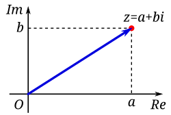

# Complex Numbers

A complex number is defined as $z = x + iy$, where $x, y \in \mathbb{R}$. Here, $x$ represents the **real part** ($\operatorname{Re}z$) and $y$ represents the **imaginary part** ($\operatorname{Im}z$).

The set of all such numbers, $\mathbb{C}$, constitutes the complex plane. Since $\mathbb{R} \subset \mathbb{C}$, real numbers are identified as complex numbers where $\operatorname{Im}z = 0$.

There exists a bijective correspondence between $\mathbb{C}$ and the Euclidean plane $\mathbb{R}^2$, expressed as:

$$z = x + iy \longleftrightarrow (x, y)$$

```{r,output=FALSE,echo=FALSE}
# Values for symbolic placement
x <- 3
y <- 2

# Create empty plot with no axes or box
plot(0, 0, type = "n",
     xlim = c(-5, 5), ylim = c(-5, 5),
     xlab = "", ylab = "",
     axes = FALSE, asp = 1)

# Draw arrowed axes
arrows(-5, 0, 5, 0, length = 0.1)   # Real axis
arrows(0, -5, 0, 5, length = 0.1)   # Imaginary axis

# Axis labels
text(5, 0, "Real axis", pos = 4)
text(0, 5, "Imaginary axis", pos = 4)

# Points
points(x, 0, pch = 19, col = "blue")        # x
points(0, y, pch = 19, col = "red")         # iy
points(x, y, pch = 19, col = "darkgreen")   # x + iy

# Labels
text(x, 0, "x", pos = 4)
text(0, y, "iy", pos = 4)
text(x, y, "x + iy", pos = 4)

```
In this geometric representation:

* The **real axis** corresponds to the $x$-axis.
* The **imaginary axis** ($i\mathbb{R}$), containing purely imaginary numbers of the form $iy$, corresponds to the $y$-axis.


###  Basic Definitions and Algebra

- A complex number has the form $z = a + ib$ where $a, b$ are real numbers
- $a$ is the **real part**: $\text{Re}(z) = a$
- $b$ is the **imaginary part**: $\text{Im}(z) = b$
- A number is **purely imaginary** if $a = 0$
- A number is **real** if $b = 0$
- Zero is the only number that is both real and purely imaginary

###  Arithmetic Operations

#### Addition
$z+w=(x + iy) + (u + iv) = (x+u) + i(y+v)$

```{r,echo=FALSE,output=FALSE}
# Keep variables symbolic
x <- 1; y <- 3
u <- 3; v <- 1

# Empty plot (no box, no ticks)
plot(0, 0, type = "n",
     xlim = c(-1, 6), ylim = c(-1, 5),
     xlab = "", ylab = "", axes = FALSE, asp = 1)

# Arrowed axes
arrows(-1, 0, 6, 0, length = 0.12, lwd = 1.5, col = "black")
arrows(0, -1, 0, 5, length = 0.12, lwd = 1.5, col = "black")

# Axis labels
text(6, 0, "Real axis", pos = 4)
text(0, 5, "Imaginary axis", pos = 4)

# Colors for vectors
col_z1 <- "red"
col_z2 <- "blue"
col_sum <- "purple"

# Draw main vectors
arrows(0, 0, x, y, length = 0.12, lwd = 2, col = col_z1)   # z1
arrows(0, 0, u, v, length = 0.12, lwd = 2, col = col_z2)   # z2
arrows(0, 0, x + u, y + v, length = 0.12, lwd = 2, col = col_sum)  # z1 + z2

# Labels
text(x, y, expression(z == x + i*y), pos = 4, col = col_z1)
text(u, v, expression(w == u + i*v), pos = 4, col = col_z2)
text(x + u, y + v, expression(z + w == (x + u) + i*(y + v)), pos = 4, col = col_sum)

# Parallelogram dotted lines
arrows(x, y, x + u, y + v,length = 0.12, lwd = 1, col = "blue")
arrows(u, v, x + u, y + v, length = 0.12,lwd = 1, col = "red")

# Points
points(x, y, pch = 19, col = col_z1)
points(u, v, pch = 19, col = col_z2)
points(x + u, y + v, pch = 19, col = col_sum)
```

#### Subtraction
$z-w=(x + iy) - (u + iv) = (x-u) + i(y-v)$

#### Multiplication

$(a + ib)(c + id) = (ac - bd) + i(ad + bc)$

#### Division
$$\frac{a + ib}{c + id} = \frac{(a + ib)(c - id)}{(c + id)(c - id)} = \frac{ac + bd}{c^2 + d^2} + i\frac{bc - ad}{c^2 + d^2}$$

### Complex Conjugate

- The conjugate of $z = a + ib$ is $\bar{z} = a - ib$
```{r,output=FALSE,echo=FALSE}
# Empty plot (no box, no ticks)
plot(0, 0, type = "n",
     xlim = c(-1, 6), ylim = c(-4, 4),
     xlab = "", ylab = "", axes = FALSE, asp = 1)

# Arrowed axes
arrows(-1, 0, 6, 0, length = 0.12, lwd = 1.5)
arrows(0, -4, 0, 4, length = 0.12, lwd = 1.5)

# Axis labels
text(6, 0, "Real axis", pos = 4)
text(0, 4, "Imaginary axis", pos = 4)

# Ray length
L <- 5

# Angles (symbolic)
theta <- pi/6   # 30 degrees for drawing

# Upper ray (+θ)
arrows(0, 0, L*cos(theta), L*sin(theta), length = 0.12, lwd = 2, col = "blue")

# Lower ray (-θ)
arrows(0, 0, L*cos(-theta), L*sin(-theta), length = 0.12, lwd = 2, col = "red")

# ---- Curved angle arcs ----

# Arc for +θ
t <- seq(0, theta, length.out = 100)
#lines(0.8*cos(t), 0.8*sin(t), lwd = 2)
text(1.1*cos(theta/2), 1.1*sin(theta/2), expression(theta),col="blue")

# Arc for -θ
t2 <- seq(0, -theta, length.out = 100)
#lines(0.8*cos(t2), 0.8*sin(t2), lwd = 2)
text(1.1*cos(-theta/2), 1.1*sin(-theta/2), expression(-theta),col="red")

# Arc for total angle 2θ
t3 <- seq(-theta, theta, length.out = 200)
# Arc for total angle 2θ
t3 <- seq(-theta, theta, length.out = 200)
x_arc <- 1.6*cos(t3)
y_arc <- 1.6*sin(t3)

# Draw the arc
lines(x_arc, y_arc, lwd = 2)

# ---- Double arrowheads (pointing inward) ----

# Left arrowhead (points toward the arc)
arrows(x_arc[5], y_arc[5], x_arc[1], y_arc[1],
       length = 0.12, lwd = 2)

# Right arrowhead (points toward the arc)
arrows(x_arc[length(x_arc)-5], y_arc[length(y_arc)-5],
       x_arc[length(x_arc)], y_arc[length(y_arc)],
       length = 0.12, lwd = 1)


text(L*cos(-theta), L*sin(-theta),
     expression(bar(z) == x - i*y),
     pos = 4, col = "red")
text(L*cos(theta), L*sin(theta),
     expression(z == x + i*y),
     pos = 4, col = "blue")
```
- Properties: $\text{For all } z,w \in \mathbb{C}:$

  - $\overline{z+w} = \bar{z} + \bar{w}$  
  - $\overline{zw} = \bar{z}\,\bar{w}$  
  - $\overline{(z/w)} = \frac{\bar{z}}{\bar{w}},\ w \neq 0$  
  - $\frac{1}{z} = \frac{\bar{z}}{|z|^{2}},\ z \neq 0$  
  - $z$ is real $\Longleftrightarrow z = \bar{z}$  
  - $z$ is purely imaginary $\Longleftrightarrow z = -\bar{z}$ 


### Absolute Value (Modulus)

- The absolute value or modulus of $z = a + ib$ is:
  - $|z| = \sqrt{a^2 + b^2} = \sqrt{z\bar{z}}$
```{r,echo=FALSE}
# Coordinates for the complex number
x <- 4
y <- 3

# Empty plot (no box, no ticks)
plot(0, 0, type = "n",
     xlim = c(-1, x + 2), ylim = c(-1, y + 2),
     xlab = "", ylab = "", axes = FALSE, asp = 1)

# Arrowed axes
arrows(-1, 0, x + 2, 0, length = 0.12, lwd = 1.5, col = "gray0")
arrows(0, -1, 0, y + 2, length = 0.12, lwd = 1.5, col = "gray0")

# Axis labels
text(x + 2, 0, "Real", pos = 4, col = "gray20")
text(0, y + 2, "Imaginary", pos = 4, col = "gray20")

points(x, y, pch = 19, col = "gray0")

# Labels for points

text(x, y+0.3, expression(z == x + i*y), pos = 4, col = "red")

# Triangle sides
segments(0, -0.25, x, -0.25, lwd = 2, col = "blue") 
arrows(0.2, -0.25, 0, -0.25, length = 0.12, col = "blue", lwd = 2)
arrows(x - 0.2, -0.25, x, -0.25, length = 0.12, col = "blue", lwd = 2)
segments(x + 0.25, 0, x + 0.25, y, lwd = 2, col = "red")
arrows(x + 0.25, 0.2, x + 0.25, 0, length = 0.12, col = "red", lwd = 2)
arrows(x + 0.25, y - 0.2, x + 0.25, y, length = 0.12, col = "red", lwd = 2)

lines(c(x, x), c(0, y), lwd = 2, col = "gray20", lty = 2)
segments(0, 0, x, y, lwd = 2, col = "purple")    # hypotenuse

# Side labels
text(x/2, -0.5, "x", col = "blue")               # horizontal
text(x + 0.5, y/2, "y", col = "red")             # vertical

# Hypotenuse label (correct sqrt rendering)
text(x/2-1.5, y/2+0.8,
     expression("|" * z * "|" == sqrt(x^2 + y^2)),
     pos = 4, col = "purple")

```
- Properties:
  - $|z| \geq 0$ for all $z$, with equality if and only if $z = 0$
  - $|zw|^{2} = (zw)(\overline{zw}) = (z\bar{z})(w\bar{w}) = |z|^{2}|w|^{2}$  
  - $|z_1 \cdot z_2| = |z_1| \cdot |z_2|$
  - $\left|\frac{z_1}{z_2}\right| = \frac{|z_1|}{|z_2|}$ for $z_2 \neq 0$
  - $|z_1 + z_2| \leq |z_1| + |z_2|$ (Triangle inequality)
  - $\left| |z_1| - |z_2| \right| \leq |z_1 - z_2|$

###  Important Inequalities

1. **Triangle Inequality**: $|z_1 + z_2| \leq |z_1| + |z_2|$
   - Equality holds if and only if $\frac{z_1}{z_2} > 0$ (i.e., the ratio is positive real)

2. $-|z| \leq \text{Re}(z) \leq |z|$
   - Equality on right when $z$ is positive real

3. $-|z| \leq \text{Im}(z) \leq |z|$

4. **Cauchy's Inequality**: $|a_1b_1 + a_2b_2 + \ldots + a_nb_n|^2 \leq (|a_1|^2 + \ldots + |a_n|^2)(|b_1|^2 + \ldots + |b_n|^2)$
   - Equality holds if and only if the $a_i$ are proportional to the $b_i$

### Fundamental Theorem of Algebra

A complex polynomial of degree $n \ge 0$ is a function of the form


\[
p(z) = a_n z^n + a_{n-1} z^{\,n-1} + \cdots + a_1 z + a_0,
\qquad z \in \mathbb{C},
\]


where $a_0, a_1, \ldots, a_n$ are complex numbers and $a_n \neq 0$.

A fundamental property of the complex numbers is that every polynomial
with complex coefficients can be factored completely into linear factors.

```{theorem,name="Fundamental Theorem of Algebra"}
Every complex polynomial $p(z)$ of degree $n \ge 1$ admits a factorization


\[
p(z) = c\,(z - \zeta_1)^{m_1} (z - \zeta_2)^{m_2} \cdots (z - \zeta_k)^{m_k},
\]


where the numbers $\zeta_1, \ldots, \zeta_k$ are distinct complex roots of $p$,
each multiplicity satisfies $m_j \ge 1$, and \(m_1 + m_2 + \cdots + m_k = n.\)
This factorization is **unique**, up to a permutation of the factors.
```


```{proof}
*Omitted.* Multiple complete and rigorous proofs are available at
[ProofWiki](https://proofwiki.org/wiki/Fundamental_Theorem_of_Algebra).
```

The uniqueness of the factorization is straightforward. 
The points $\zeta_1, \ldots, \zeta_k$ are uniquely determined as the zeros of $p(z)$,
that is, the solutions of $p(z)=0$. Each multiplicity $m_j$ is the unique
integer $m \ge 1$ for which $p(z)$ can be written in the form
$(z-\zeta_j)^m q(z)$ with $q(\zeta_j)\neq 0$.

To prove that such a factorization exists, one uses induction on the degree
$n$ of the polynomial. The key step is to show that $p(z)$ has at least one
root $\zeta_1$. Once a root is found, the polynomial can be factored as
$p(z) = (z-\zeta_1) q(z)$, where $q(z)$ has degree $n-1$. By the induction
hypothesis, $q(z)$ can be factored into linear factors, which completes the
factorization of $p(z)$. Thus, the Fundamental Theorem of Algebra is
equivalent to the statement that every complex polynomial of degree
$n \ge 1$ has at least one zero.


## Geometric Representation

### The Complex Plane

- A complex number $z = a + ib$ corresponds to the point $(a,b)$ in the plane
- The $x$-axis is called the **real axis**
- The $y$-axis is called the **imaginary axis**
- The plane is called the **complex plane**




###  Vector Interpretation

- Complex numbers can be represented as vectors from the origin
- Vector addition corresponds to complex addition
- The length of the vector is $|z|$
- The distance between points $z_1$ and $z_2$ is $|z_1 - z_2|$

### Polar Form

- A complex number can be written in **polar form**:
  - $z = r(\cos\theta + i\sin\theta)$ where $r = |z|$ and $\theta = \arg(z)$
  - $r$ is the modulus: $r = |z| = \sqrt{a^2 + b^2}$
  - $\theta$ is the **argument** or **amplitude**: $\theta = \arg(z)$

- Properties of polar form:
  - For $z_1 = r_1(\cos\theta_1 + i\sin\theta_1)$ and $z_2 = r_2(\cos\theta_2 + i\sin\theta_2)$:
  - $z_1z_2 = r_1r_2[\cos(\theta_1 + \theta_2) + i\sin(\theta_1 + \theta_2)]$
  - $\arg(z_1z_2) = \arg(z_1) + \arg(z_2)$
  - $\arg\left(\frac{z_1}{z_2}\right) = \arg(z_1) - \arg(z_2)$

### De Moivre's Formula

- For $z = r(\cos\theta + i\sin\theta)$:
  - $z^n = r^n(\cos n\theta + i\sin n\theta)$

- For $r = 1$:
  - $(\cos\theta + i\sin\theta)^n = \cos n\theta + i\sin n\theta$

###  Roots of Complex Numbers

- The $n$-th roots of $z = r(\cos\theta + i\sin\theta)$ are:
  - $\sqrt[n]{z} = \sqrt[n]{r}\left[\cos\left(\frac{\theta + 2\pi k}{n}\right) + i\sin\left(\frac{\theta + 2\pi k}{n}\right)\right]$ for $k = 0, 1, 2, \ldots, n-1$

- There are $n$ distinct $n$-th roots of any non-zero complex number
- These roots have equal moduli and are equally spaced around a circle
- For $z = 1$, the roots are called the **$n$-th roots of unity**

### Equations in the Complex Plane

- Circle with center $a$ and radius $r$: $|z - a| = r$
  - In algebraic form: $(z - a)(\bar{z} - \bar{a}) = r^2$

- Straight line: $z = a + bt$ where $t$ is a real parameter
  - Two lines are parallel if $b'$ is a real multiple of $b$
  - Lines are orthogonal if $\frac{b'}{b}$ is purely imaginary
  - The angle between lines is $\arg\frac{b'}{b}$

### Stereographic Projection and the Riemann Sphere

The extended complex plane is the complex plane together with the 
point at infinity. We denote the it by \(C^* = c\cup\{\infty\}\).
- The extended complex plane includes $\infty$ and can be represented on a unit sphere
- Under stereographic projection, the point $(x_1, x_2, x_3)$ on the sphere corresponds to:
  - $z = \frac{x_1 + ix_2}{1 - x_3}$

- The north pole $(0,0,1)$ corresponds to $\infty$
- Properties:
  - Circles on the sphere correspond to circles or lines in the plane
  - The distance formula: $d(z,z') = \frac{2|z-z'|}{\sqrt{(1+|z|^2)(1+|z'|^2)}}$
  - The sphere is often called the **Riemann sphere**

### Key Formulas and Results

1. $z\bar{z} = |z|^2 = a^2 + b^2$

2. $\frac{1}{z} = \frac{\bar{z}}{|z|^2} = \frac{a - ib}{a^2 + b^2}$

3. $z^n = r^n(\cos n\theta + i\sin n\theta)$

4. $\sqrt[n]{z} = \sqrt[n]{r}\left[\cos\left(\frac{\theta + 2\pi k}{n}\right) + i\sin\left(\frac{\theta + 2\pi k}{n}\right)\right]$ where $k = 0, 1, \ldots, n-1$

5. Triangle inequality: $|z_1 + z_2| \leq |z_1| + |z_2|$

6. Cauchy's inequality: $\left|\sum_{i=1}^{n} a_i\bar{b}_i\right|^2 \leq \left(\sum_{i=1}^{n}|a_i|^2\right)\left(\sum_{i=1}^{n}|b_i|^2\right)$

7. The equation of a circle: $|z - a| = r$

8. The roots of unity: $\omega^k$ where $\omega = \cos\frac{2\pi}{n} + i\sin\frac{2\pi}{n}$ and $k = 0, 1, \ldots, n-1$

##  Exercise

1. Find the values of
\[    (1 + 2i)^3, \quad \frac{5}{-3 + 4i}, \quad \left( \frac{2 + i}{3 - 2i} \right)^2, \quad (1 + i)^n + (1 - i)^n.\]

1. If \( z = x + iy \) (where \(x\) and \(y\) are real numbers), find the real and imaginary parts of:
\[z^4, \quad \frac{1}{z}, \quad \frac{z - 1}{z + 1}, \quad \frac{1}{z^2}.\]
 
1. Show that:
\[  \left( \frac{-1 \pm i\sqrt{3}}{2} \right)^3 = 1 \quad \text{and} \quad \left( \frac{\pm 1 \pm i\sqrt{3}}{2} \right)^6 = 1\]
for all combinations of signs.

