# Hodge Star and Differential Forms

*Notes and Lecture Summaries*
*Research Readings - 12 May, 2018*

**Important**: This is not my original works(), This is just a keep track of my readings

## Basic k-Forms

### Definitions and Structure

```{definition,name="Basic One-Forms"}
For each \( i \in \{1,\ldots,n\} \), the \emph{basic one-form} \( dx_i \) is the linear map \(dx_i : \mathbb{R}^n \longrightarrow \mathbb{R}\) defined by projecting a vector onto its \(i\)-th coordinate.  If \( \mathbf{u} = (u_1,\ldots,u_n) \in \mathbb{R}^n \), then
\[
dx_i(u_1,\ldots,u_n) = u_i.
\]
```

### Basic k-Forms

This algebraic understanding of the basic one-forms as linear maps allows us to define a natural generalization. Instead of looking only at linear maps, we now also define $k$-forms on $\mathbb{R}^n$. The definition relies on the determinant.

```{definition,name="Basic Two-Form"}
The basic two-form $dx_i \wedge dx_j$ takes two vectors $\mathbf{u}, \mathbf{v} \in \mathbb{R}^n$ and maps them to the following determinant:


$$dx_i \wedge dx_j (\mathbf{u}, \mathbf{v}) = \det \begin{pmatrix} u_i & v_i \\ u_j & v_j \end{pmatrix} = u_i v_j - u_j v_i$$
```

```{definition,name="Basic Three-Forms"}
The basic three-form $dx_i \wedge dx_j \wedge dx_k$ takes three vectors $\mathbf{u}, \mathbf{v}, \mathbf{w} \in \mathbb{R}^n$ and maps them to:


$$dx_i \wedge dx_j \wedge dx_k (\mathbf{u}, \mathbf{v}, \mathbf{w}) = \det \begin{pmatrix} u_i & v_i & w_i \\ u_j & v_j & w_j \\ u_k & v_k & w_k \end{pmatrix}$$
```

```{definition,name="Basic $k$-Forms"}
For $1 \le i_1 < i_2 < \dots < i_k \le n$, the basic $k$-form $dx_{i_1} \wedge \dots \wedge dx_{i_k}$ acts on $k$ vectors $\mathbf{u}^1, \dots, \mathbf{u}^k$ via:


$$dx_{i_1} \wedge \dots \wedge dx_{i_k}(\mathbf{u}^1, \dots, \mathbf{u}^k) = \det \begin{pmatrix} u_{i_1}^1 & \dots & u_{i_1}^k \\ \vdots & \ddots & \vdots \\ u_{i_k}^1 & \dots & u_{i_k}^k \end{pmatrix}$$
```

```{lemma,name="Antisymmetry of Basic Form"}
For any vectors $\mathbf{u}, \mathbf{v}$:
  
$$\begin{aligned} dx_i \wedge dx_j (\mathbf{u}, \mathbf{v}) &=-(dx_j \wedge dx_i (\mathbf{u}, \mathbf{v}))\\
dx_i \wedge dx_i &=  0\end{aligned}$$
```

```{proof}
For any vectors $\mathbf{u}, \mathbf{v}$:
  
$$\begin{aligned} dx_i \wedge dx_j (\mathbf{u}, \mathbf{v}) &= \begin{vmatrix} u_i & v_i \\ u_j & v_j \end{vmatrix} = u_i v_j - u_j v_i \\ dx_j \wedge dx_i (\mathbf{u}, \mathbf{v}) &= \begin{vmatrix} u_j & v_j \\ u_i & v_i \end{vmatrix} = u_j v_i - u_i v_j = -(dx_i \wedge dx_j (\mathbf{u}, \mathbf{v})) \end{aligned}$$
  Thus, $dx_i \wedge dx_j = - dx_j \wedge dx_i$, which implies:
  $$dx_i \wedge dx_i = \begin{vmatrix} u_i & v_i \\ u_i & v_i \end{vmatrix} = u_i v_i - u_i v_i = 0$$
```

### Exterior Derivative of a Function (0‑Forms)

```{definition}
Let \(f : U \subseteq \mathbb{R}^n \to \mathbb{R}\) be a smooth function.  
Its **differential** (also called the exterior derivative of a 0‑form) is the 1‑form

\[
df = \sum_{i=1}^n \frac{\partial f}{\partial x_i}\, dx_i.
\]

In particular, for \(U \subseteq \mathbb{R}^3\),
\[
df = f_x\,dx + f_y\,dy + f_z\,dz.
\]
```


### Differential Forms on Riemann Surfaces

Let $M$ be a Riemann surface.

* A $0$-form on $M$ is a function on $M$.
* A $1$-form $\omega$ on $M$ is an assignment of two continuous functions $f$ and $g$ to each local coordinate $z = x + iy$ on $M$ such that $\omega = f\,dx + g\,dy$.
* A $2$-form $\Omega$ on $M$ is an assignment of a continuous function $f$ to each local coordinate $z$ such that $f(z)\,dx \wedge dy$ is invariant under coordinate changes. That is, in terms of another local coordinate $\tilde{z}$ we have:

$$\tilde{f}(\tilde{z}) = f(z(\tilde{z})) \frac{\partial(x,y)}{\partial(\tilde{x},\tilde{y})}$$


where $\frac{\partial(x,y)}{\partial(\tilde{x},\tilde{y})}$ is the Jacobian determinant.

```{definition,name="Exterior Derivative of a k-form"}
The exterior derivative of a $k$-form $\omega = \sum f_{i_1 \dots i_k} dx_{i_1} \wedge \dots \wedge dx_{i_k}$ on $U \subseteq \mathbb{R}^n$ is the $(k+1)$-form $d\omega$ given by:


$$d\omega = \sum_{1 \le i_1 < \dots < i_k \le n} d(f_{i_1 \dots i_k}) \wedge dx_{i_1} \wedge \dots \wedge dx_{i_k}$$


where $d(f_{i_1 \dots i_k})$ means the exterior derivative of the function ($0$-form).
```

### k-Forms in R^3

```{definition,name="Forms in R3"}
Let $U \subseteq \mathbb{R}^3$ be an open subset.

1. A **zero-form** is a smooth function $f: U \to \mathbb{R}$.
2. A **one-form** is an expression $f\,dx + g\,dy + h\,dz$ for smooth functions $f,g,h: U \to \mathbb{R}$.
3. A **two-form** is an expression $f\,dy \wedge dz + g\,dz \wedge dx + h\,dx \wedge dy$ for smooth functions $f,g,h: U \to \mathbb{R}$.
4. A **three-form** is an expression $f\,dx \wedge dy \wedge dz$ for a smooth function $f: U \to \mathbb{R}$.
```


### k-Forms and Vector Calculus

There is a natural correspondence between differential forms in $\mathbb{R}^3$ and concepts from vector calculus:

| Form Degree | Differential Form | Vector Calculus Concept |
| --- | --- | --- |
| $0$-form | Function $f$ | Scalar Field $f$ |
| $1$-form | $f\,dx + g\,dy + h\,dz$ | Vector Field $\mathbf{F} = (f,g,h)$ |
| $2$-form | $f\,dy \wedge dz + g\,dz \wedge dx + h\,dx \wedge dy$ | Vector Field $\mathbf{F} = (f,g,h)$ |
| $3$-form | $f\,dx \wedge dy \wedge dz$ | Scalar Field $f$ |


```{example}
Show that \(dz \wedge dx \wedge dy = dx \wedge dy \wedge dz.\)
```

**Solution**
Using antisymmetry of the wedge product,


\[
dz \wedge dx = -\, dx \wedge dz,
\qquad
dz \wedge dy = -\, dy \wedge dz.
\]


Thus,


\[
dz \wedge dx \wedge dy
= -\, dx \wedge dz \wedge dy
= dx \wedge dy \wedge dz.
\]

```{example}
List the independent non-vanishing basic $k$-forms in $\mathbb{R}^4$.
```

**Solution**: 
Because of antisymmetry, the only non-vanishing basic $k$-forms in 
$\mathbb{R}^4$ occur for $k \le 4$.

- *Basic one-forms*:


\[
dx_1,\quad dx_2,\quad dx_3,\quad dx_4.
\]


- *Basic two-forms:*


\[
dx_1 \wedge dx_2,\quad
dx_1 \wedge dx_3,\quad
dx_1 \wedge dx_4,\quad
dx_2 \wedge dx_3,\quad
dx_2 \wedge dx_4,\quad
dx_3 \wedge dx_4.
\]

- *Basic three-forms*:


\[
dx_1 \wedge dx_2 \wedge dx_3,\quad
dx_1 \wedge dx_2 \wedge dx_4,\quad
dx_1 \wedge dx_3 \wedge dx_4,\quad
dx_2 \wedge dx_3 \wedge dx_4.
\]


- *Basic four-form*:


\[
dx_1 \wedge dx_2 \wedge dx_3 \wedge dx_4.
\]


There is only one independent basic four-form, since repeated factors 
would make the wedge product vanish.

```{example}
Write down the vector field $F : \mathbb{R}^3 \to \mathbb{R}^3$ associated to the two-form


\[
\omega = xy\, dx \wedge dy + xyz\, dx \wedge dz + x^2\, dy \wedge dz.
\]


```

**solution**:
A general two-form in $\mathbb{R}^3$ can be written as


\[
\omega = f\, dy \wedge dz + g\, dz \wedge dx + h\, dx \wedge dy,
\]


and it corresponds to the vector field $(f, g, h)$.

Rewrite $\omega$ in this order:


\[
\omega = x^2\, dy \wedge dz - xyz\, dz \wedge dx + xy\, dx \wedge dy.
\]


Thus the associated vector field is


\[
F(x,y,z) = (x^2,\; -xyz,\; xy).
\]


```{example}
Let $\omega = dx \wedge dz$ be a basic two-form on $\mathbb{R}^3$, and let 
$u = (1,2,3)$ and $v = (3,2,1)$. Evaluate $\omega(u,v)$.
```

**solution**: 
We compute


\[
\omega(u,v) = (dx \wedge dz)(u,v)
= 
\begin{vmatrix}
u_1 & v_1 \\
u_3 & v_3
\end{vmatrix}
=
\begin{vmatrix}
1 & 3 \\
3 & 1
\end{vmatrix}
= 1 - 9 = -8.
\]


```{example}
Let $\omega = dx \wedge dy \wedge dz$ be the basic three-form on $\mathbb{R}^3$.

a) Show that $\omega(u,v,w)=1$ for $u=(1,0,0)$, $v=(0,1,0)$, $w=(0,0,1)$.
b) Show that $\omega(v,u,w)=-1$.
c) Show that exactly three orderings of $(u,v,w)$ give $+1$ and three give $-1$.
```

**solution**
(a) We compute


\[
\omega(u,v,w)
=
\begin{vmatrix}
u_1 & v_1 & w_1 \\
u_2 & v_2 & w_2 \\
u_3 & v_3 & w_3
\end{vmatrix}
=
\begin{vmatrix}
1 & 0 & 0 \\
0 & 1 & 0 \\
0 & 0 & 1
\end{vmatrix}
= 1.
\]


(b) Swapping $u$ and $v$ exchanges two columns of the determinant:


\[
\omega(v,u,w)
=
\begin{vmatrix}
v_1 & u_1 & w_1 \\
v_2 & u_2 & w_2 \\
v_3 & u_3 & w_3
\end{vmatrix}
=
- 
\begin{vmatrix}
u_1 & v_1 & w_1 \\
u_2 & v_2 & w_2 \\
u_3 & v_3 & w_3
\end{vmatrix}
= -1.
\]


(c) Any permutation of $(u,v,w)$ corresponds to permuting the columns of the determinant.  
An **even** number of column swaps preserves the sign; an **odd** number reverses it.

Thus the following three orderings give $+1$:


\[
(u,v,w),\quad (w,u,v),\quad (v,w,u),
\]

i.e. 
\[
dx \wedge dy \wedge dz(\mathbf{u},\mathbf{v},\mathbf{w})
= dx \wedge dy \wedge dz(\mathbf{w},\mathbf{u},\mathbf{v})
= dx \wedge dy \wedge dz(\mathbf{v},\mathbf{w},\mathbf{u})
= 1,
\]
and the following three give $-1$:


\[
(v,u,w),\quad (w,v,u),\quad (u,w,v).
\]

i.e.

\[
dx \wedge dy \wedge dz(\mathbf{v},\mathbf{u},\mathbf{w})
= dx \wedge dy \wedge dz(\mathbf{w},\mathbf{v},\mathbf{u})
= dx \wedge dy \wedge dz(\mathbf{u},\mathbf{w},\mathbf{v})
= -1.
\]


The reason is that permuting two basis vectors corresponds to swapping two columns of the matrix whose determinant defines the value of the $3$‑form. Since exchanging two columns changes the determinant by a factor of $-1$, any even number of such swaps leaves the determinant unchanged, whereas any odd number of swaps multiplies it by $-1$.


## Wedge Product

```{definition,name="Wedge Product"}
Consider a simple $k$-form $\omega$ and a simple $m$-form $\eta$ on an open
subset $U \subseteq \mathbb{R}^n$ of the form


\[
\omega = f\, dx_{i_1} \wedge \cdots \wedge dx_{i_k}, 
\qquad
\eta = g\, dx_{j_1} \wedge \cdots \wedge dx_{j_m},
\]


for smooth functions $f, g : U \to \mathbb{R}$.

The \emph{wedge product} $\omega \wedge \eta$ is the $(k+m)$-form defined by


\[
\omega \wedge \eta
= fg\, dx_{i_1} \wedge \cdots \wedge dx_{i_k}
      \wedge dx_{j_1} \wedge \cdots \wedge dx_{j_m}.
\]

```

Note that the order of the $dx_i$'s is important, since exchanging two
differentials introduces a sign by antisymmetry.

The wedge product of arbitrary $k$- and $m$-forms is defined by linearity,
i.e.\ by distributing the wedge product term-by-term over sums.


```{definition,name="Wedge Product"}
The wedge product $\wedge$ combines a $k$-form and an $m$-form to yield a $(k+m)$-form. It is associative, bilinear, and satisfies graded commutativity:


$$\omega \wedge \eta = (-1)^{km} \eta \wedge \omega$$
```

### Examples of Wedge Product

```{example,name="Wedge product of two 1-forms"}
Let $\omega = x\,dx + x\,dy + e^z\,dz$ and $\eta = y\,dx + x\,dy + z\,dz$. Then:


$$\begin{aligned} \omega \wedge \eta &= (x\,dx + x\,dy + e^z\,dz) \wedge (y\,dx + x\,dy + z\,dz) \\ &= (x^2 - xy)\,dx \wedge dy + (xz + e^z y)\,dz \wedge dx + (xz - e^z x)\,dz \wedge dy \end{aligned}$$
```

```{example,name="Wedge product of a 1-form and a 2-form"}
Let $\omega = xy\,dx + y\,dy$ and $\eta = z\,dy \wedge dz$. Then:


$$\omega \wedge \eta = (xy\,dx + y\,dy) \wedge (z\,dy \wedge dz) = xyz\,dx \wedge dy \wedge dz$$
```

```{lemma}
Let $\mathbf{F}, \mathbf{G}$ be vector fields associated with $1$-forms $\omega_1, \eta_2$ in $\mathbb{R}^3$:


$$\begin{aligned} \omega &= f_1\,dx + f_2\,dy + f_3\,dz \quad \longleftrightarrow \quad \mathbf{F} = (f_1, f_2, f_3) \\ \eta &= g_1\,dx + g_2\,dy + g_3\,dz \quad \longleftrightarrow \quad \mathbf{G} = (g_1, g_2, g_3) \end{aligned}$$


Then $\omega_1 \wedge \eta_2$ corresponds to the cross product $\mathbf{F} \times \mathbf{G}$.
```

```{proof}
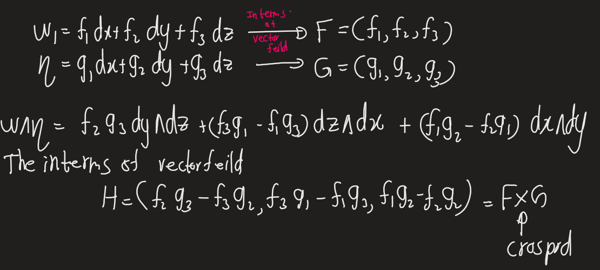
```

---


```{lemma,name="Graded Product Rule"}
For a $k$-form $\omega$ and an $m$-form $\eta$:


$$d(\omega \wedge \eta) = d\omega \wedge \eta+ (-1)^k \omega \wedge d\eta$$
```

```{proof}
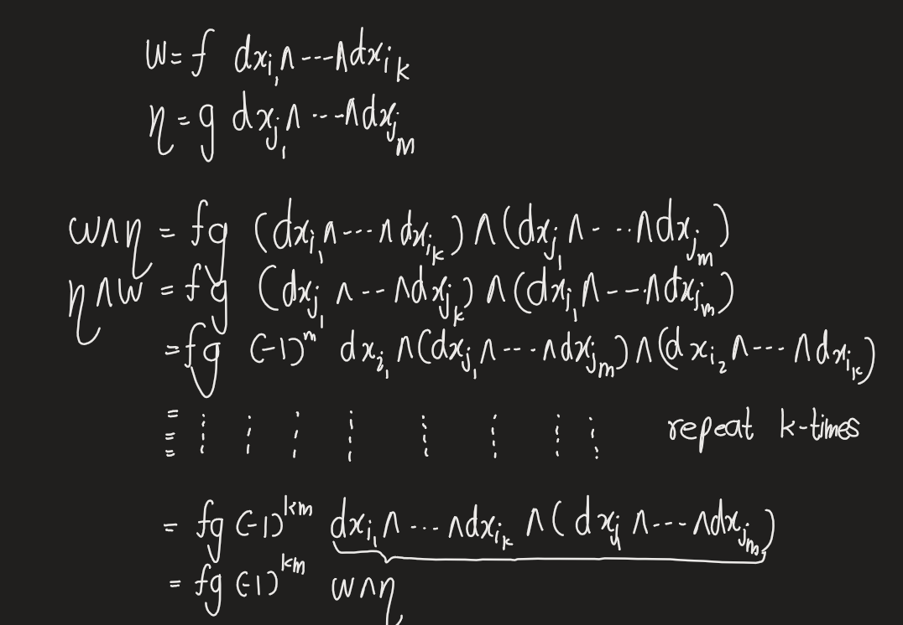
```

```{lemma}
Let $\omega$ be a one-form and $\eta$ a two\hyp{}form on an open set $U \subseteq \mathbb{R}^3$. Suppose these forms correspond to vector fields $\mathbf{F}$ and $\mathbf{G}$.
$$\begin{aligned} 
\omega &= f_1\,dx + f_2\,dy + f_3\,dz \quad
&\longleftrightarrow \quad \mathbf{F}=(f_1,f_2,f_3) \\ 
\eta &= g_{1}\, dy \wedge dz + g_{2}\, dz \wedge dx
+ g_{3}\, dx \wedge dy, \quad &\longleftrightarrow \quad \mathbf{G} = (g_1, g_2, g_3) \end{aligned}$$
Then the three-form $\omega \wedge \eta$ corresponds to the scalar function 
given by the dot product $\mathbf{F} \cdot \mathbf{G}$.
```

```{proof}
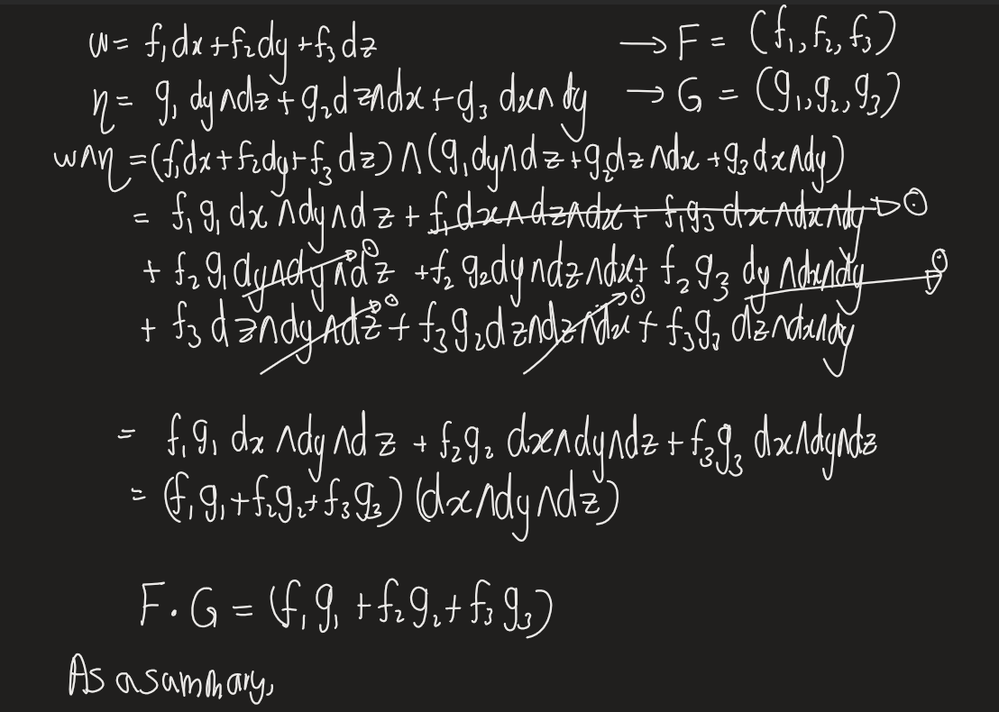
```
As a summary,

| Differential Form Concept | Vector Calculus Concept |
| --- | --- |
| 1‑form \(\omega\) | vector field **F** |
| 1‑form \(\eta\) | vector field **G** | 2‑form \(\omega \wedge \eta\) | cross product **F × G** |

| Differential Form Concept | Vector Calculus Concept |
| --- | --- |
| 1‑form \(\omega\), 2‑form \(\eta\) | vector fields **F**, **G** |
| 3‑form \(\omega \wedge \eta\) | dot product **F · G** |

```{example} 
Let \(\omega = x\,dy \wedge dz + y\,dz \wedge dx + z\,dx \wedge dy\) and \(\eta = x\,dx + y\,dy + z\,dz.\)
```

**Solution**: We compute the wedge product, noting that any term containing a repeated
\(dx, dy,\) or \(dz\) vanishes:
\begin{align*}
\omega \wedge \eta
&= (x\,dy \wedge dz + y\,dz \wedge dx + z\,dx \wedge dy)
   \wedge (x\,dx + y\,dy + z\,dz) \\[4pt]
&= x^{2}\,dy \wedge dz \wedge dx
   + y^{2}\,dz \wedge dx \wedge dy
   + z^{2}\,dx \wedge dy \wedge dz.
\end{align*}

Since


\[
dy \wedge dz \wedge dx
= dz \wedge dx \wedge dy
= dx \wedge dy \wedge dz,
\]


we obtain the standard form:


\[
\omega \wedge \eta
= (x^{2} + y^{2} + z^{2})\,dx \wedge dy \wedge dz.
\]


```{example}
Let \(\omega = f_{1}\,dx + f_{2}\,dy\) and \(\eta = g_{1}\,dx + g_{2}\,dy\) be one\hyp{}forms on \(\mathbb{R}^{2}\), with associated vector fields


\[
\mathbf{F} = (f_{1}, f_{2}), \qquad \mathbf{G} = (g_{1}, g_{2}).
\]


Then


\[
\omega \wedge \eta
= \det\!\begin{pmatrix}
f_{1} & g_{1} \\
f_{2} & g_{2}
\end{pmatrix}
\, dx \wedge dy.
\]
```

**Solution**:
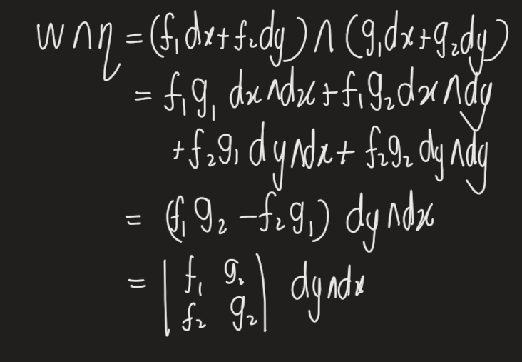


```{example}
Let $\omega = f\,dx + g\,dy + h\,dz$ be an arbitrary one-form on  $\mathbb{R}^3.$
Show that $\omega \wedge \omega = 0.$

```

**Solution**: We compute directly,
\begin{align*}
\omega \wedge \omega
&= (f\,dx + g\,dy + h\,dz) \wedge (f\,dx + g\,dy + h\,dz) \\[4pt]
&= fg\,dx \wedge dy + fh\,dx \wedge dz + gf\,dy \wedge dx
   + gh\,dy \wedge dz + hf\,dz \wedge dx + hg\,dz \wedge dy.
\end{align*}

Grouping terms and using the antisymmetry of the wedge product,


\[
dy \wedge dx = -dx \wedge dy, \quad
dz \wedge dx = -dx \wedge dz, \quad
dz \wedge dy = -dy \wedge dz,
\]


we obtain


\[
\omega \wedge \omega
= (gh - hg)\,dy \wedge dz
+ (hf - fh)\,dz \wedge dx
+ (fg - gf)\,dx \wedge dy.
\]


Since scalar functions commute, i.e. \( gh = hg, \ hf = fh, \ fg = gf \),
it follows that


\[
\omega \wedge \omega = 0
\]


```{example}
Find the cross-product of the vectors $\mathbf{F} = (1,1,0)$  and $\mathbf{G} = (0,2,3)$ in $\mathbb{R}^3$  by computing the wedge product of the associated one-forms.
```


**Solution** : The one-forms associated to \(\mathbf{F}\) and \(\mathbf{G}\) are


\[
\omega = dx + dy, \qquad \eta = 2\,dy + 3\,dz.
\]


Compute the wedge product:
\begin{align*}
\omega \wedge \eta
&= (dx + dy) \wedge (2\,dy + 3\,dz) \\[4pt]
&= 2\,dx \wedge dy + 3\,dx \wedge dz + 3\,dy \wedge dz.
\end{align*}

Rewriting in standard orientation,


\[
\omega \wedge \eta
= 3\,dy \wedge dz - 3\,dz \wedge dx + 2\,dx \wedge dy.
\]


By the dictionary between two-forms and vector fields,


\[
\mathbf{F} \times \mathbf{G}
= (3,\,-3,\,2).
\]


Thus the wedge product correctly reproduces the cross-product.

```{example}
Let $\mathbf{A},\, \mathbf{B},\, \mathbf{C} \in\mathbb{R}^3.$ Show that $$\mathbf{A}\cdot(\mathbf{B}\times\mathbf{C})
=\mathbf{B}\cdot(\mathbf{C}\times\mathbf{A})
=\mathbf{C}\cdot(\mathbf{A}\times\mathbf{B})$$
using wedge products of the associated one-forms.
```

**Solution**: Let \(\omega, \eta, \lambda\) be the one-forms associated to
\(\mathbf{A}, \mathbf{B}, \mathbf{C}\).  
From the dictionary for one-forms and vector fields,


\[
\omega \wedge \eta \wedge \lambda
= (\mathbf{A}\cdot(\mathbf{B}\times\mathbf{C}))\, dx\wedge dy\wedge dz,
\]


\[
\eta \wedge \lambda \wedge \omega
= (\mathbf{B}\cdot(\mathbf{C}\times\mathbf{A}))\, dx\wedge dy\wedge dz,
\]


\[
\lambda \wedge \omega \wedge \eta
= (\mathbf{C}\cdot(\mathbf{A}\times\mathbf{B}))\, dx\wedge dy\wedge dz.
\]


Since all three are one-forms, wedge products anticommute:


\[
\omega \wedge \eta = -\,\eta \wedge \omega, \qquad
\eta \wedge \lambda = -\,\lambda \wedge \eta, \qquad
\omega \wedge \lambda = -\,\lambda \wedge \omega.
\]


Thus,


\[
\omega \wedge \eta \wedge \lambda
= \eta \wedge \lambda \wedge \omega
= \lambda \wedge \omega \wedge \eta.
\]


Therefore,


\[
\mathbf{A}\cdot(\mathbf{B}\times\mathbf{C})
=
\mathbf{B}\cdot(\mathbf{C}\times\mathbf{A})
=
\mathbf{C}\cdot(\mathbf{A}\times\mathbf{B}),
\]


which follows directly from the antisymmetry of the wedge product.


## Exterior Derivative

```{definition,name="Exterior Derivative of a k-Form"}

The **exterior derivative of a zero‑form** \(f\) on \(U \subset \mathbb{R}^n\) is the one‑form  
\[
df = \sum_{i=1}^{n} \frac{\partial f}{\partial x_i}\, dx_i,
\]
which coincides with the differential introduced earlier.

The **exterior derivative of a \(k\)-form**  
\[
\omega = \sum_{1 \le i_1 < \cdots < i_k \le n}
f_{i_1 \cdots i_k}\,
dx_{i_1} \wedge \cdots \wedge dx_{i_k}
\]
on \(U \subset \mathbb{R}^n\) is the \((k+1)\)-form  
\[
d\omega
= \sum_{1 \le i_1 < \cdots < i_k \le n}
d(f_{i_1 \cdots i_k}) \wedge
dx_{i_1} \wedge \cdots \wedge dx_{i_k},
\]
where \(d(f_{i_1 \cdots i_k})\) is the exterior derivative of the scalar function \(f_{i_1 \cdots i_k}\).  
In other words, the operator \(d\) is applied to the component functions of \(\omega\).
```


```{lemma,name="Exterior Derivative in R^3"}

1. Zero‑forms: If \(f\) is a zero‑form on \(U \subset \mathbb{R}^3\), then 

\[df= \frac{\partial f}{\partial x}\, dx
+ \frac{\partial f}{\partial y}\, dy
+ \frac{\partial f}{\partial z}\, dz.\]

2. One‑forms If  \(\omega = f\, dx + g\, dy + h\, dz,\) then  

\begin{align}
d\omega
&= d(f) \wedge dx + d(g) \wedge dy + d(h) \wedge dz \\[4pt]
&= \left( \frac{\partial h}{\partial y} - \frac{\partial g}{\partial z} \right) dy \wedge dz
 + \left( \frac{\partial f}{\partial z} - \frac{\partial h}{\partial x} \right) dz \wedge dx
 + \left( \frac{\partial g}{\partial x} - \frac{\partial f}{\partial y} \right) dx \wedge dy.
\end{align}


3. Two‑forms: If  \(\eta = f\, dy \wedge dz + g\, dz \wedge dx + h\, dx \wedge dy,\) then  

\begin{align}
d\eta &= d(f) \wedge dy \wedge dz+ d(g) \wedge dz \wedge dx+ d(h) \wedge dx \wedge dy,\\
&= \left(\frac{\partial f}{\partial x}+ \frac{\partial g}{\partial y}+ \frac{\partial h}{\partial z}\right)dx \wedge dy \wedge dz.
\end{align}

Finally, the exterior derivative of any three‑form in \(\mathbb{R}^3\) must vanish, since it would produce a four‑form, and all \(k\)-forms with \(k \ge 4\) are identically zero in \(\mathbb{R}^3\).

```

```{proof}
1. 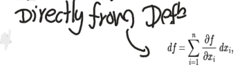
1. 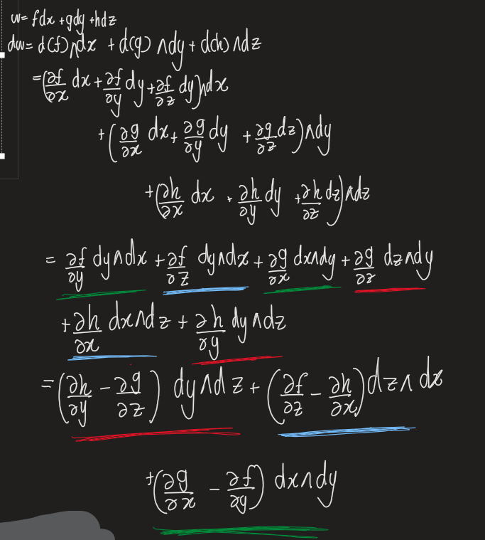
1. 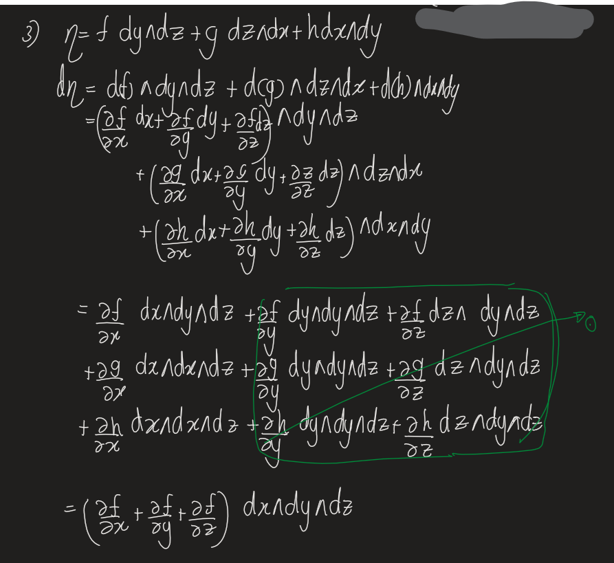
```

```{example}
Let \(f(x,y,z) = y \ln(x) + z\) be a smooth function on  \(U = \{(x,y,z) \in \mathbb{R}^3 \mid x > 0\}.\) 
Its exterior derivative is the one‑form  $df$ on $U$ is 
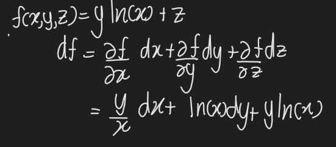
```


```{example}
Let  \(\omega = xy\, dx + (z + y)\, dy + xyz\, dz
\) be a one‑form on \(\mathbb{R}^3\).Its exterior derivative is the two‑form \(d\omega\) on \(\mathbb{R}^3\) given by:

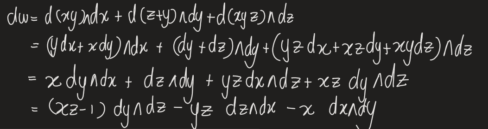

```

```{example,name="Linearity of the Exterior Derivative"}

If \(\omega\) and \(\eta\) are two \(k\)-forms, and \(a, b \in \mathbb{R}\), then  
\[
d(a\omega + b\eta) = a\, d\omega + b\, d\eta.
\]

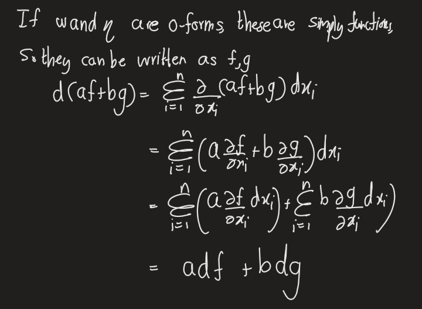
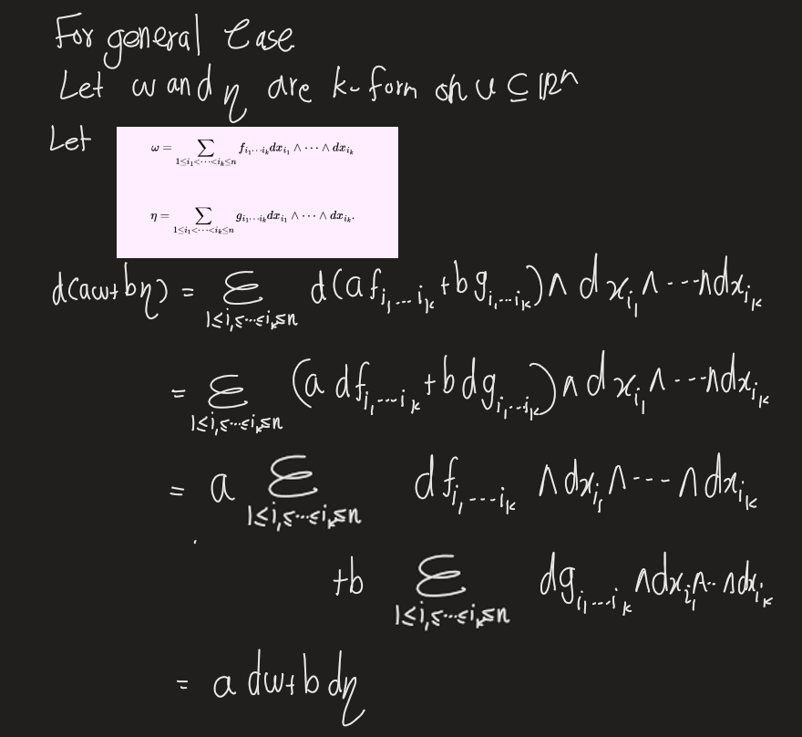

```


### Graded Product Rule

The usual product rule from calculus is  
\[
\frac{d}{dx}(fg)
= \frac{df}{dx}\, g + f\, \frac{dg}{dx}.
\]

```{lemma,name="Graded Product Rule for the Exterior Derivative"}

Let \(\omega\) be a \(k\)-form and \(\eta\) be an \(l\)-form on \(U \subseteq \mathbb{R}^n\). Then  
\[
d(\omega \wedge \eta)
= d(\omega) \wedge \eta
+ (-1)^k\, \omega \wedge d(\eta).
\]

```

```{proof}
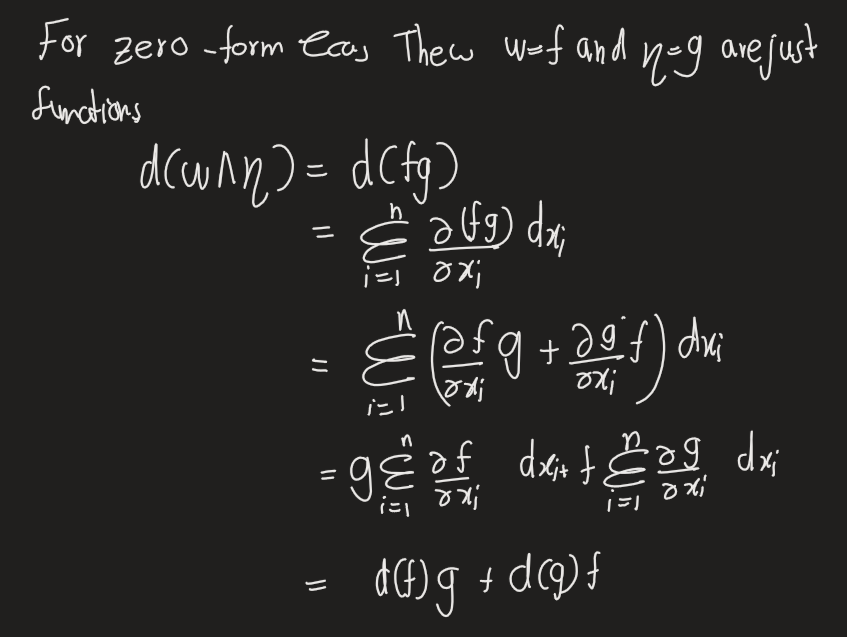

**General Case**
  

Write \(\omega\) and \(\eta\) in local coordinates as
\[
\omega = \sum_{I} f_I\, dx_{i_1} \wedge \cdots \wedge dx_{i_k},
\qquad
\eta = \sum_{J} g_J\, dx_{j_1} \wedge \cdots \wedge dx_{j_l},
\]
where \(I = (i_1 < \cdots < i_k)\), \(J = (j_1 < \cdots < j_l)\), and \(f_I, g_J\) are smooth functions.

Their wedge product is
\[
\omega \wedge \eta
= \sum_{I,J} f_I g_J\,
dx_{i_1} \wedge \cdots \wedge dx_{i_k}
\wedge
dx_{j_1} \wedge \cdots \wedge dx_{j_l}.
\]

Applying the exterior derivative and using linearity,
\[
d(\omega \wedge \eta)
= \sum_{I,J} d(f_I g_J) \wedge
dx_{i_1} \wedge \cdots \wedge dx_{i_k}
\wedge
dx_{j_1} \wedge \cdots \wedge dx_{j_l}.
\]

By the product rule for functions (the 0‑form case you already proved),
\[
d(f_I g_J) = df_I\, g_J + f_I\, dg_J.
\]
Hence
\[
d(\omega \wedge \eta)
= \sum_{I,J} df_I\, g_J \wedge dx_I \wedge dx_J
+ \sum_{I,J} f_I\, dg_J \wedge dx_I \wedge dx_J,
\]
where \(dx_I = dx_{i_1} \wedge \cdots \wedge dx_{i_k}\) and \(dx_J = dx_{j_1} \wedge \cdots \wedge dx_{j_l}\).

For the first sum,
\[
\sum_{I,J} df_I\, g_J \wedge dx_I \wedge dx_J
= \left(\sum_I df_I \wedge dx_I\right)
\wedge
\left(\sum_J g_J dx_J\right)
= d\omega \wedge \eta.
\]

For the second sum, note that \(dg_J\) is a 1‑form and \(dx_I\) is a \(k\)-form, so
\[
dg_J \wedge dx_I = (-1)^k\, dx_I \wedge dg_J.
\]
Thus
\[
\sum_{I,J} f_I\, dg_J \wedge dx_I \wedge dx_J
= (-1)^k \sum_{I,J} f_I\, dx_I \wedge dg_J \wedge dx_J
= (-1)^k\, \omega \wedge d\eta.
\]

Combining both parts,
\[
d(\omega \wedge \eta)
= d\omega \wedge \eta + (-1)^k\, \omega \wedge d\eta,
\]
which proves the lemma. 
```

```{example}
Let \(\omega = xy\,dz\) and \(\eta = (y+z)\,dx + 2\,dy\) be two one-forms on \(\mathbb{R}^3\).
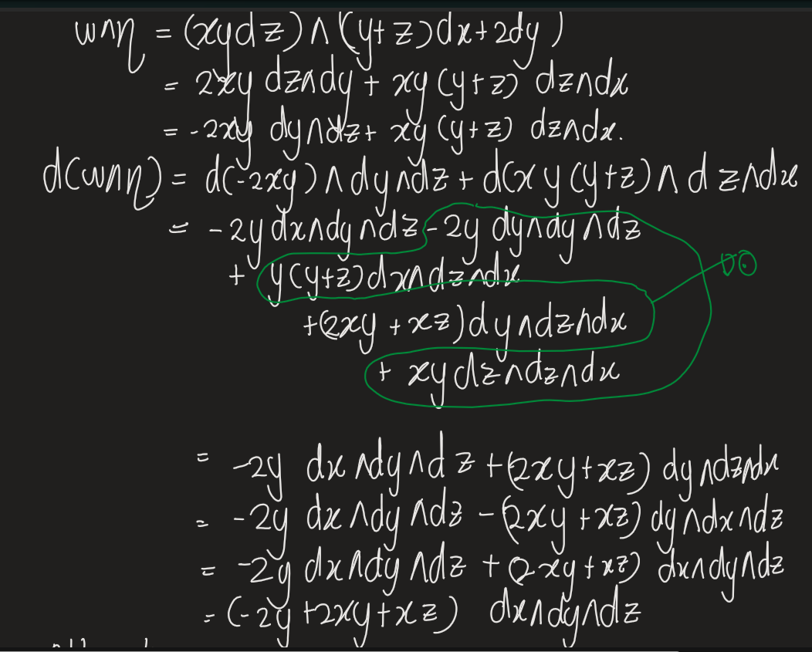
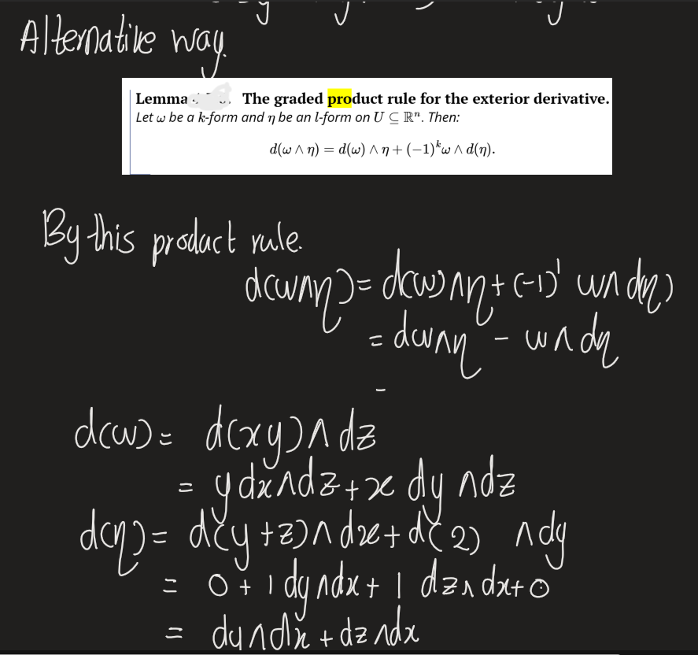
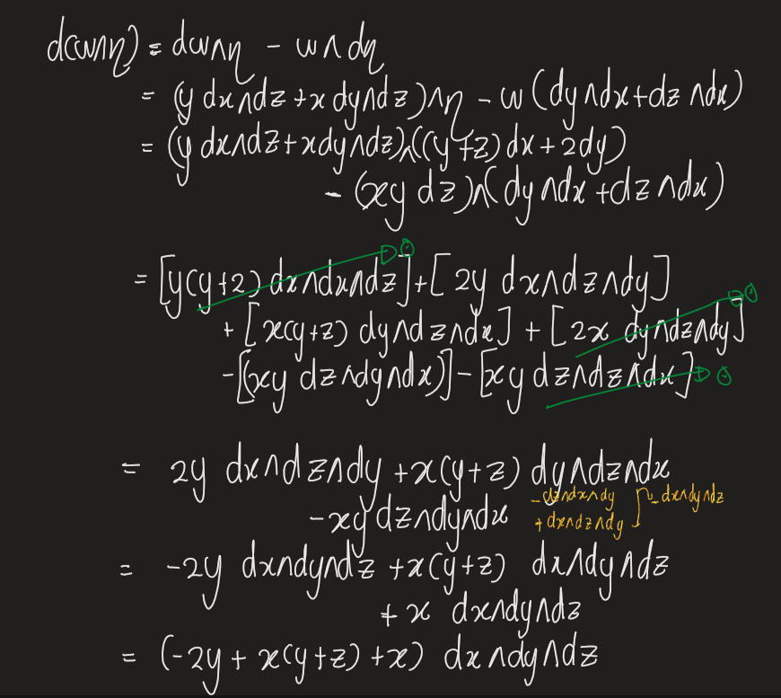
```

```{remark}
**Graded product rule in \(\mathbb{R}^3\)**
  
In \(\mathbb{R}^3\), the graded product rule splits into the following
non-vanishing cases.


- If \(\omega = f\) is a zero-form and \(\eta = g\) is a zero-form, then
    

\[
        d(fg) = d(f)\,g + f\,d(g).
    \]


- If \(\omega = f\) is a zero-form and \(\eta\) is a one-form, then
    

\[
        d(f\eta) = d(f) \wedge \eta + f\, d(\eta).
    \]


- If \(\omega = f\) is a zero-form and \(\eta\) is a two-form, then
    

\[
        d(f\eta) = d(f) \wedge \eta + f\, d(\eta).
    \]


- If \(\omega\) is a one-form and \(\eta\) is a one-form, then
    

\[
        d(\omega \wedge \eta)
        = d(\omega) \wedge \eta - \omega \wedge d(\eta).
    \]
```

```{theorem,name="Property $d^2 = 0$"}
For any differential form $\omega$: 
$$d(d\omega) = d^2\omega = 0$$
```

```{proof}
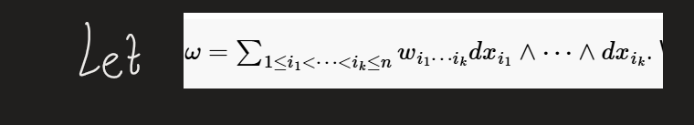
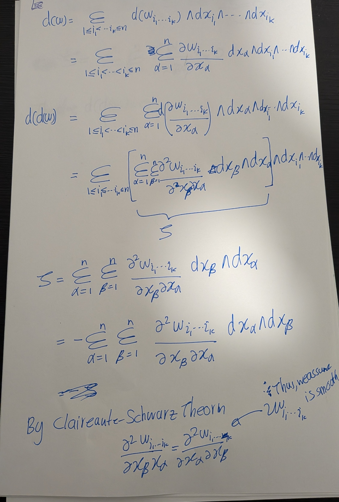
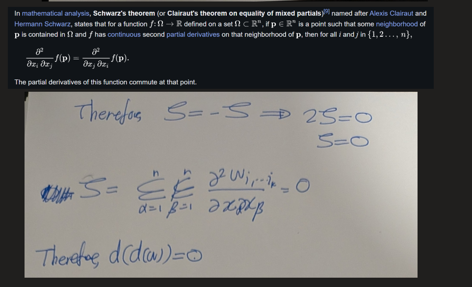
```

```{example}
Let \(\omega = xy\,dx + \frac{y}{x}\,dy + \frac{z}{x}\,dz\) on \(U = \{(x,y,z) \in \mathbb{R}^3 \mid x \neq 0\}\). Find the two-form \(d\omega\) and write your result in standard form. What is the vector field associated to \(d\omega\)?
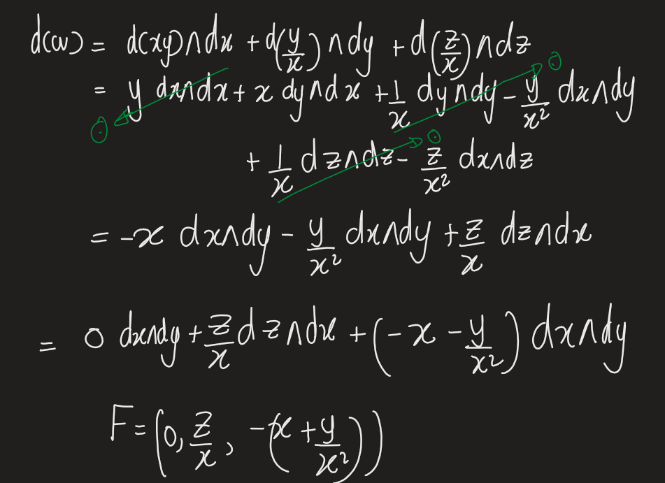
```

```{example}
Find the three-form dw if $w =xyz(dy \wedge  dz+dz \wedge  dx + dx \wedge dy)$, and write 
your result in standard form. 
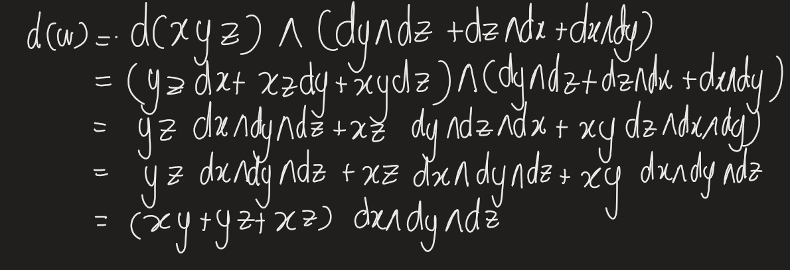
```

```{example}
Let $\omega = x e^{y}\, dx + z\, dy + y e^{x}\, dz.$ Show by explicit calculation that $d^{2}\omega = 0$


**Solution**: We know that \(d^{2}\omega = 0\) for any differential form \(\omega\). But let us verify this directly for the given one-form.

We first compute the two-form \(d\omega\):


\[
d\omega 
= d(xe^{y}) \wedge dx + dz \wedge dy + d(ye^{x}) \wedge dz.
\]


Compute each term:


\[
d(xe^{y}) = e^{y}\, dx + x e^{y}\, dy,
\qquad
d(ye^{x}) = e^{x}\, dy + y e^{x}\, dx.
\]


Thus,


\[
\begin{aligned}
d\omega
&= (e^{y}\, dx + x e^{y}\, dy)\wedge dx 
    + dz \wedge dy
    + (e^{x}\, dy + y e^{x}\, dx)\wedge dz \\[6pt]
&= x e^{y}\, dy \wedge dx 
    + dz \wedge dy
    + y e^{x}\, dx \wedge dz
    + e^{x}\, dy \wedge dz.
\end{aligned}
\]


Reordering wedge products:


\[
d\omega
= (e^{x} - 1)\, dy \wedge dz
  - y e^{x}\, dz \wedge dx
  - x e^{y}\, dx \wedge dy.
\]


Now compute the three-form \(d^{2}\omega = d(d\omega)\):


\[
d^{2}\omega
= d(e^{x} - 1)\wedge dy \wedge dz
  - d(ye^{x})\wedge dz \wedge dx
  - d(xe^{y})\wedge dx \wedge dy.
\]


Compute derivatives:


\[
d(e^{x}-1) = e^{x}\, dx,
\qquad
d(ye^{x}) = e^{x}\, dy + y e^{x}\, dx,
\qquad
d(xe^{y}) = e^{y}\, dx + x e^{y}\, dy.
\]


Substitute:


\[
\begin{aligned}
d^{2}\omega
&= e^{x}\, dx \wedge dy \wedge dz
   - (e^{x}\, dy + y e^{x}\, dx)\wedge dz \wedge dx \\
&\quad - (e^{y}\, dx + x e^{y}\, dy)\wedge dx \wedge dy.
\end{aligned}
\]


All terms containing repeated wedge factors vanish, leaving:


\[
d^{2}\omega
= (e^{x} - e^{x})\, dx \wedge dy \wedge dz
= 0.
\]


Thus, \(d^{2}\omega = 0,\) as expected.
```

```{example}
Let  \(\omega = (x^{2} - y^{2})\, dx + y\, dz,
\qquad \eta = (x^{2} + y^{2})\, dy + y\, dz.\)


Show by explicit calculation that  


\[
d(\omega \wedge \eta) = d\omega \wedge \eta - \omega \wedge d\eta,
\]
which is consistent with the graded product rule since \(\omega\) is a one‑form.
```

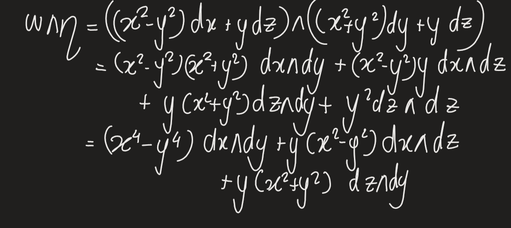
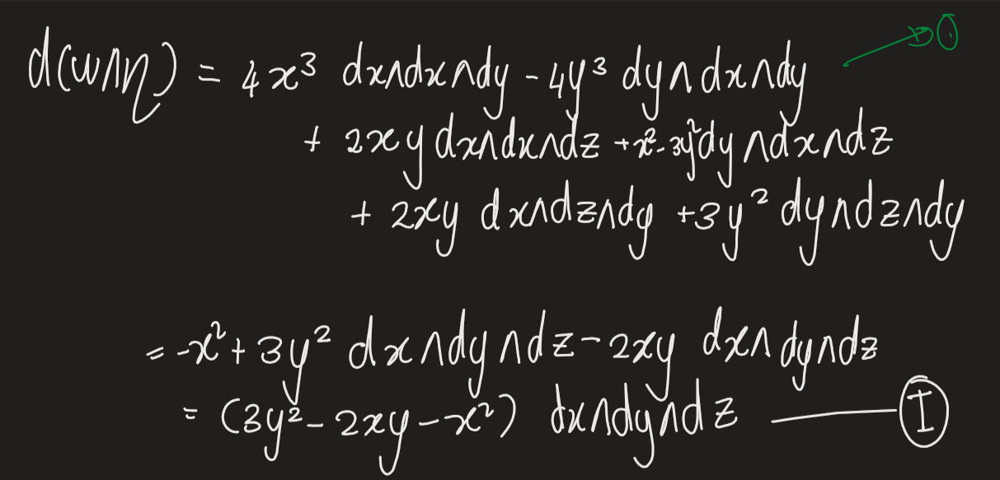
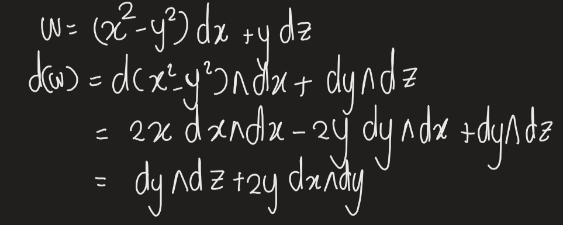
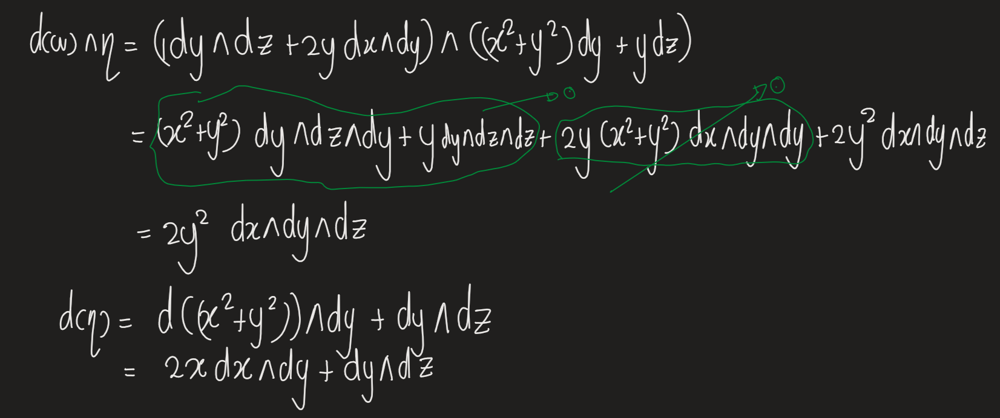
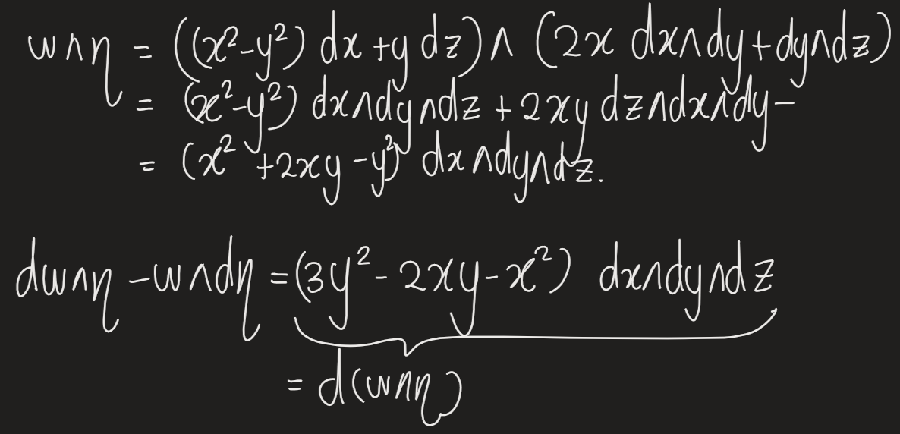


```{example}
Let \(\omega = (x + y)\, dx + xy\, dy\)
be a one‑form on \(\mathbb{R}^2\), and let  
\(\varphi(u, v) = \big(e^{u+v},\, e^{u-v}\big)\) be a smooth map \(\varphi : \mathbb{R}^2 \to \mathbb{R}^2\).  

Find the two‑form \(d(\varphi^{*}\omega).\)

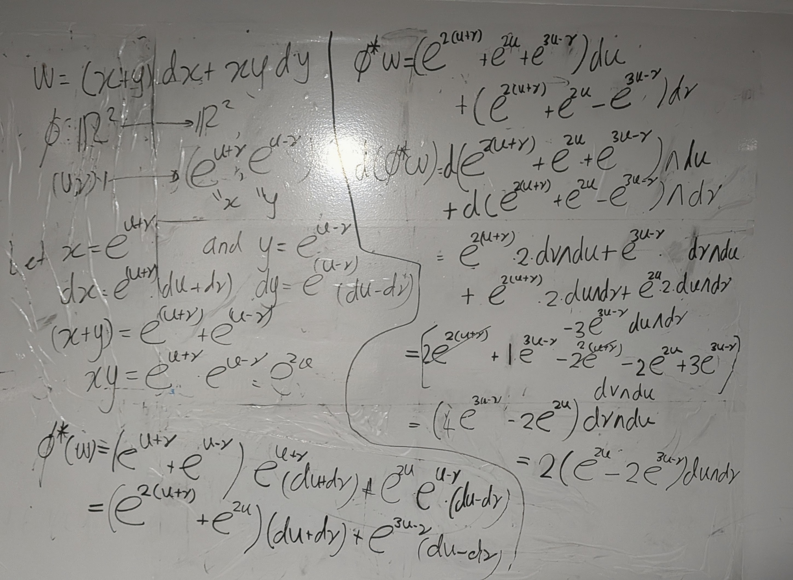
```

```{example} 
Let $\omega$ be a *$k$*-form, η an *m*-form, and $\lambda$ an *$l$*-form on \(U \subseteq \mathbb{R}^n\).  Show that

\[
d(\omega \wedge \eta \wedge \lambda)
= d\omega \wedge \eta \wedge \lambda
  + (-1)^{k}\, \omega \wedge d\eta \wedge \lambda
  + (-1)^{k+m}\, \omega \wedge \eta \wedge d\lambda.
\]

This is the graded Leibniz rule for the exterior derivative applied to a triple wedge product.

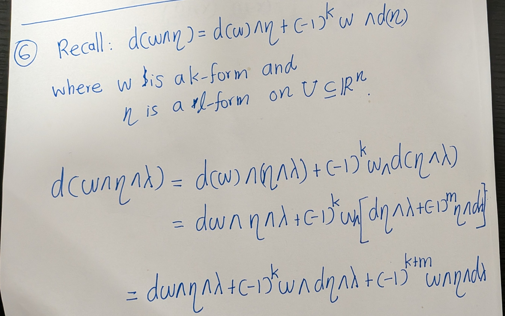
```


```{example}
Let \(f, g : U \to \mathbb{R}\) be smooth functions with \(U \subseteq \mathbb{R}^n\), and let \(\alpha : [a,b] \to \mathbb{R}^n\) be a parametric curve whose image lies in \(U\).  
Using the product rule for the exterior derivative \(d(fg)\), show that

\[\int_{\alpha} f\, dg= f(\alpha(b))\, g(\alpha(b))  - f(\alpha(a))\, g(\alpha(a))  - \int_{\alpha} g\, df.\]

This identity is the natural generalization of integration by parts to line integrals of one‑forms.  When the curve is an interval in \(\mathbb{R}\), it reduces to the usual integration‑by‑parts formula.

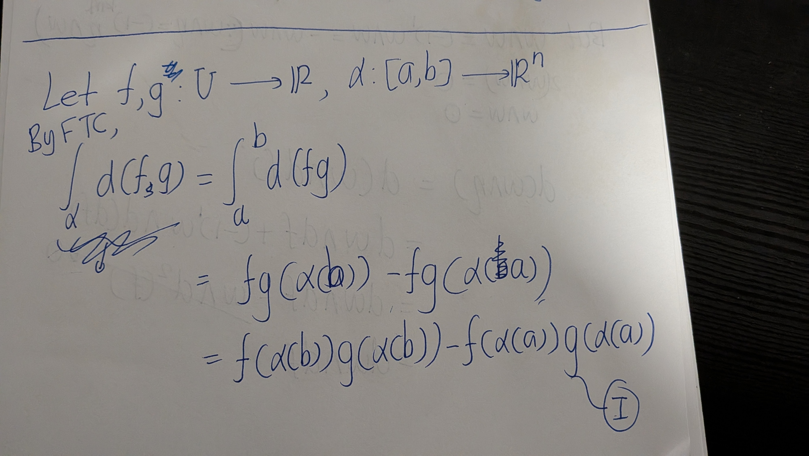
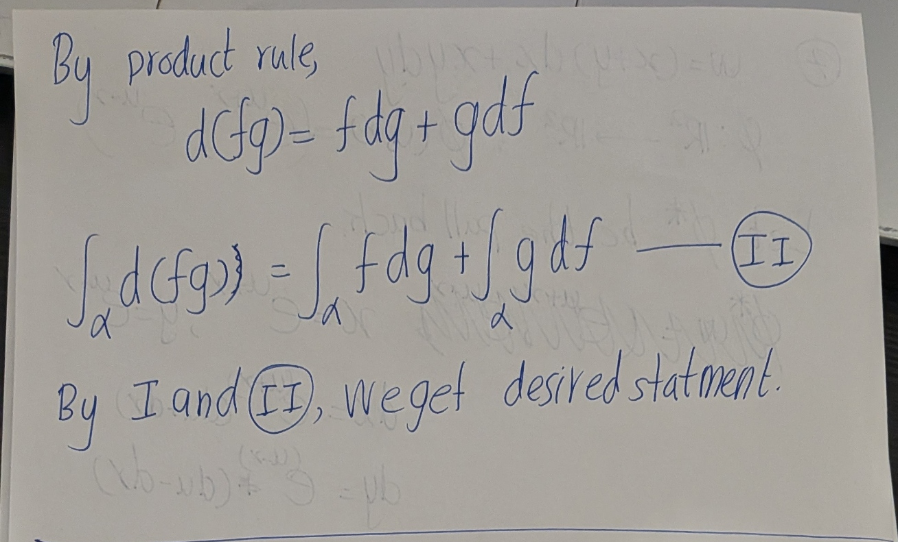
```

```{example}
Let \(\omega\) and \(\eta\) be one‑forms that differ by the exterior derivative of a \(0\)-form, i.e. \(\eta = \omega + df\) for some smooth function \(f\).  Show that 
\(d(\omega \wedge \eta) = d\omega \wedge df.\)
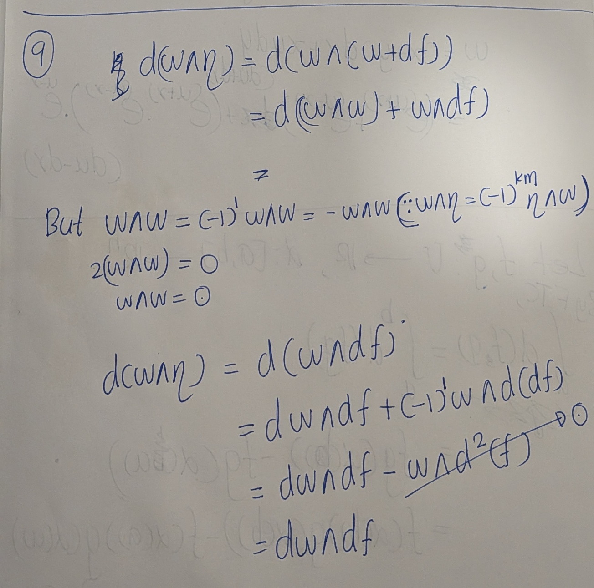
```


### Grad, Curl, and Div Connection

```{definition,name="Gradient"}
For a $0$-form $f$:
$$df = \frac{\partial f}{\partial x}dx + \frac{\partial f}{\partial y}dy + \frac{\partial f}{\partial z}dz \quad \longleftrightarrow \quad \nabla f = \left(\frac{\partial f}{\partial x}, \frac{\partial f}{\partial y}, \frac{\partial f}{\partial z}\right)$$
```

```{definition,name="Curl"}
For a $1$-form $\omega = f_1\,dx + f_2\,dy + f_3\,dz$, the $2$-form $d\omega$ corresponds to $\nabla \times \mathbf{F}$:


$$d\omega = \left(\frac{\partial f_3}{\partial y} - \frac{\partial f_2}{\partial z}\right)dy \wedge dz + \left(\frac{\partial f_1}{\partial z} - \frac{\partial f_3}{\partial x}\right)dz \wedge dx + \left(\frac{\partial f_2}{\partial x} - \frac{\partial f_1}{\partial y}\right)dx \wedge dy$$
```


```{definition,name="Divergence"}
For a $2$-form $\eta = f_1\,dy \wedge dz + f_2\,dz \wedge dx + f_3\,dx \wedge dy$, the $3$-form $d\eta$ corresponds to $\nabla \cdot \mathbf{F}$:


$$d\eta = \left(\frac{\partial f_1}{\partial x} + \frac{\partial f_2}{\partial y} + \frac{\partial f_3}{\partial z}\right)dx \wedge dy \wedge dz$$

```

```{example,name="Maxwell’s equations"}

Here you can write whatever explanation, derivation, or equations you want.


\begin{align}
\nabla \cdot \mathbf{E} &= \frac{\rho}{\varepsilon_0}, \\[6pt]
\nabla \cdot \mathbf{B} &= 0, \\[12pt]
\nabla \times \mathbf{E} &= -\,\frac{\partial \mathbf{B}}{\partial t}, \\[6pt]
\nabla \times \mathbf{B} &= \mu_0 \mathbf{J} + \mu_0 \varepsilon_0\, \frac{\partial \mathbf{E}}{\partial t}.
\end{align}

where 

- **\(\mathbf{E}\)** — electric field  
- **\(\mathbf{B}\)** — magnetic field  
- **\(\rho\)** — charge density (charge per unit volume)  
- **\(\mathbf{J}\)** — current density (current per unit area)  
- **\(\varepsilon_0\)** — permittivity of free space  
- **\(\mu_0\)** — permeability of free space  
- **\(\nabla \cdot\)** — divergence operator  
- **\(\nabla \times\)** — curl operator  
- **\(\frac{\partial}{\partial t}\)** — time derivative  


*I'm not intersetted in physics staff so I slip*

```


**Dictionary between the exterior derivative in \(\mathbb{R}^3\) and vector calculus concepts.**

| Differential form concept            | Vector calculus concept            |
|-------------------------------------|------------------------------------|
| \(d\) of a 0‑form \(df\)            | gradient \(\nabla f\)              |
| \(d\) of a 1‑form \(d\omega\)       | curl \(\nabla \times \mathbf{F}\)  |
| \(d\) of a 2‑form \(d\eta\)         | divergence \(\nabla \cdot \mathbf{F}\) |


```{lemma,name="Vector calculus identities"}
Let \(f, g\) be smooth functions on \(U \subseteq \mathbb{R}^3\), and let  
\(\mathbf{F}, \mathbf{G}\) be smooth vector fields on \(U\).  
Then the following identities hold:

1. 

\[
   \nabla(fg) = (\nabla f)\, g + f\, (\nabla g).
   \]


2. 

\[
   \nabla \times (f\mathbf{F})
   = (\nabla f) \times \mathbf{F}
     + f\, (\nabla \times \mathbf{F}).
   \]


3. 

\[
   \nabla \cdot (f\mathbf{F})
   = (\nabla f) \cdot \mathbf{F}
     + f\, (\nabla \cdot \mathbf{F}).
   \]


4. 

\[
   \nabla \cdot (\mathbf{F} \times \mathbf{G})
   = (\nabla \times \mathbf{F}) \cdot \mathbf{G}
     - \mathbf{F} \cdot (\nabla \times \mathbf{G}).
   \]


```

```{proof}
Omitted
```


## The Hodge Star Operator

```{definition,name="Hodge Star Dual"}
Let $\omega = dx_{i_1} \wedge \dots \wedge dx_{i_k}$ be a basic $k$-form on $\mathbb{R}^n$. The **Hodge star dual** $*\omega$ is the unique basic $(n-k)$-form satisfying:


$$\omega \wedge *\omega = dx_1 \wedge \dots \wedge dx_n$$


Extended linearly, for a general $k$-form $\eta = \sum f_{i_1 \dots i_k} dx_{i_1} \wedge \dots \wedge dx_{i_k}$:


$$*\eta = \sum f_{i_1 \dots i_k} *(dx_{i_1} \wedge \dots \wedge dx_{i_k})$$
```

```{example,name="The action of the Hodge star in R"}
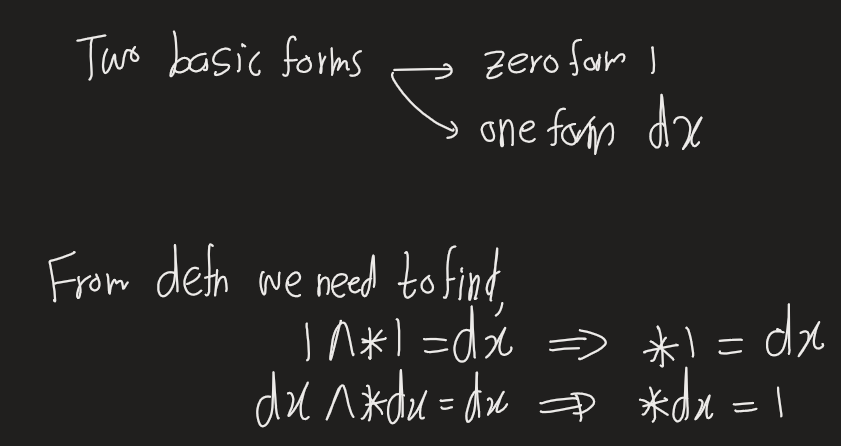
```

```{example,name="The action of the Hodge star in R^2"}
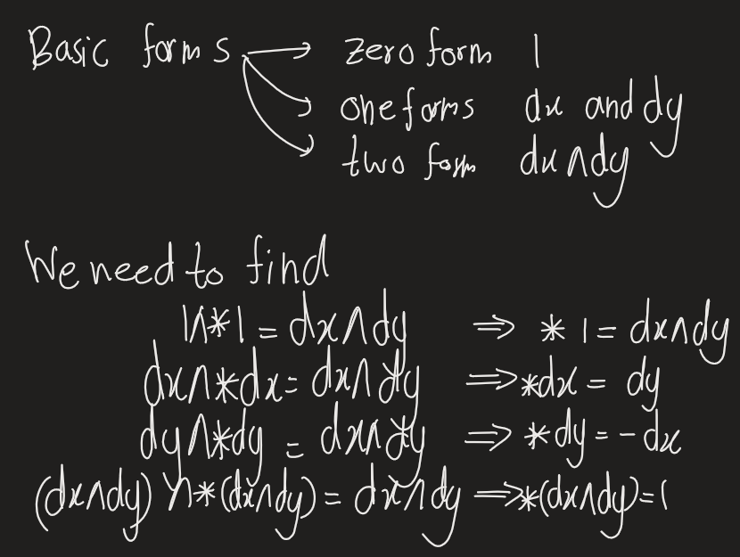
```

```{example,name="The action of the Hodge star in R^3"}
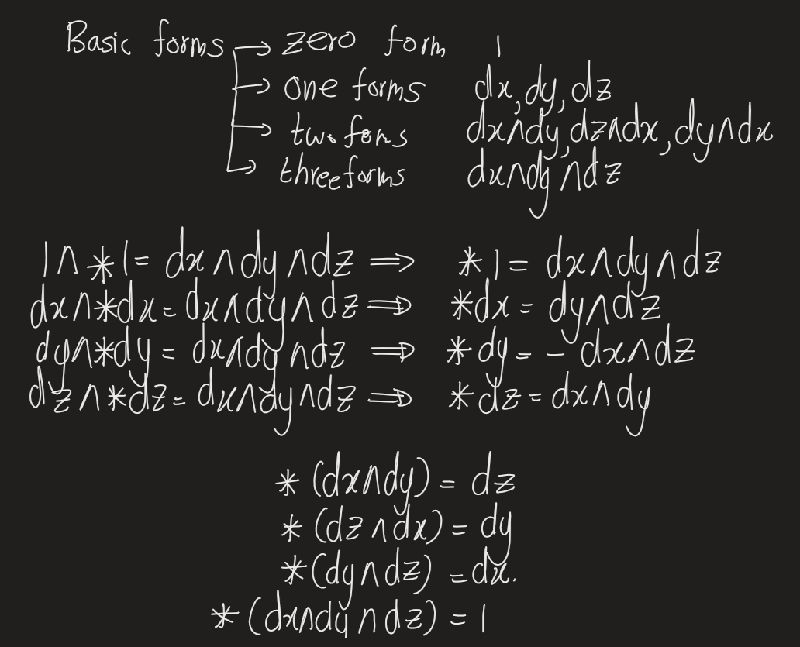
```

```{example,name="An example the Hodge star in R^3"}
Consider the two‑form  \(\omega = xyz\, dy \wedge dz \;+\; e^{x}\, dx \wedge dy.\) Find Its Hodge star dual is the one‑form.
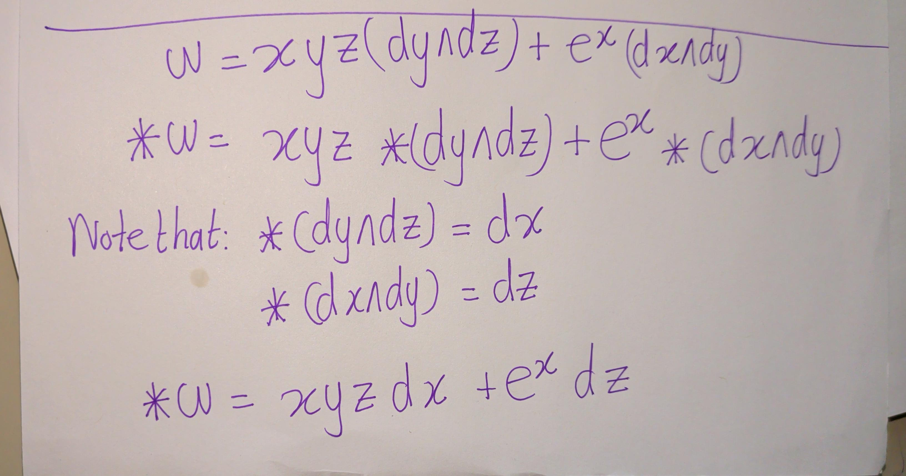
```

```{example,name="Another example the Hodge star in R^3"}
Let $w = fdx+gdy+h dz$ be a one form on $\mathbb{R}^3$. Find Its Hodge star dual is the one‑form.

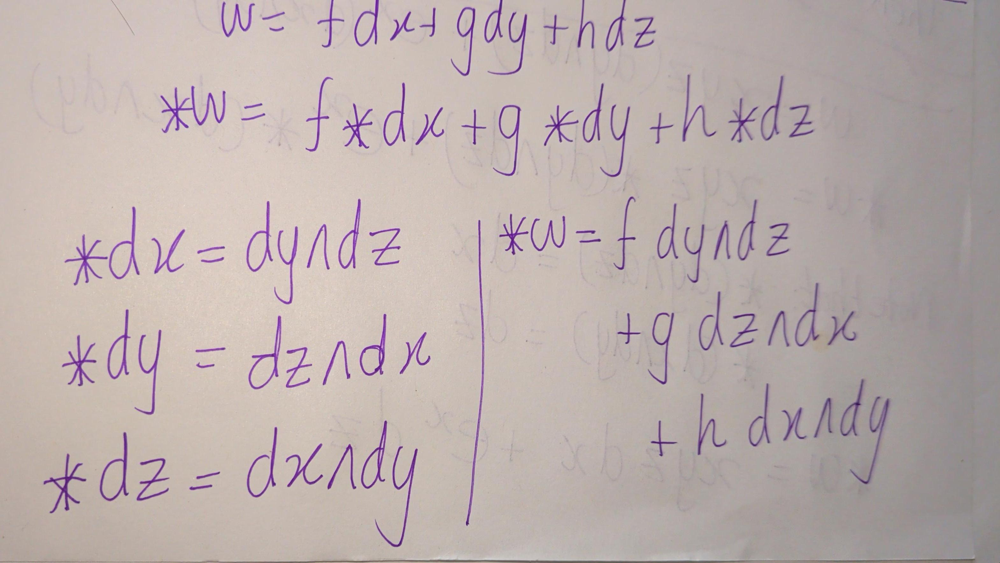
```

```{example}
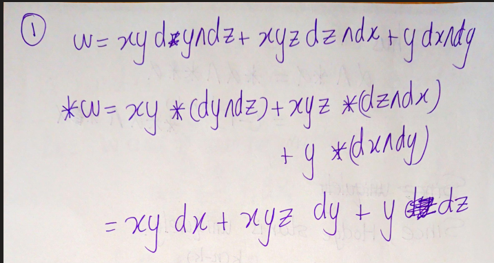
```

```{proposition}
On $k$-forms in $\mathbb{R}^n$, applying the Hodge star twice yields:

$$**\alpha = (-1)^{k(n-k)} \alpha$$
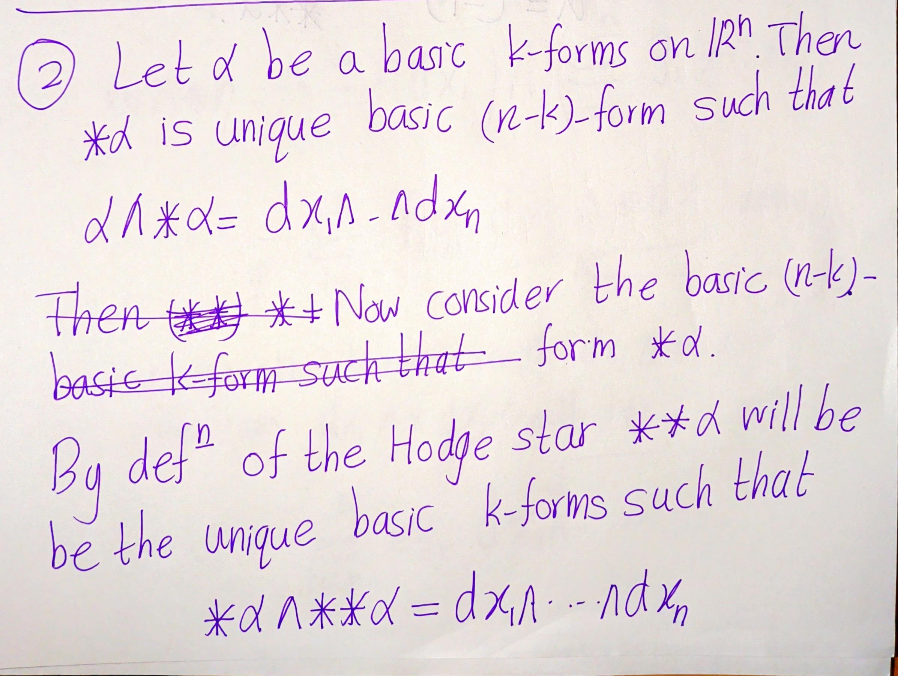
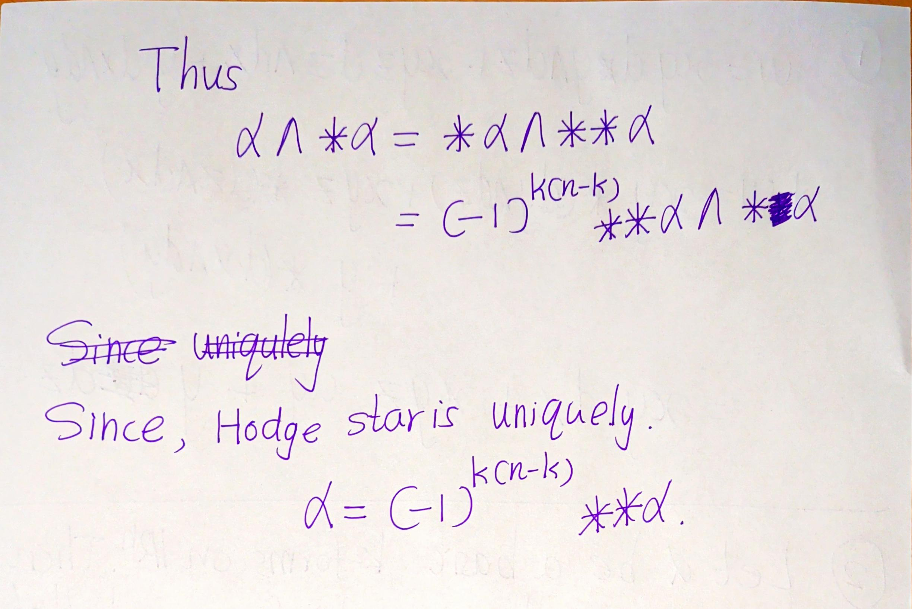
```


```{example}
Let \(\omega\) and \(\eta\) be one‑forms on \(\mathbb{R}^n\), and let  \(\mathbf{F}\) and \(\mathbf{G}\) be the associated vector fields.  Show that
\[\star(\omega \wedge \star \eta) = \mathbf{F} \cdot \mathbf{G}.\]

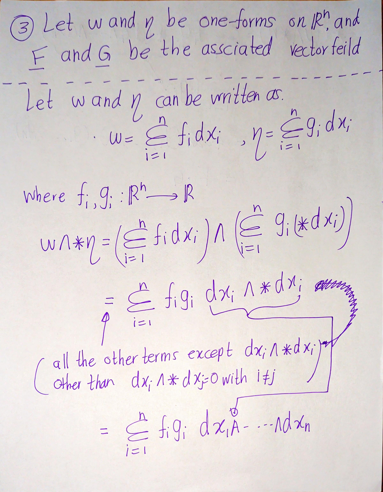
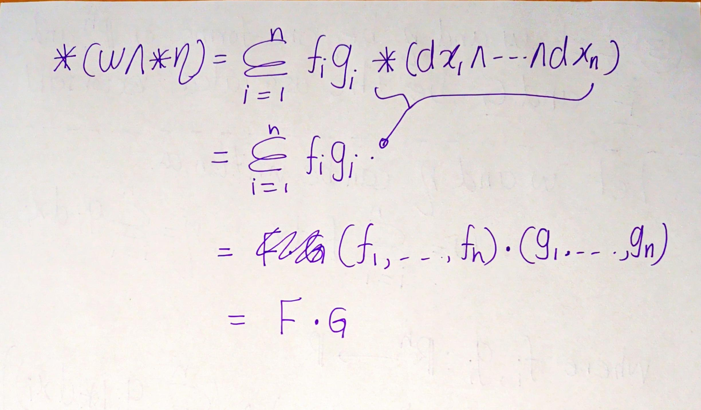
```


```{example}
Let \(\omega\) and \(\eta\) be \(k\)-forms on \(\mathbb{R}^n\).  Show that 
\[\omega \wedge \star \eta = (-1)^{k(n-k)}\, \star \omega \wedge \eta.\]

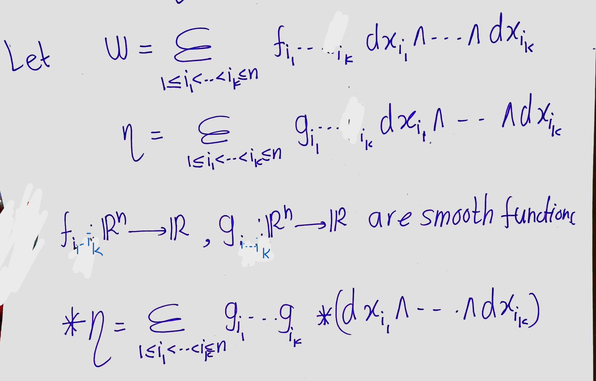
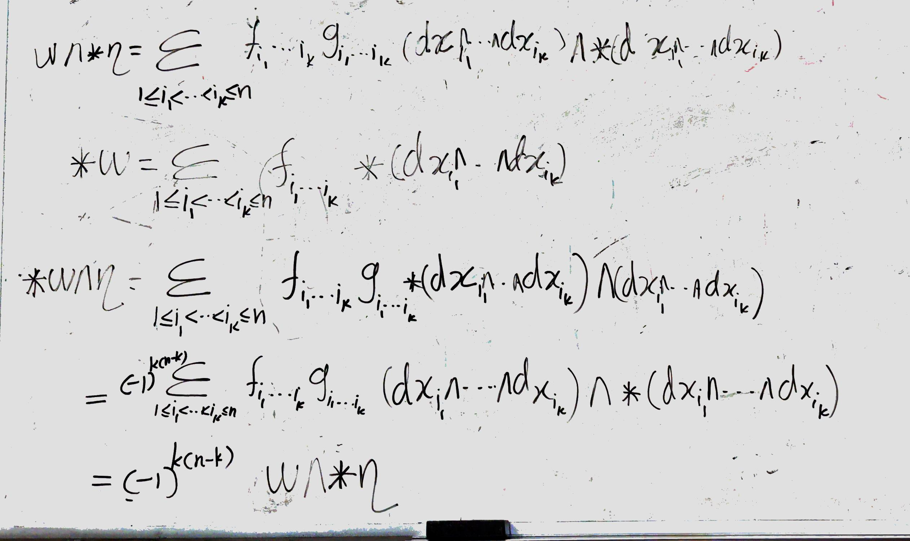
```

As a summary,
Let \(M\) be a Riemann surface.

| General (real coordinates)        | Complex coordinates                     | Comparison / relations |
|----------------------------------|------------------------------------------|-------------------------|
| **0‑forms**                      | Function                                 | —                       |
| **1‑forms**                      | \(f\,dx + g\,dy\)                        | \(u(z)\,dz + v(z)\,d\bar{z}\) |
|                                  |                                          | \(dz = dx + i\,dy,\quad d\bar{z} = dx - i\,dy\) |
|                                  |                                          | \(f = u + v,\quad g = i(u - v)\) |
| **2‑forms**                      | \(f\, dx \wedge dy\)                     | \(g(z)\, dz \wedge d\bar{z}\) |
|                                  |                                          | \(dz \wedge d\bar{z} = -2i\, dx \wedge dy\) |


## Integration, Chains, and Stokes' Theorem

Recall chains in  Manifolds For that I need Triangulation. 
Wikipedia says, *In mathematics, triangulation describes the replacement of topological spaces with simplicial complexes by the choice of an appropriate homeomorphism. A space that admits such a homeomorphism is called a triangulable space. Triangulations can also be used to define a piecewise linear structure for a space, if one exists. Triangulation has various applications both in and outside of mathematics, for instance in algebraic topology, in complex analysis, and in modeling.*

<div>
<div style="text-align: center;">


<p><em>Source: Wikipedia</em></p>
</div>
</div>


### Simplices and Chains

<table>
<tr>
<td style="width:40%; vertical-align:top;">


<p><em>Source: Wikipedia</em></p>

</td>

<td style="width:60%; vertical-align:top;">

* **0‑simplex:** Point \(P\).  
* **1‑simplex:** Directed segment \(\langle P_1, P_2 \rangle\).  
* **2‑simplex:** Oriented triangle \(\langle P_1, P_2, P_3 \rangle\).

An \(n\)-chain \(c\) is a formal integer linear combination of \(n\)-simplices:


\[
c = \sum_i m_i \sigma_i, \qquad m_i \in \mathbb{Z}.
\]


</td>
</tr>
</table>

### Geometric simplices

Take \(p_0, \ldots, p_n\) as \(n+1\) affinely independent points in \(\mathbb{R}^n\).  
This means the vectors  \(p_1 - p_0,\; p_2 - p_0,\; \ldots,\; p_n - p_0
\) are linearly independent.

The **simplex determined by** these points is the set


\[
\Delta
= \left\{
\sum_{i=0}^{n} t_i p_i
\;\middle|\;
t_i \in [0,1],\;
\sum_{i=0}^{n} t_i = 1
\right\}.
\]


By definition, \(\Delta\) has dimension \(n\).

The points \(p_0, \ldots, p_n\) are its **vertices**, and the simplices formed by any \(n\) of these vertices are its **faces**.  
The **boundary** \(\partial \Delta\) is the union of all faces. 
The **standard \(n\)-simplex** is the simplex generated by the unit vectors \(e_0, e_1, \ldots, e_n. \)

---

To understand chain I had to go back Holmoloygy classes

###  Homology Groups

In a triangulation of a manifold, the triangles are called **two‑simplices**,  
the edges are **one‑simplices**,  
and the vertices are **zero‑simplices**.

Orientation on the manifold induces orientation on each triangle and on each edge.  
An edge receives **opposite orientations** from the two triangles that share it.

Let the vertices be labeled \(P_1, P_2, P_3, \ldots\).  We write

- \(\langle P_1, P_2 \rangle\) for the **oriented edge** from \(P_1\) to \(P_2\),
- \(\langle P_1, P_2, P_3 \rangle\) for the **oriented triangle** bounded by    \(\langle P_1, P_2 \rangle\), \(\langle P_2, P_3 \rangle\), \(\langle P_3, P_1 \rangle\).

Reversing orientation changes the sign:


\[
\langle P_1, P_2, P_3 \rangle = -\,\langle P_3, P_2, P_1 \rangle,
\qquad
\langle P_1, P_2 \rangle = -\,\langle P_2, P_1 \rangle.
\]

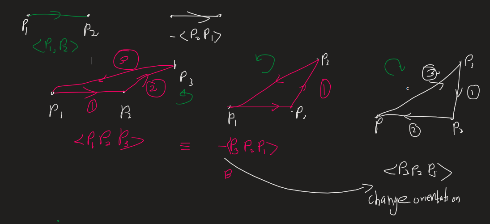
For a simplicial complex \(X\), the group \(C_n(X)\) of \(n\)-chains is


\[
C_n(X)
= \left\{
\sum_i m_i \sigma_i \;\middle|\; m_i \in \mathbb{Z}
\right\},
\]


where each \(\sigma_i\) is a singular \(n\)-simplex of \(X\).  
An element of \(C_n(X)\) need not form a connected simplicial complex.

An \(n\)-chain is a formal integer linear combination of oriented \(n\)-simplices.

Any \(n\)-chain \(c \in C_n(X)\) can be written uniquely as a finite sum


\[
c = \sum_i a_i \sigma_i,
\]


where:

- \(a_i \in \mathbb{Z}\) are the integer coefficients,
- \(\sigma_i\) are the \(n\)-simplices  
  (points for \(n=0\), directed edges for \(n=1\), triangles for \(n=2\), tetrahedra for \(n=3\)),
- and \(a_i = 0\) for all but finitely many indices.

{width=50%}

Now let's see some concreate examples.

```{example}
<table>
<tr>
<th>k</th>
<th>simplices</th>
<th>chains</th>
</tr>

<!-- k = 0 -->
<tr>
<td>0</td>
<td>
<strong>0-simplex</strong><br>
Just points (A, B, C)<br>
Discrete locations<br>
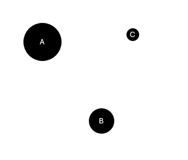
</td>
<td>
<strong>0-chains</strong><br>
\(c_0 = k_1A + k_2B + k_3C,\; k_i \in \mathbb{Z}\)<br>
\(c_0 = 3A - 2B + 1C\)
</td>
</tr>

<!-- k = 1 -->
<tr>
<td>1</td>
<td>
<strong>1-simplex</strong><br>
Directed segments<br>
\(\sigma_1 = A \to B\)<br>
\(\sigma_2 = B \to C\)<br>
\(\sigma_3 = C \to A\)<br>
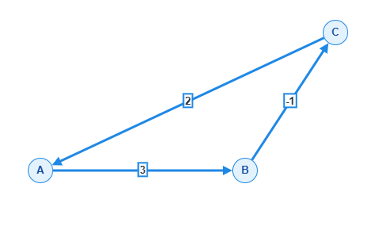
</td>
<td>
<strong>1-chains</strong><br>
\(c_1 = k_1\sigma_1 + k_2\sigma_2 + k_3\sigma_3,\; k_i \in \mathbb{Z}\)<br>
\(c_1 = 3\sigma_1 - 1\sigma_2 + 2\sigma_3\)
</td>
</tr>

<!-- k = 2 -->
<tr>
<td>2</td>
<td>
<strong>2-simplex</strong><br>
\(\tau_1\): triangle (A, B, C), CCW oriented<br>
\(\tau_2\): triangle (A, C, D), CCW oriented<br>
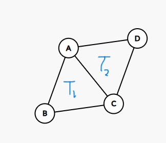
</td>
<td>
<strong>2-chains</strong><br>
\(c_2 = k_1\tau_1 + k_2\tau_2,\; k_i \in \mathbb{Z}\)<br>
\(c_2 = 1\tau_1 + 3\tau_2\)<br>
<ul>
<li>1τ₁: one layer of the first triangular patch</li>
<li>3τ₂: triple layer of the second triangular patch</li>
</ul>
</td>
</tr>

<!-- k = 3 -->
<tr>
<td>3</td>
<td>
<strong>3-simplex</strong><br>
A cube in \(\mathbb{R}^3\) triangulated into six tetrahedra<br>
\(\Delta_1, \Delta_2, \ldots, \Delta_6\)<br>
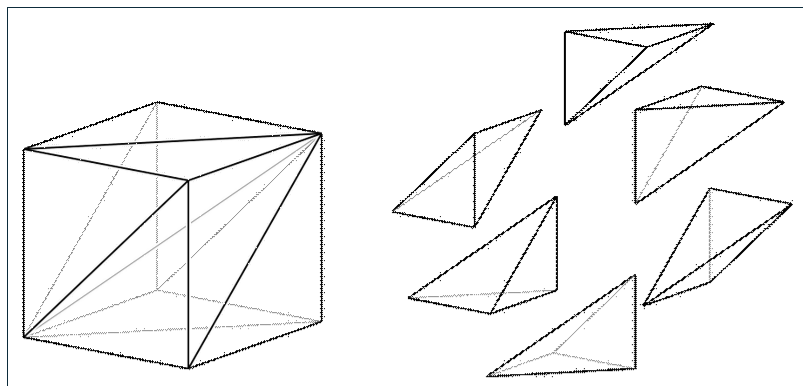
</td>
<td>
<strong>3-chains</strong><br>
\(c_3 = 1\Delta_1 + 1\Delta_2 + 1\Delta_3 + 1\Delta_4 + 1\Delta_5 + 1\Delta_6\)<br>
If we write:<br>
\(c_3 = 2\Delta_1 - 5\Delta_2\)<br>
it means:<br>
<ul>
<li>count Δ₁ twice</li>
<li>count Δ₂ five times with reversed orientation</li>
</ul>
</td>
</tr>

</table>

```

```{definition,name="Boundary operator"}

\[
\delta(\langle P_0, \ldots, P_n \rangle)
=
\begin{cases}
0, 
& n = 0, \\[6pt]
\langle P_2 \rangle - \langle P_1 \rangle,
& n = 1,\ \text{where } \langle P_1, P_2 \rangle, \\[10pt]
\langle P_2, P_3 \rangle
- \langle P_1, P_3 \rangle
+ \langle P_1, P_2 \rangle,
& n = 2,\ \text{where } \langle P_1, P_2, P_3 \rangle.
\end{cases}
\]

In general


\[
\delta(\langle P_0, \ldots, P_n \rangle)
=
\sum_{i=0}^{n}
(-1)^i
\langle P_0, \ldots, \widehat{P_i}, \ldots, P_n \rangle,
\]

```
 Chains and the Boundary Map

The collection of \(n\)-chains forms an abelian group under addition, and the
boundary operator


\[
\delta : C_n \longrightarrow C_{n-1}
\]


is a group homomorphism.  
We denote the group of \(n\)-chains by \(C_n\).  
(For \(n > 2\), one typically has \(C_n = \{0\}\) in a 2‑dimensional manifold.)

---

Integrating 0‑forms over 0‑chains

A 0‑form is simply a function, and it can be evaluated on 0‑chains (finite sums of points).  
For a 0‑chain


\[
\sum_{\alpha} n_\alpha P_\alpha,
\qquad n_\alpha \in \mathbb{Z},
\]


the integral of a function \(f\) over this chain is


\[
\sum_{\alpha} n_\alpha\, f(P_\alpha).
\]


---

Integrating 1‑forms over 1‑chains

A 1‑form \(\omega\) can be integrated over 1‑chains, which are finite unions of oriented paths.  
If a path \(c : [0,1] \to M\) lies inside a coordinate chart \(z = x + iy\), and


\[
\omega = f(x,y)\,dx + g(x,y)\,dy,
\]


then the integral along \(c\) is


\[
\int_c \omega
= \int_0^1 \left[
f(x(t),y(t))\,\frac{dx}{dt}
+ g(x(t),y(t))\,\frac{dy}{dt}
\right] dt.
\]


---

Integrating 2‑forms over 2‑chains

A 2‑form \(\Omega\) can be integrated over 2‑chains.  
If \(D\) lies in a coordinate chart and


\[
\Omega = f(x,y)\, dx \wedge dy,
\]


then


\[
\iint_D \Omega
= \iint_D f(x,y)\, dx \wedge dy.
\]


This definition extends naturally to arbitrary 2‑chains.


#### Summary

**Integration of differential forms over chains**

| Dim(n) | Geometric n‑Chain (Domain) | Differential n‑Form (Integrand) | “Integral” | Geometric Meaning |
|-------|-----------------------------|----------------------------------|------------|-------------------|
| **0** | Points: \(\sum n_\alpha P_\alpha\) | Function \(f(x,y)\) | \(\sum n_\alpha f(P_\alpha)\) | Evaluating a function at weighted points. |
| **1** | Paths / curves: \(c(t) = (x(t), y(t))\) | \(1\)-form \(\omega = f\,dx + g\,dy\) | \(\displaystyle \int_0^1 \big( f(x(t),y(t))\,\frac{dx}{dt} + g(x(t),y(t))\,\frac{dy}{dt} \big)\, dt\) | Line integral (circulation, work along a path). |
| **2** | Regions / surfaces \(D\) | \(2\)-form \(\Omega = f(x,y)\, dx \wedge dy\) | \(\displaystyle \iint_D f(x,y)\, dx \wedge dy\) | Double integral (signed area, flux over a region). |
| **3** | Volumes / 3‑chains (e.g., tetrahedra filling a region) | \(3\)-form \(\Phi = f(x,y,z)\, dx \wedge dy \wedge dz\) | \(\displaystyle \iiint_{V} f(x,y,z)\, dx \wedge dy \wedge dz\) | Triple integral (volume, mass, flux through a 3‑dimensional region). |


### Stoke Theorem

<div style="display: flex; align-items: center; gap: 20px;">

<div style="flex: 1;">
<strong>Theorem (Generalized Stokes' Theorem):</strong><br>
If $\omega$ is a $C^1$ $k$-form and $D$ is a $(k+1)$-chain, then


\[
\int_{\partial D} \omega = \int_D d\omega.
\]


</div>

<div style="flex: 1; text-align: center;">
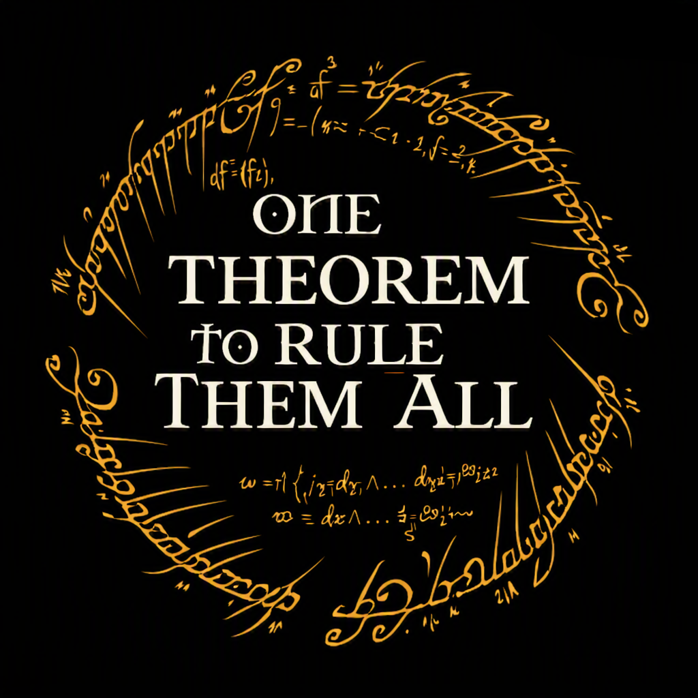
</div>

</div>

- **k=0**  This is trivial (This is very similar to Fundamental therom of calculus)

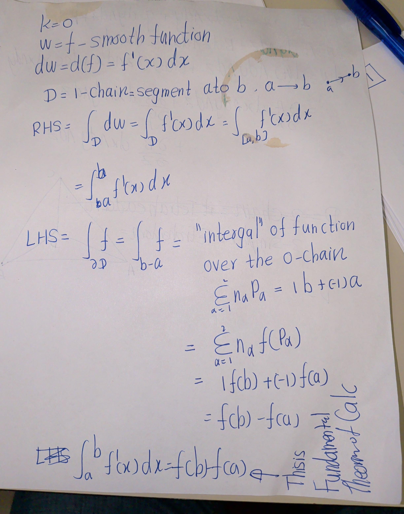

- **k=1** 
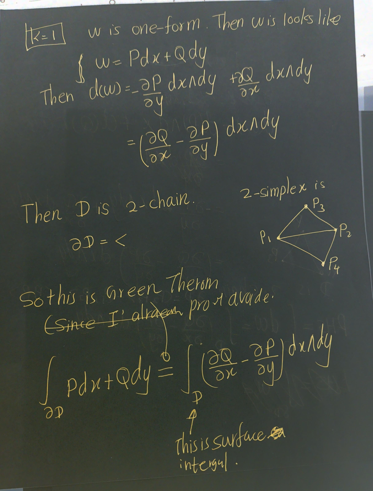
- **k=2**


## Complex Operators and Harmonic Forms

On a Riemann surface with complex coordinate $z = x + iy$:


$$
\begin{aligned} 
\partial f &= f_z\,dz = \frac{1}{2}(f_x - i f_y)\,dz \\ \bar{\partial} f &= f_{\bar{z}}\,d\bar{z} = \frac{1}{2}(f_x + i f_y)\,d\bar{z}
\end{aligned}
$$


The exterior derivative decomposes as $d = \partial + \bar{\partial}$.

```{definition,name="Laplacian and Harmonic Forms"}
The Laplacian of a function $f$ is:

$$\Delta f = (f_{xx} + f_{yy})\,dx \wedge dy = -2i\,\partial \bar{\partial} f$$

A $1$-form $\omega$ is **harmonic** if it is locally given by $df$ where $\Delta f = 0$.
```


```{proposition}
A differential form $\omega$ is harmonic if and only if it is both **closed** ($d\omega = 0$) and **co-closed** ($d*\omega = 0$).
```