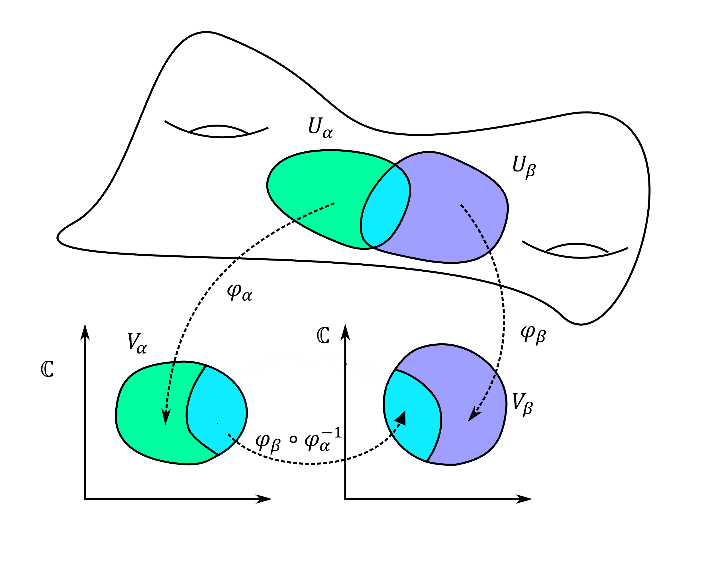
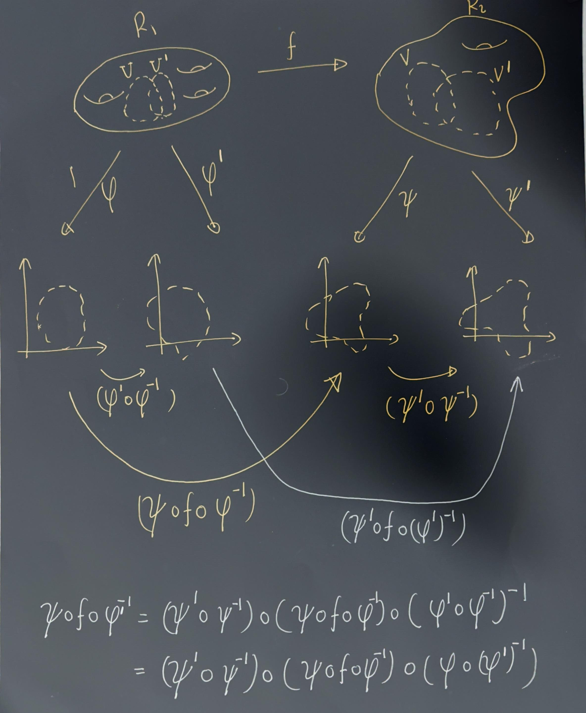
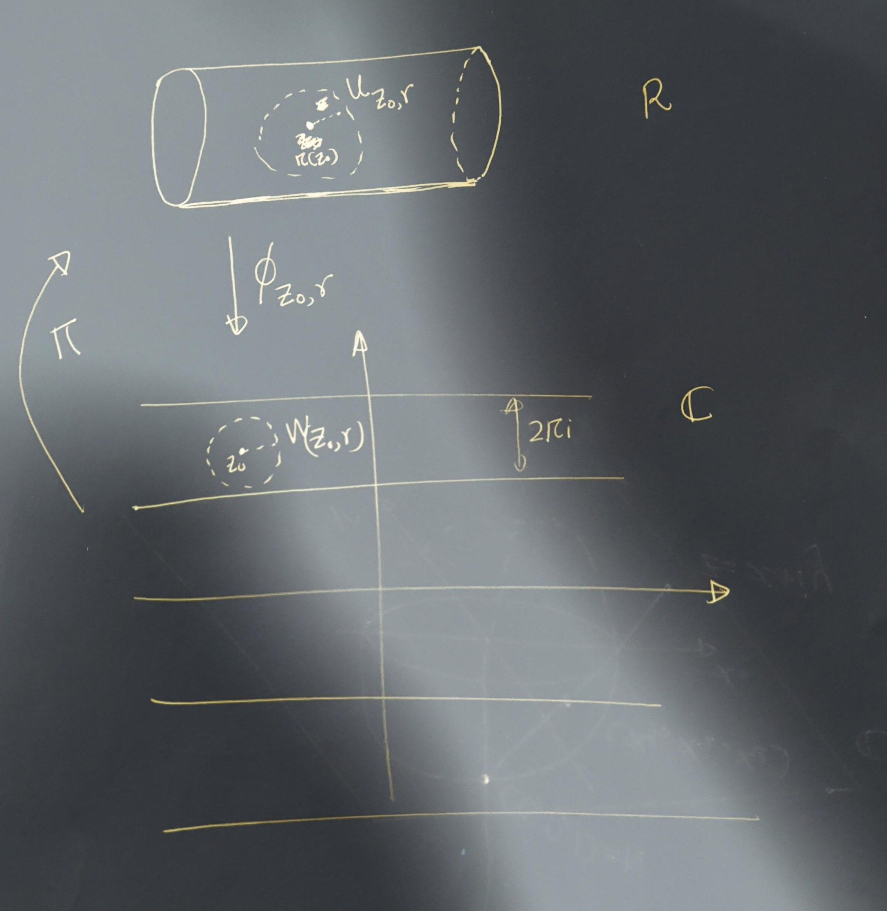

# Riemann Surfaces. 
```{definition,name="Riemann surface"}
A **Riemann surface** is a second‑countable, Hausdorff topological space \(X\) equipped with a **complex atlas**  \(\mathcal{A} = \{(U_\alpha, \varphi_\alpha)\}\) satisfying the following properties:

1. Each \(U_\alpha \subseteq X\) is open.

2. Each map  \(   \varphi_\alpha : U_\alpha \to V_\alpha   \)
   is a homeomorphism onto an open set \(V_\alpha \subseteq \mathbb{C}\).

3. The collection \(\{U_\alpha\}\) covers \(X\).

4. For every pair of charts \((U_\alpha, \varphi_\alpha)\) and \((U_\beta, \varphi_\beta)\) with  \(   U_\alpha \cap U_\beta \neq \varnothing,\)
   the **transition map**
   \[
   \varphi_\beta \circ \varphi_\alpha^{-1} :
   \varphi_\alpha(U_\alpha \cap U_\beta) \longrightarrow
   \varphi_\beta(U_\alpha \cap U_\beta)
   \]
   is a **biholomorphism**.


```




```{remark}
**Terminology**: 
  -"holomorphic functions"  are functions which are complex differentiable on an open set in the complex plane. 
  -A "biholomorphic map" is a holomorphic bijection whose inverse is holomorphic.
```


```{definition}
Let \(R_1\) and \(R_2\) be Riemann surfaces. A map  \(f : R_1 \to R_2\)
is said to be **holomorphic** if for every pair of charts \((U, \varphi) \quad \text{on } R_1, \qquad (V, \psi) \quad \text{on } R_2,\) the map  \(\psi \circ f \circ \varphi^{-1}\) is holomorphic on its domain (which may be empty).
```

Suppose \((U, \varphi)\), \((U', \varphi')\) are charts on \(R_1\), and \((V, \psi)\), \((V', \psi')\) are charts on \(R_2\). On the overlap where all maps are defined, we have:

- the transition maps   \(  \varphi' \circ \varphi^{-1},\psi' \circ \psi^{-1}  \) are **biholomorphisms** (by condition (5) in the definition of a complex atlas)
- therefore  
  \[
  \psi' \circ f \circ (\varphi')^{-1}
  = (\psi' \circ \psi^{-1}) 
    \circ (\psi \circ f \circ \varphi^{-1}) 
    \circ (\varphi \circ (\varphi')^{-1})
  \]   is holomorphic if and only if \(\psi \circ f \circ \varphi^{-1}\) is holomorphic.

Thus the notion of holomorphicity does **not** depend on the choice of charts.
```



```{exercise}
Assume that for all \( p \in R_1 \) there is a chart \((U,\phi)\) such that \( p \in U \) and a chart \((V,\psi)\) such that \( f(p) \in V \), so that \(\psi \circ f \circ \phi^{-1}\) is holomorphic (in the standard sense, as a complex analytic function on an open subset of the plane). Show that \( f \) is holomorphic.
```


**Solution**:I will update it later.

```{example}
Define the equivalence relation on \(\mathbb{C}\) by  \(z \sim w \quad \text{if and only if} \quad z = w + 2\pi i n \quad \text{for some } n \in \mathbb{Z}.\) Let  \(R = \mathbb{C}/\!\sim\) as a topological space, with projection map  \(\pi : \mathbb{C} \to R.\)

We will define an atlas on \(R\) which will make it a Riemann surface.
Define  \(W_{z_0,r} = \{\, z \in \mathbb{C} : |z - z_0| < r \,\}.\) Restrict to \(r < \pi\) (for convenience). Let  \(U_{z_0,r} = \pi(W_{z_0,r}).\)

Let  \(
\varphi_{z_0,r} : U_{z_0,r} \to W_{z_0,r}\)
be the unique right inverse of \(\pi\) on \(U_{z_0,r}\) with image \(W_{z_0,r}\).
<center>
{width=50%}
</center>
```

```{exercise}
Show that for any \(p \in W\) and any \(q \in W\), the map  \(\sigma(q) - \sigma(p) : U \longrightarrow \mathbb{C}\) is a **translation**, and in particular holomorphic.
```

## The Riemann sphere


As a set, the **Riemann sphere** is  \(\widehat{\mathbb{C}} = \mathbb{C} \cup \{\infty\}.\) To make this into a Riemann surface, we must specify a **topology** and an **atlas**.


A basis for the topology consists of:

1. Sets of the form  \(   U \subset \mathbb{C},\)
   where \(U\) is open in \(\mathbb{C}\) and \(\infty \notin U\).

2. Sets of the form  \(\{\infty\} \cup (\mathbb{C} \setminus K),
   \) where \(K \subset \mathbb{C}\) is compact.

Equivalently, a set \(V \subset \widehat{\mathbb{C}}\) is open iff:

- If \(p \in \mathbb{C}\), then there exists an open set \(U \subset \mathbb{C}\) with  \(p \in U \subset V.\)

- If \(p = \infty\), then there exists a compact \(K \subset \mathbb{C}\) such that  \(  \{\infty\} \cup (\mathbb{C} \setminus K) \subset V.
  \)

```{exercise}
Show that \(\widehat{\mathbb{C}}\) is compact.
```

We define an atlas consisting of two charts:


\[
U_1 = \widehat{\mathbb{C}} \setminus \{\infty\}, \qquad 
\varphi_1(z) = z.
\]
\[
U_2 = \widehat{\mathbb{C}} \setminus \{0\}, \qquad 
\varphi_2(z) = \frac{1}{z}.
\]

The first chart and its inverse are clearly continuous.

To see that \(\varphi_2\) is continuous, note that it maps  \(U_1 \cap U_2 = \widehat{\mathbb{C}} \setminus \{0,\infty\}\) bijectively onto \(\mathbb{C} \setminus \{0\}\).


The overlap maps are:
\[
\varphi_2 \circ \varphi_1^{-1}(z) = \frac{1}{z}, \qquad
\varphi_1 \circ \varphi_2^{-1}(w) = \frac{1}{w}.
\]

These are biholomorphic, since the inverse of \(z \mapsto 1/z\) is again \(z \mapsto 1/z\).

Thus, this defines a valid atlas, and the resulting Riemann surface is the **Riemann sphere**.

### Stereographic Projection and the Metric

We identify the Riemann sphere with the unit sphere \(S^2 = \{(x_1,x_2,x_3) \in \mathbb{R}^3 : x_1^2 + x_2^2 + x_3^2 = 1\}.\) Think of \(\mathbb{C}\) as the plane \((x_1,y_1,0)\). Given \(z = x + iy \in \mathbb{C}\), draw the line from the north pole \((0,0,1)\) to \((x,y,0)\).  
This intersects the sphere at:
<div style="display: flex; justify-content: space-between; align-items: flex-start;">

<div style="width: 48%;">


\[
\begin{align*}
x_1 &= \frac{2x}{|z|^2+1}
     = \frac{2x}{x^2 + y^2 + 1},\\
x_2 &= \frac{2y}{|z|^2+1}
     = \frac{2y}{x^2 + y^2 + 1},\\
x_3 &= \frac{|z|^2-1}{|z|^2+1}
     = \frac{x^2 + y^2 - 1}{x^2 + y^2 + 1}.
\end{align*}
\]


</div>

<div style="width: 48%; text-align: center;">


</div>

</div>

Define
\[
\sigma : S^2 \to \widehat{\mathbb{C}}
\]
by
\[
\sigma(x_1,x_2,x_3) =
\begin{cases}
\dfrac{x_1}{1 - x_3} + i\,\dfrac{x_2}{1 - x_3}, & (x_1,x_2,x_3) \neq (0,0,1), \\[1em]
\infty, & (x_1,x_2,x_3) = (0,0,1).
\end{cases}
\]


\[
\sigma^{-1}(z) =
\begin{cases}
\left(
\dfrac{2\Re z}{|z|^2 + 1},
\dfrac{2\Im z}{|z|^2 + 1},
\dfrac{|z|^2 - 1}{|z|^2 + 1}
\right), & z \in \mathbb{C}, \\[1em]
(0,0,1), & z = \infty.
\end{cases}
\]


The spherical (or chordal) metric is:
\[
d_{\widehat{\mathbb{C}}}(z,w)|
= \frac{2|z-w|}{\sqrt{(1+|z|^2)(1+|w|^2)}},
\]
with the natural extension when one point is \(\infty\).


