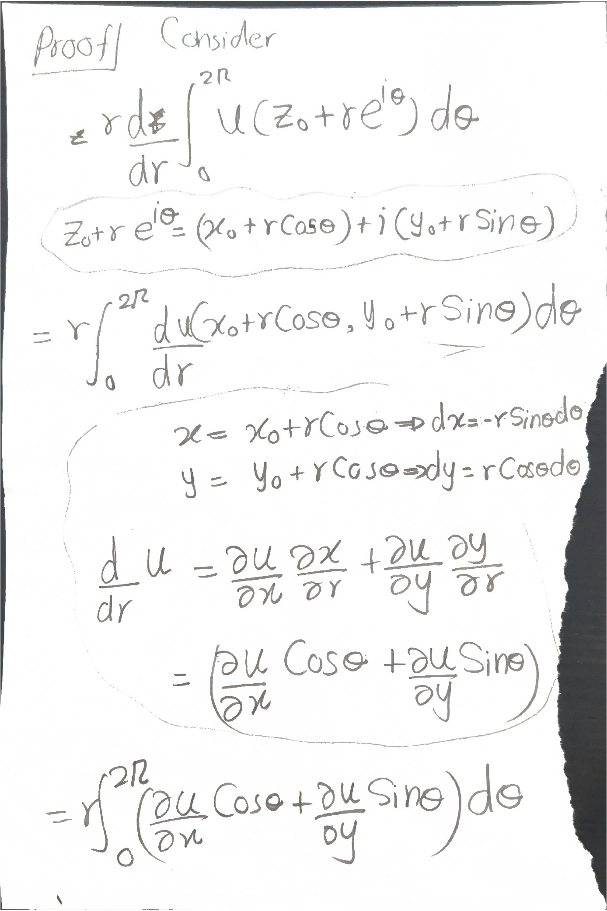
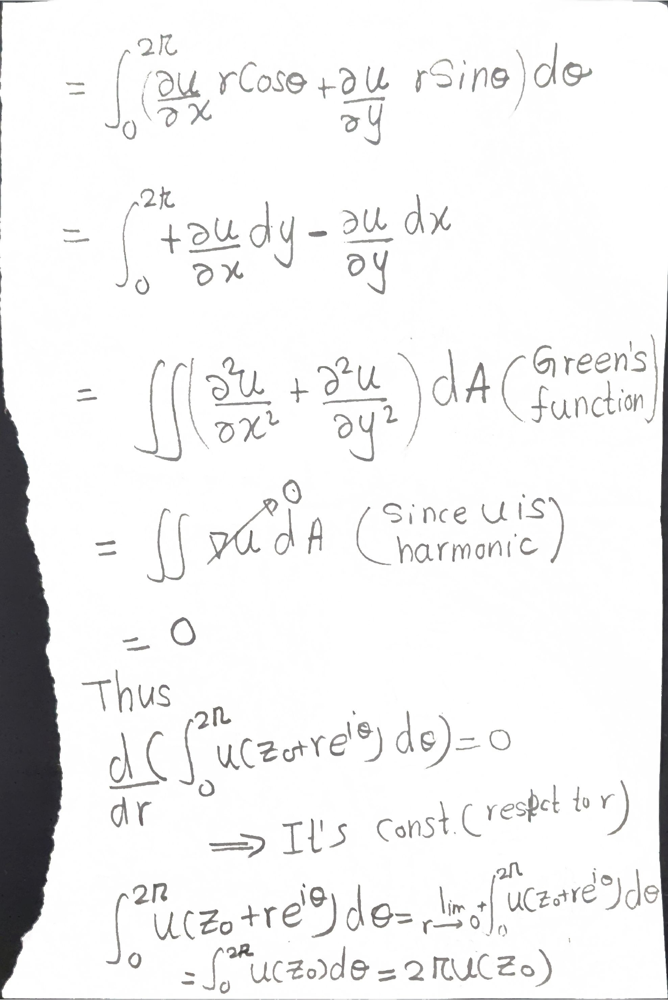
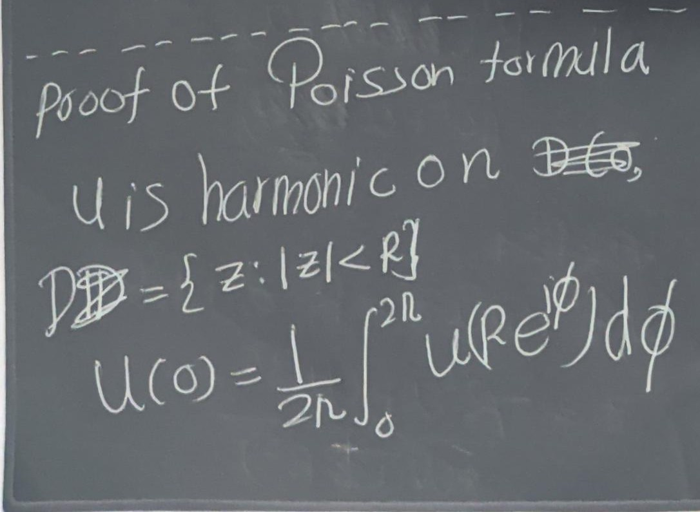
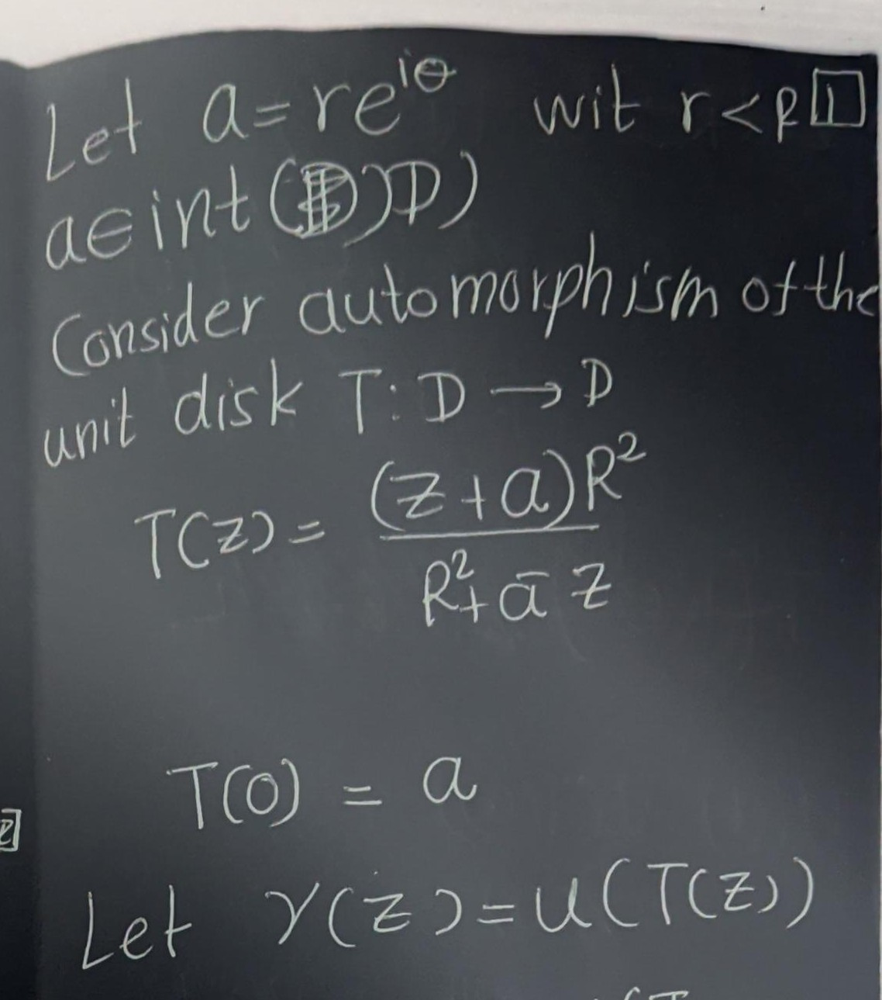
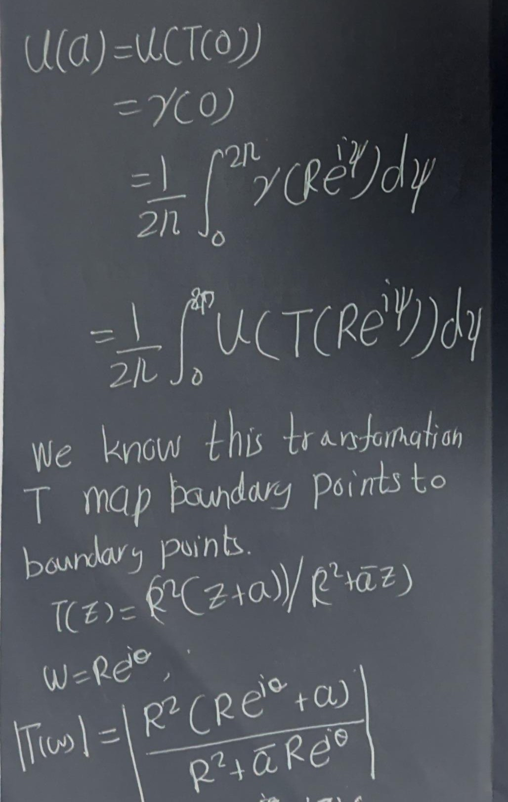
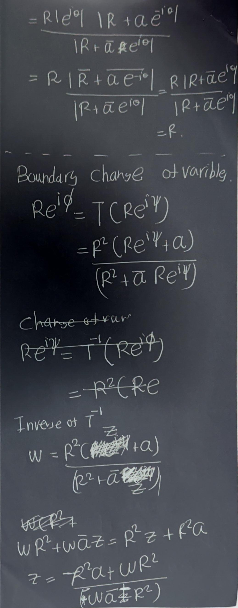

# Univalent Functions

## Basic Principles

### Recalling stuff that we already know?

```{definition}
- A *domain* = open connected subset of $\mathbb{C}$. 
- *Simply connected* is defined via the complement being connected (rather than "no holes" or "every loop contractible"  these are equivalent for domains in $\mathbb{C}$, but the complement-in-$\hat{\mathbb{C}}$ characterization is the cleanest one to work with). 
- A **neighborhood of a set $E \subset \mathbb{C}$** is an open set which contains $E$.
- A **compact Set** is a *closed* and *bounded* subset of \( \mathbb{C} \).
- The **closure** \( \overline{E} \) of a set \( E \subset \mathbb{C} \) is the smallest closed set that contains \( E \). Equivalently, \(   \overline{E} = E \cup \{\text{limit points of } E\}.\)
- The**Interior** \( E^\circ \) of a set \( E \) is the largest open set contained in \( E \).  It may happen that \( E^\circ = \varnothing \).
- The **boundary**  of \( E \) is the set  \(   \partial E = \overline{E} - E^\circ,   \) consisting of all points in the closure of \( E \) that are not interior points.


```

*Notation*: The unit disk $\mathbb{D} = \{|z|<1\}$ and its boundary circle $\mathbb{T}= \{|z|=1\}$.


```{definition}

- An **Arc** in the complex plane is the continuous image of a line segment.  
   Formally, an arc is a continuous mapping $z = \varphi(t)$     of an interval $a \le t \le b$ into $\mathbb{C}$.
- A **Rectifiable Arc** is an arc that has a finite length — that is, the mapping function $\varphi$ is of *bounded variation*.
- A **Jordan Arc** is an arc without self-intersections.
- A **Closed Curve** is the continuous image of a circle, or equivalently, an arc whose endpoints coincide.
- A **Simple Closed Curve (Jordan Curve)** is a closed curve without ```
   
```{r, animated-arc, message=FALSE, warning=FALSE, eval=knitr::is_html_output(), fig.align="center",echo=FALSE}
library(plotly)

# 1. Define the parameters and range for t
t_max <- 4 * pi
steps <- 100
t_vals <- seq(0, t_max, length.out = steps)

# 2. Build a cumulative dataset
# To show the path "drawing", frame 5 needs to contain points 1 through 5, etc.
df_list <- lapply(seq_along(t_vals), function(i) {
  t_sub <- t_vals[1:i]
  data.frame(
    x = 0.1 * t_sub * cos(t_sub),  # Define your curve's real part
    y = 0.1 * t_sub * sin(t_sub),  # Define your curve's imaginary part
    frame = i                      # The current step of the slider
  )
})
animated_data <- do.call(rbind, df_list)

# 3. Create the interactive Plotly graphic
plot_ly(data = animated_data, x = ~x, y = ~y, frame = ~frame,
        type = 'scatter', mode = 'lines+markers',
        line = list(color = '#1f77b4', width = 3),
        marker = list(color = '#d62728', size = 4)) %>%
  layout(
    title = "Dynamic Visualization of an Arc",
    xaxis = list(title = "Re(z)", range = c(-1.5, 1.5)),
    yaxis = list(title = "Im(z)", range = c(-1.5, 1.5), scaleanchor = "x", scaleratio = 1),
    showlegend = FALSE
  ) %>%
  animation_opts(
    frame = 40,        # Speed of the drawing animation (in milliseconds)
    transition = 0,     # Smooth transition timing between steps
    redraw = FALSE
  ) %>%
  animation_slider(
    currentvalue = list(prefix = "Parameter t step: ", font = list(color="darkblue"))
  )
```

```{tikz, comprehensive-curves-grid, fig.cap = "Comprehensive comparison of curves, arcs, and non-arc structures in the complex plane.", fig.align = "center", echo = FALSE,fig.path = "fig/"}
\begin{tikzpicture}[scale=1.4]

  % ====================================================
  % ROW 1: OPEN SIMPLE ARCS
  % ====================================================
  
  % TOP LEFT: Continuous Arc
  \begin{scope}[shift={(0,0)}]
    \node[above] at (0, 1.2) {\small \textbf{Continuous Arc (General Open)}};
    \draw[->] (-1.5,0) -- (1.5,0) node[right] {$\Re z$};
    \draw[->] (0,-1.5) -- (0,1.5) node[above] {$\Im z$};
    
    \draw[blue,thick] (-1,0.2) .. controls (-0.3,1.0) and (0.5,0.8) .. (1,0.1);
    \fill[blue] (-1,0.2) circle (0.04);
    \fill[blue] (1,0.1) circle (0.04);
    
    \node at (-1.1,0.4) {$\varphi(a)$};
    \node at (1.1,0.3) {$\varphi(b)$};
  \end{scope}

  % TOP RIGHT: Jordan Arc
  \begin{scope}[shift={(4,0)}]
    \node[above] at (0, 1.2) {\small \textbf{Jordan Arc (Simple Open)}};
    \draw[->] (-1.5,0) -- (1.5,0) node[right] {$\Re z$};
    \draw[->] (0,-1.5) -- (0,1.5) node[above] {$\Im z$};
    
    \draw[blue,thick] (-1,-0.5) .. controls (-0.5,0.8) and (0.5,0.6) .. (1,-0.2);
    \fill[blue] (-1,-0.5) circle (0.04);
    \fill[blue] (1,-0.2) circle (0.04);
    \node at (-1.2,-0.7) {$\varphi(a)$};
    \node at (1.2,-0.4) {$\varphi(b)$};
  \end{scope}

  % ====================================================
  % ROW 2: CLOSED STRUCTURES
  % ====================================================

  % MIDDLE LEFT: Closed Curve
  \begin{scope}[shift={(0,-3.5)}]
    \node[above] at (0, 1.2) {\small \textbf{Closed Curve (General)}};
    \draw[->] (-1.5,0) -- (1.5,0);
    \draw[->] (0,-1.5) -- (0,1.5);
    
    \draw[red,thick] 
      (0,0.8) .. controls (-1,0.5) and (-0.5,-0.5) .. 
      (0.2,0) .. controls (0.8,0.5) and (1,0.2) .. 
      (0,0.8);
  \end{scope}

  % MIDDLE RIGHT: Jordan Domain / Jordan Curve
  \begin{scope}[shift={(4,-3.5)}]
    \node[above] at (0, 1.2) {\small \textbf{Jordan Curve \& Domain}};
    \draw[->] (-1.5,0) -- (1.5,0);
    \draw[->] (0,-1.5) -- (0,1.5);
    
    \fill[red!10] 
      (0,1) .. controls (-1,0.5) and (-0.8,-0.5) .. 
      (0,-1) .. controls (0.8,-0.5) and (1,0.5) .. 
      (0,1);
      
    \draw[red,thick] 
      (0,1) .. controls (-1,0.5) and (-0.8,-0.5) .. 
      (0,-1) .. controls (0.8,-0.5) and (1,0.5) .. 
      (0,1);
      
    \node at (0,0) {\footnotesize $\text{Jordan domain}$};
  \end{scope}

% ====================================================
  % ROW 3: SELF-INTERSECTING NON-SIMPLE CASES
  % ====================================================

  % BOTTOM LEFT: Self-Intersecting Arc (FIXED COORDINATES)
  \begin{scope}[shift={(0,-7.0)}]
    \node[above] at (0, 1.2) {\small \textbf{Self-Intersecting Open Arc}};
    \draw[->] (-1.5,0) -- (1.5,0) node[right] {$\Re z$};
    \draw[->] (0,-1.5) -- (0,1.5) node[above] {$\Im z$};

    % Control points stretched out to (3, 1.5) and (-3, 1.5) to force the loop
    \draw[blue,thick]
      (-1,-0.5) .. controls (3,1.5) and (-3,1.5) .. (1,-0.5);

    \fill[blue] (-1,-0.5) circle (0.04) node[below left] {$\varphi(a)$};
    \fill[blue] (1,-0.5) circle (0.04) node[below right] {$\varphi(b)$};
  \end{scope}
  % ====================================================
  % ROW 4: NON-ARC STRUCTURE
  % ====================================================

  % CENTERED BOTTOM: Branching Structure
  \begin{scope}[shift={(2,-10.5)}]
    \node[above] at (0, 1.2) {\small \textbf{Branching Structure (Not an Arc)}};
    \draw[->] (-1.5,0) -- (1.5,0);
    \draw[->] (0,-1.5) -- (0,1.5);

    \draw[purple,thick] (-1,0) -- (0,0);
    \draw[purple,thick] (0,0) .. controls (0.5,0.5) .. (1,0.5);
    \draw[purple,thick] (0,0) .. controls (0.5,-0.5) .. (1,-0.5);

    \fill[purple] (0,0) circle (0.05) node[below left] {\footnotesize Split};
  \end{scope}
\end{tikzpicture} 
```


```{theorem ,name= "The Jordan Curve Theorem"}   
   The Jordan curve theorem asserts that every Jordan curve divides the plane into two regions the *interior* and the *exterior* of the curve.
```


**Core complex analysis, compressed:**

- Analytic at $z_0$ $\Rightarrow$ infinitely differentiable there $\Rightarrow$ local Taylor series. This equivalence (holomorphic = analytic) is "one of the miracles"  it has no real-variable analogue.
- Cauchy's integral formula $f(z) = \frac{1}{2\pi i}\oint_C \frac{f(\zeta)}{\zeta - z}d\zeta$ generates the Taylor coefficients by differentiating under the integral sign.
- **Uniqueness principle**: zeros of a nonzero analytic function are isolated (no accumulation point inside the domain).
- **Morera's theorem**: the converse of Cauchy  vanishing of all contour integrals $\Rightarrow$ analytic. This is your go-to tool for proving analyticity of things defined by integrals (you'll see this trick again with Green's function below).
- **Maximum modulus principle**: $|f|$ has no interior local max unless $f$ is constant  "a peakless landscape," as Duren nicely puts it.
- **Schwarz lemma**: $f:\mathbb{D}\to\mathbb{D}$, $f(0)=0$ $\Rightarrow$ $|f(z)|\le |z|$ and $|f'(0)|\le 1$, with equality only for rotations $f(z)=e^{i\theta}z$. Proof is one line: apply max modulus to $g(z) = f(z)/z$ (removable singularity at 0). This lemma is the seed of an enormous amount of univalent function theory  half the book grows out of clever applications of it.
- **Residue theorem** and its corollary the **argument principle**: the number of zeros of $f$ inside $C$ equals $\frac{1}{2\pi i}\oint_C \frac{f'}{f}dz$, i.e. the winding number of $f(C)$ about $0$. This is the "count zeros by watching the image curve wind around the origin" idea.
- **Rouché's theorem**: if $|g|<|f|$ on $C$, then $f$ and $f+g$ have the same number of zeros inside $C$. Proof is slick: $\Delta_C \arg(f+g) = \Delta_C\arg f + \Delta_C \arg(1+g/f)$, and the second term is $0$ because $1+g/f$ stays in the right half-plane (never winds around 0) when $|g/f|<1$.
- **Hurwitz's theorem**: locally uniform limits of zero-free (or non-vanishing) analytic functions are either identically zero or zero-free themselves  more precisely, zeros of the limit are limits of zeros of the $f_n$. Proved directly from Rouché by shrinking a circle around a zero $z_0$ of $f$ and comparing $f$ to $f_n$ there.
- **Univalence is essentially closed under locally-uniform limits**: if $f_n\to f$ locally uniformly and each $f_n$ is univalent, $f$ is univalent *or constant* (the "or constant" is unavoidable  e.g. $f_n(z) = z/n \to 0$). This single theorem is why families of univalent functions behave so well under limits, and it's the linchpin for the compactness argument used later to prove Riemann mapping.


## Local Mapping Properties

Since analytic $f = u+iv$ satisfies Cauchy–Riemann, the real Jacobian of the map $(x,y)\mapsto(u,v)$ works out to be exactly $|f'(z)|^2$. So:

- $f'(z_0)\ne 0 \iff$ $f$ locally univalent near $z_0$ (inverse function theorem one way, Rouché the other way).
- **Warning example**: local univalence everywhere does *not* imply global univalence. $f(z)=z^2$ on the annular sector $1<|z|<2,\ 0<\arg z < 3\pi/2$ is locally univalent throughout but not globally (angle range exceeds $\pi$, so some values get hit twice). This is exactly the kind of subtlety that matters for quadratic differentials and slit mappings  local vs. global univalence is a recurring theme in your own extremal-problem work.

**Geometric meaning of $f'$:**

- $|f'|^2$ = local area magnification $\Rightarrow$ Area of $f(D) = \iint_D |f'(z)|^2\,dx\,dy$.
- $|f'|$ = local arclength magnification $\Rightarrow$ length of $f(C) = \int_C |f'(z)|\,|dz|$.
- $\arg f'(z_0)$ = local rotation angle. This is why analytic univalent maps are called **conformal**: the rotation is the *same* for every arc through $z_0$, so the angle between two arcs is preserved.

Then: linear fractional (Möbius) transformations map "circles" (circles-or-lines) to "circles," preserve inverse-point pairs, and the automorphisms of $\mathbb{D}$ are exactly $f(z) = e^{i\theta}\frac{z-\alpha}{1-\bar\alpha z}$, $|\alpha|<1$  derived from the Schwarz lemma.

## Normal Families

- **Normal family**: every sequence has a locally-uniformly-convergent subsequence (this is the complex-analytic analogue of Bolzano–Weierstrass).
- **Local boundedness** (uniformly bounded on compacts) $\Rightarrow$ (via Cauchy's formula) the derivatives are also locally bounded.
- **Montel's theorem**: locally bounded $\Rightarrow$ normal. (See \@ref(thm:montel))Proved by a diagonal argument: converge on a countable dense set, then use local boundedness (via the Cauchy estimate) to upgrade pointwise convergence on a dense set to uniform convergence on compacts  essentially Arzelà–Ascoli done by hand.
- Converse also holds: normal $\Rightarrow$ locally bounded.
- **Vitali's theorem**: for a normal family, convergence at just a set of points *with an accumulation point* in $D$ already forces full locally-uniform convergence. (Proof: any two subsequential limits must agree on the accumulation set, hence agree everywhere by uniqueness.)

**Punchline for the book**: the class $S$ (univalent, $f(0)=0$, $f'(0)=1$ on $\mathbb{D}$) is locally bounded via the growth theorem $|f(z)| \le |z|(1-|z|)^{-2}$ (proved later, in Ch. 2 in Duren[]), hence normal by Montel, hence (combining with the §1.1 univalence-limit theorem, ruling out the constant case since $f_n'(0)=1$ forces $f'(0)=1\ne 0$) **$S$ is a compact normal family**. This single fact is *the* reason extremal problems over $S$ (like the ones you've been chasing with the $a_3 - \lambda a_2^2$ functional) are guaranteed to have solutions.

## Extremal Problems

General machinery: a continuous functional $\phi$ on a compact normal family $\mathcal{F}$ always attains its supremum of $\mathrm{Re}\,\phi$  take a maximizing sequence, extract a locally-uniformly-convergent subsequence (compactness), use continuity of $\phi$ to pass to the limit. This is the abstract shape of *every* extremal-function existence proof in the book (and, not coincidentally, of the Schiffer-variation existence arguments you've been working through for Pfluger's paper).

Also: if $\mathcal{G}$ is dense in $\mathcal{F}$, sup over $\mathcal{G}$ = sup over $\mathcal{F}$  useful for restricting to "nice" functions (e.g. slit mappings) without changing the extremal value.

## The Riemann Mapping Theorem

Koebe's compactness proof (not Riemann's original Dirichlet-principle argument, which had a gap Riemann didn't close):

1. Let $\mathcal{F}$ = univalent $f:D\to\mathbb{D}$ with $f(\zeta)=0$, $f'(\zeta)>0$. Show $\mathcal{F}\ne\emptyset$ (using simple connectivity to take a square-root branch of $z-\alpha$ for an omitted point $\alpha$, then a Möbius map to squeeze into $\mathbb{D}$).
2. $\mathcal{F}$ is normal (Montel, since it's bounded by 1).
3. Maximize $f'(\zeta)$ over $\mathcal{F}$  extremal function $f$ exists by the §1.4 machinery, and it's not constant since $f'(\zeta)=M>0$.
4. Show $f$ must be *onto* $\mathbb{D}$: if it missed a point $\omega$, you can construct (via a square root of a Möbius transform of $f$) another candidate $G\in\mathcal{F}$ with $G'(\zeta) > f'(\zeta)$  contradicting extremality. This is the clever "square-root trick" step; it's the crux of the whole proof.
5. Uniqueness: any two such maps differ by an automorphism of $\mathbb{D}$ fixing $0$ with positive derivative there, which is forced to be the identity.

Plus **Carathéodory's extension theorem**: if $D$ is a Jordan domain, the Riemann map extends to a homeomorphism of the closures  stated without proof (referred to Goluzin).

## Analytic Continuation

- Basic continuation across a shared boundary arc where two analytic functions agree  proved via a clever splitting of the Cauchy integral into two pieces that overlap correctly on either side.
- Upgraded version: continuity across the arc suffices, analyticity *on* the arc isn't needed a priori (this is the more useful, harder version, proved via the same integral-splitting trick using an "extended Cauchy theorem" for continuous-on-boundary functions).
- **Schwarz reflection principle** (special case): if $f$ is analytic in $\mathbb{D}$, continuous up to a boundary arc $\Gamma$, and real on $\Gamma$, then $f(z) := \overline{f(1/\bar z)}$ for $|z|>1$ analytically continues $f$ across $\Gamma$.
- **General reflection** across analytic arcs mapping to analytic arcs: reduce to the real-line case via local analytic parametrizations of both arcs, conjugate by these parametrizations, apply the basic reflection principle, then transport back. Key upshot for univalent function theory: **a function in $S$ mapping onto a Jordan domain with analytic boundary extends univalently across $|z|=1$ to a slightly larger disk**  this fact gets used constantly later (e.g. to justify boundary behavior of extremal functions in coefficient problems).

## Harmonic and Subharmonic Functions

- States **Green's theorem/formula** $\oint_C(\phi\,\partial\psi/\partial n - \psi\,\partial\phi/\partial n)\,ds = \iint_D(\phi\,\Delta\psi - \psi\,\Delta\phi)\,dx\,dy$  this is the workhorse used again in §1.8 to prove Green's function is symmetric.
- Real/imaginary parts of analytic functions are harmonic (Cauchy–Riemann $\Rightarrow$ Laplace's equation); harmonic conjugates exist locally (globally on simply connected domains, via a path integral that's path-independent by Green's theorem).
- Harmonic $\circ$ analytic = harmonic.
- **Mean value property**: $u(z_0) = \frac{1}{2\pi}\int_0^{2\pi} u(z_0+re^{i\theta})\,d\theta$, derived from Green's theorem applied to $\nabla u$.


<div style="display: flex; align-items: flex-start; gap: 1em;">

<div style="flex: 2;">

```{theorem, name="Mean value property (Holomorphic version)"}
Let $f: \Omega \to \mathbb{C}$ be holomorphic on an open set $\Omega \subseteq \mathbb{C}$.
If $\overline{D(z_0, R)} \subset \Omega$, then:
$$
f(z_0) = \frac{1}{2\pi} \int_0^{2\pi} f(z_0 + R e^{i\theta}) \, d\theta
$$
```

```{theorem, name="Mean value property (Harmonic function version)"}
Let $\Omega \subseteq \mathbb{C}$ be an open set, and let $u: \Omega \to \mathbb{R}$ be harmonic.
If $\overline{D(z_0, R)} \subset \Omega$, then:
$$
u(z_0) = \frac{1}{2\pi} \int_0^{2\pi} u(z_0 + R e^{i\theta}) \, d\theta
$$
```
</div>

<div style="flex: 1;">

</div>

</div>

```{proof}
*(Proof of the Holomorphic version)*
  Quick Proof via Cauchy's Integral FormulaThis follows directly from Cauchy's Integral Formula evaluated along the circular contour $\gamma(\theta) = z_0 + R e^{i\theta}$ for $\theta \in [0, 2\pi]$:Cauchy's Formula:
  $$f(z_0) = \frac{1}{2\pi i} \int_\gamma \frac{f(z)}{z - z_0} \, dz$$
  Parametrize $z = z_0 + R e^{i\theta}$ (so $dz = i R e^{i\theta} d\theta$ and $z - z_0 = R e^{i\theta}$):

\begin{eqnarray}
f(z_0) &=& \frac{1}{2\pi i} \int_0^{2\pi} \frac{f(z_0 + R e^{i\theta})}{R e^{i\theta}} \, (i R e^{i\theta} \, d\theta)\\
 &=& \frac{1}{2\pi} \int_0^{2\pi} f(z_0 + R e^{i\theta}) \, d\theta
\end{eqnarray}

```

```{proof}
*(Proof of the Harmonic Version version)*
<center>
{width=70%}
{width=70%}
</center>
```

- **Poisson formula**: reconstructs $u$ inside a disk from boundary values, via the Poisson kernel $P_r(\theta) = \frac{R^2-r^2}{R^2-2Rr\cos\theta+r^2}$.

```{proof}
<center>
{width=50%}
{width=50%}
{width=50%}
{width=50%}
</center>
```
- **Maximum principle for harmonic functions**, and the **converse mean-value characterization**: continuous + local mean-value property $\Rightarrow$ harmonic (proved by comparing $u$ to its Poisson integral $U$ and using the maximum principle on $u - U$).


- **Subharmonic functions**: $u \le U$ (Poisson integral) on every disk; equivalently, continuous + local *sub*-mean-value property. Key facts: sums of subharmonic functions are subharmonic; $\max(u,v)$ is subharmonic; convex increasing functions of subharmonic functions are subharmonic (via Jensen's inequality)  this is exactly how you get $|u|^p$ ($p\ge 1$, $u$ harmonic) and $|f|^p$ ($p>0$, $f$ analytic) subharmonic, and $\log|f|$ subharmonic in the generalized sense (allowing $-\infty$)  facts used throughout the coefficient-estimate machinery in later chapters.

## Green's Functions

For a finitely-connected domain $D$ with smooth boundary, Green's function is
$$g(z,\zeta) = h(z,\zeta) - \log|z-\zeta|,$$
where $h(\cdot,\zeta)$ is the harmonic function solving the Dirichlet problem with boundary data $\log|z-\zeta|$ (so $g=0$ on the boundary and $g$ has the right log singularity at $\zeta$).

- **Positivity**: $g>0$ inside, by the maximum principle.
- **Symmetry** $g(z,\zeta)=g(\zeta,z)$: proved by excising small $\epsilon$-disks around two points $\zeta_1,\zeta_2$, applying Green's formula to $g(\cdot,\zeta_1)$ and $g(\cdot,\zeta_2)$ on the resulting domain, and letting $\epsilon\to 0$  the log singularities' normal derivatives blow up in exactly the right way ($\sim 1/\epsilon$) to produce the residue-like terms $-2\pi g(\zeta_1,\zeta_2)+2\pi g(\zeta_2,\zeta_1) = 0$.
- **Reproducing formula**: for harmonic $u$,
$$u(\zeta) = -\frac{1}{2\pi}\int_C u\,\frac{\partial g}{\partial n}\,ds,$$
generalizing the Poisson formula to arbitrary domains  same excise-and-let-$\epsilon\to0$ technique.
- **Connection to the Riemann map**: if $f:D\to\mathbb{D}$ is the Riemann map with $f(\zeta)=0$, then $g(z,\zeta) = -\log|f(z)|$. Conversely, knowing $g$ recovers $f$ via $f(z) = \exp\{-g(z,\zeta) - i\,\tilde g(z,\zeta)\}$ where $\tilde g$ is the harmonic conjugate (well-defined mod $2\pi$ around $\zeta$, so $f$ is still single-valued). This Green's-function $\leftrightarrow$ conformal-map duality is precisely the language your Nehari/Schippers reading has been using (period matrices, canonical domains)  it's the classical one-variable shadow of the multiply-connected constructions you've been chewing on.
