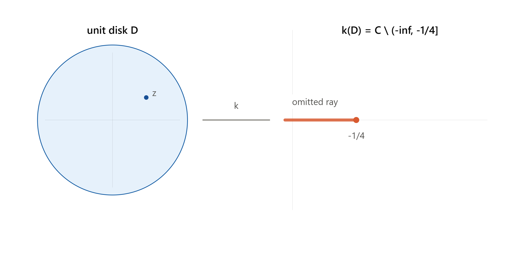

# Elementary Theory of Univalent Functions


## Introduction - the class $S$

```{definition,name="Univalence"}
- $f$ is *univalent* (schlicht) on a domain $D$ if $f(z_1) = f(z_2) \implies z_1 = z_2$. 
- For analytic $f$, *local* univalence at $z_0$ is equivalent to $f'(z_0) \ne 0$. 
infinitesimally.
```


An analytic univalent map is automatically a conformal mapping (angle-preserving), since $f'(z_0)\neq 0$ means the map looks like a rotation-and-scaling


**The normalized class.** $S$ consists of $f$ analytic and univalent on $\mathbb D = \{|z|<1\}$ with
$$f(0)=0,\qquad f'(0)=1,$$
so every $f\in S$ has a Taylor expansion
$$f(z) = z + a_2 z^2 + a_3 z^3 + \cdots, \qquad |z|<1.$$
By the Riemann mapping theorem, this normalized disk-based class is essentially universal: any univalent map of a simply connected domain (with $\ge 2$ boundary points) onto another can be built from a member of $S$ by pre- and post-composing with Möbius maps.

**The Koebe function** is the star example:
$$k(z) = \frac{z}{(1-z)^2} = z + 2z^2 + 3z^3 + \cdots = \sum_{n=1}^\infty n z^n.$$
To see its image, write
$$k(z) = \frac{1}{4}\left(\left(\frac{1+z}{1-z}\right)^2 - 1\right).$$
The Möbius map $\zeta = \dfrac{1+z}{1-z}$ sends $\mathbb D$ conformally onto the right half-plane $\operatorname{Re}\zeta>0$. Squaring a right half-plane sweeps it around into the *entire plane minus the nonpositive reals* $(-\infty,0]$, and then $\frac14(\zeta^2-1)$ shifts and scales that slit to $(-\infty,-\tfrac14]$. That's exactly the picture in the diagram: $k$ maps $\mathbb D$ **onto $\mathbb C$ minus the ray $(-\infty,-1/4]$.**




```{example}
ther examples in $S$:

1. $f(z) = z$
2. $f(z) = \dfrac{z}{1-z}$
3. $f(z) = \dfrac{z}{1-z^2}$
4. $f(z) = \dfrac{1}{4}\log\dfrac{1+z}{1-z}$
5. $f(z) = z - \dfrac{1}{2}z^2$

```

```{r setup-tikz-table, include=FALSE}
# Global setup to ensure TikZ chunks load required math packages
knitr::opts_chunk$set(
  tikz.preamble = c(
    "\\usepackage{amsmath}",
    "\\usepackage{amssymb}",
    "\\usepackage{xcolor}",
    "\\usetikzlibrary{positioning, calc}"
  )
)
```


```{tikz map-identity, echo=FALSE, fig.ext='png', fig.width=5, fig.height=2, engine.opts=list(extra.preamble=c('\\usepackage{amsmath}', '\\usepackage{amssymb}', '\\usepackage{xcolor}', '\\usetikzlibrary{positioning, calc}'))}
\begin{tikzpicture}[scale=0.7, every node/.style={transform shape}, region/.style={fill=cyan!20}, arrow/.style={->, >=stealth, thick, blue!80!black}]
  \begin{scope}[shift={(0,0)}]
    \fill[region] (0,0) circle (1);
    \draw[->, black] (-1.3,0) -- (1.3,0); 
    \draw[->, black] (0,-1.3) -- (0,1.3);
    \draw[thick, black] (0,0) circle (1);
    \node at (0, 1.3) [font=\tiny\bfseries] {$\mathbb{D}$};
  \end{scope}
  
  \draw[arrow] (1.6,0) -- node[above=1pt] {\tiny $f(z)=z$} (3.2,0);
  
  \begin{scope}[shift={(4.8,0)}]
    \fill[region] (0,0) circle (1);
    \draw[->, black] (-1.3,0) -- (1.3,0); 
    \draw[->, black] (0,-1.3) -- (0,1.3);
    \draw[thick, black] (0,0) circle (1);
    \node at (0, 1.3) [font=\tiny\bfseries] {$\mathbb{D}$};
  \end{scope}
\end{tikzpicture}
```


```{r setup2, include=FALSE}
library(knitr)

# Define global TikZ engine options as a properly structured list
knitr::opts_chunk$set(
  engine.opts = list(
    extra.preamble = c(
      "\\usepackage{amsmath}",
      "\\usepackage{amssymb}",
      "\\usepackage{xcolor}",
      "\\usetikzlibrary{positioning, calc}"
    )
  )
)
```

```{tikz map-halfplane, echo=FALSE, fig.ext='png', fig.width=5, fig.height=2}
\begin{tikzpicture}[scale=0.7, every node/.style={transform shape}, region/.style={fill=cyan!20}, arrow/.style={->, >=stealth, thick, blue!80!black}]
  \begin{scope}[shift={(0,0)}]
    \fill[region] (0,0) circle (1);
    \draw[->, black] (-1.3,0) -- (1.3,0); 
    \draw[->, black] (0,-1.3) -- (0,1.3);
    \draw[thick, black] (0,0) circle (1);
    \node at (0, 1.3) [font=\tiny\bfseries] {$\mathbb{D}$};
  \end{scope}
  
  \draw[arrow] (1.6,0) -- node[above=1pt] {\tiny $f(z)=\frac{z}{1-z}$} (3.2,0);
  
  \begin{scope}[shift={(4.8,0)}]
    \fill[region] (-0.5,-1.2) rectangle (1.3,1.2);
    \draw[->, black] (-1.3,0) -- (1.3,0); 
    \draw[->, black] (0,-1.3) -- (0,1.3);
    \draw[dashed, thick, red!80!black] (-0.5,-1.2) -- (-0.5,1.2);
    \node at (-0.5,-0.3) [font=\tiny, left, red!80!black] {$-\frac{1}{2}$};
    \node at (0.5, 1.3) [font=\tiny\bfseries] {$\operatorname{Re} w > -\frac{1}{2}$};
  \end{scope}
\end{tikzpicture}
```


```{r map-tworays, echo=FALSE, engine='tikz', fig.ext='png', fig.show='hide', fig.width=5, fig.height=2, engine.opts=list(extra.preamble=c('\\usepackage{amsmath}', '\\usepackage{amssymb}', '\\usepackage{xcolor}', '\\usetikzlibrary{positioning, calc}'))}
\begin{tikzpicture}[scale=0.7, every node/.style={transform shape}, region/.style={fill=cyan!20}, slit/.style={ultra thick, red!80!black}, arrow/.style={->, >=stealth, thick, blue!80!black}]
  \begin{scope}[shift={(0,0)}]
    \fill[region] (0,0) circle (1);
    \draw[->, black] (-1.3,0) -- (1.3,0); \draw[->, black] (0,-1.3) -- (0,1.3);
    \draw[thick, black] (0,0) circle (1);
    \node at (0, 1.3) [font=\tiny\bfseries] {$\mathbb{D}$};
  \end{scope}
  \draw[arrow] (1.6,0) -- node[above=1pt] {\tiny $f(z)=\frac{z}{1-z^2}$} (3.2,0);
  \begin{scope}[shift={(4.8,0)}]
    \fill[region] (-1.2,-1.2) rectangle (1.2,1.2);
    \draw[->, black] (-1.3,0) -- (1.3,0); \draw[->, black] (0,-1.3) -- (0,1.3);
    \draw[slit] (-1.2,0) -- (-0.5,0); \draw[slit] (0.5,0) -- (1.2,0);
    \fill[red!80!black] (-0.5,0) circle (1.5pt); \fill[red!80!black] (0.5,0) circle (1.5pt);
    \node at (-0.5,-0.3) [font=\tiny, red!80!black] {$-\frac{1}{2}$};
    \node at (0.5,-0.3) [font=\tiny, red!80!black] {$\frac{1}{2}$};
  \end{scope}
\end{tikzpicture}
```

```{r map-strip, echo=FALSE, engine='tikz', fig.ext='png', fig.show='hide', fig.width=5, fig.height=2, engine.opts=list(extra.preamble=c('\\usepackage{amsmath}', '\\usepackage{amssymb}', '\\usepackage{xcolor}', '\\usetikzlibrary{positioning, calc}'))}
\begin{tikzpicture}[scale=0.7, every node/.style={transform shape}, region/.style={fill=cyan!20}, arrow/.style={->, >=stealth, thick, blue!80!black}]
  \begin{scope}[shift={(0,0)}]
    \fill[region] (0,0) circle (1);
    \draw[->, black] (-1.3,0) -- (1.3,0); \draw[->, black] (0,-1.3) -- (0,1.3);
    \draw[thick, black] (0,0) circle (1);
    \node at (0, 1.3) [font=\tiny\bfseries] {$\mathbb{D}$};
  \end{scope}
  \draw[arrow] (1.6,0) -- node[above=1pt] {\tiny $f(z)=\frac{1}{4}\log\frac{1+z}{1-z}$} (3.2,0);
  \begin{scope}[shift={(4.8,0)}]
    \fill[region] (-1.2,-0.6) rectangle (1.2,0.6);
    \draw[->, black] (-1.3,0) -- (1.3,0); \draw[->, black] (0,-1.3) -- (0,1.3);
    \draw[dashed, thick, red!80!black] (-1.2,0.6) -- (1.2,0.6);
    \draw[dashed, thick, red!80!black] (-1.2,-0.6) -- (1.2,-0.6);
    \node at (0, 0.8) [font=\tiny, red!80!black] {$\frac{\pi}{4}$};
    \node at (0,-0.8) [font=\tiny, red!80!black] {$-\frac{\pi}{4}$};
  \end{scope}
\end{tikzpicture}
```

```{r map-cardioid, echo=FALSE, engine='tikz', fig.ext='png', fig.show='hide', fig.width=5, fig.height=2, engine.opts=list(extra.preamble=c('\\usepackage{amsmath}', '\\usepackage{amssymb}', '\\usepackage{xcolor}', '\\usetikzlibrary{positioning, calc}'))}
\begin{tikzpicture}[scale=0.7, every node/.style={transform shape}, region/.style={fill=cyan!20}, arrow/.style={->, >=stealth, thick, blue!80!black}]
  \begin{scope}[shift={(0,0)}]
    \fill[region] (0,0) circle (1);
    \draw[->, black] (-1.3,0) -- (1.3,0); \draw[->, black] (0,-1.3) -- (0,1.3);
    \draw[thick, black] (0,0) circle (1);
    \node at (0, 1.3) [font=\tiny\bfseries] {$\mathbb{D}$};
  \end{scope}
  \draw[arrow] (1.6,0) -- node[above=1pt] {\tiny $f(z)=z-\frac{1}{2}z^2$} (3.2,0);
  \begin{scope}[shift={(4.8,0)}]
    \fill[region, domain=0:360, samples=120, variable=\t] 
      plot ({0.7*(cos(\t) - 0.5*cos(2*\t))}, {0.7*(sin(\t) - 0.5*sin(2*\t))});
    \draw[->, black] (-1.3,0) -- (1.3,0); \draw[->, black] (0,-1.3) -- (0,1.3);
    \node at (0, 1.3) [font=\tiny\bfseries] {Cardioid};
  \end{scope}
\end{tikzpicture}
```

```{r render-mapping-table, echo=FALSE}
library(knitr)

img1 <- fig_chunk('map-identity', 'png')
img2 <- fig_chunk('map-halfplane', 'png')
img3 <- fig_chunk('map-tworays', 'png')
img4 <- fig_chunk('map-strip', 'png')
img5 <- fig_chunk('map-cardioid', 'png')

df <- data.frame(
  Function = c(
    "$z$",
    "$z(1-z)^{-1}$",
    "$z(1-z^2)^{-1}$",
    "$\\frac{1}{4}\\log\\frac{1+z}{1-z}$",
    "$z - \\frac{1}{2}z^2 = \\frac{1}{4}\\big(1-(1-z)^2\\big)$"
  ),
  Image = c(
    "$\\mathbb{D}$ itself",
    "Half-plane $\\operatorname{Re} w > -\\frac{1}{2}$",
    "Plane minus two rays $[\\frac{1}{2},\\infty)$ and $(-\\infty,-\\frac{1}{2}]$",
    "Horizontal strip $\\lvert\\operatorname{Im} w\\rvert < \\pi/4$", # Fixed here
    "Interior of a cardioid"
  ),
  Diagram = c(
    paste0("{width=220px}"),
    paste0("{width=220px}"),
    paste0("{width=220px}"),
    paste0("{width=220px}"),
    paste0("{width=220px}")
  )
)

kable(df, format = "html", escape = FALSE,
      col.names = c("$f(z)$", "Image Domain", "Diagram"),
      align = c("l", "l", "c"))
```


**$S$ is not a vector space.** The sum of two functions in $S$ need not be univalent. See the following the example.

```{example}
 $\dfrac{z}{1-z} + \dfrac{z}{1+iz}$ has a critical point inside $\mathbb D$. This is a good reminder that $S$ is a *geometric* class (defined by injectivity), not an algebraic one.
```

**Symmetries preserving $S$.** These are the standard moves you'll use constantly:

1. **Conjugation:** $g(z) = \overline{f(\bar z)} \in S$.
2. **Rotation:** $g(z) = e^{-i\theta}f(e^{i\theta}z) \in S$.
3. **Dilation:** $g(z) = r^{-1}f(rz) \in S$ for $0<r<1$.
4. **Disk automorphism:** for $|\zeta|<1$, $g(z) = \dfrac{f\!\left(\frac{z+\zeta}{1+\bar\zeta z}\right) - f(\zeta)}{(1-|\zeta|^2)f'(\zeta)} \in S$. This is the workhorse move used in the proofs of the distortion and growth theorems below — it re-centers $f$ at an arbitrary point $\zeta$ while renormalizing back to class $S$.
5. **Range transformation:** if $\psi$ is univalent on $f(\mathbb D)$ with $\psi(0)=0,\psi'(0)=1$, then $\psi\circ f \in S$.
6. **Omitted-value transformation:** if $f$ omits the value $w$, then $g = \dfrac{wf}{w-f} \in S$ (this is used directly in the Koebe $1/4$ theorem below).
7. **Square-root transformation:** if $f\in S$, then
$$g(z) = \sqrt{f(z^2)} = z + \tfrac12 a_2 z^3 + \cdots \in S.$$

**Why (7) is univalent — a nice small argument.** Since $f(w)=0$ only at $w=0$, we can pick a single-valued branch $g(z) = \sqrt{f(z^2)}$; $g$ is automatically *odd*, $g(-z)=-g(z)$. If $g(z_1)=g(z_2)$, squaring gives $f(z_1^2)=f(z_2^2)$, so $z_1^2=z_2^2$ (univalence of $f$), i.e. $z_1 = \pm z_2$. If $z_1=-z_2$, then $g(z_1) = g(z_2) = g(-z_1) = -g(z_1)$, forcing $g(z_1)=0$, hence $z_1=0=z_2$. Either way $z_1=z_2$. $\blacksquare$

**$m$-fold symmetric functions.** $S^{(m)}\subset S$ consists of functions with $m$-fold symmetry, $f(z) = z + \sum_{k\ge1} a_{mk+1}z^{mk+1}$. The $m$-th root transform $g(z) = \{f(z^m)\}^{1/m}$ sends $S \to S^{(m)}$, and this correspondence is onto: every $g\in S^{(m)}$ arises this way. (The square-root transformation above is the case $m=2$.)

**The exterior class $\Sigma$.** This is the natural companion class: functions
$$g(z) = z + b_0 + \frac{b_1}{z} + \frac{b_2}{z^2}+\cdots$$
univalent on $\Delta = \{|z|>1\}$ except for a simple pole at $\infty$ (residue $1$). Each $g\in\Sigma$ maps $\Delta$ onto the complement of some compact connected set $E$.

- $\Sigma'\subset\Sigma$: those $g$ with $0 \notin g(\Delta)$, i.e. $g$ never vanishes. Any $g\in\Sigma$ can be shifted into $\Sigma'$ by adjusting $b_0$ (a translation, which preserves univalence).
- **Inversion**, $f\mapsto g$: for $f\in S$,
$$g(z) = \{f(1/z)\}^{-1} = z - a_2 + (a_2^2-a_3)\frac1z + \cdots \in \Sigma',$$
and this is a bijection $S \leftrightarrow \Sigma'$.
- $\Sigma'$ is closed under a square-root transform $G(z) = \sqrt{g(z^2)}$ — but (important caveat) this only works starting from $\Sigma'$, not general $\Sigma$: if $g$ has a zero, $g(z^2)=0$ somewhere creates a branch point and the square root can't be made single-valued.
- $\Sigma_0 \subset \Sigma$: the subclass with $b_0=0$ (achievable by translation, though generally *not* simultaneously with membership in $\Sigma'$).
- $\tilde\Sigma$: "full mappings," those $g\in\Sigma$ whose omitted set $E$ has 2-dimensional Lebesgue measure zero.

## The Area Theorem

This is the load-bearing result of the whole chapter — nearly everything downstream is a corollary.

> **Theorem 2.1 (Area Theorem, Gronwall 1914).** If $g \in \Sigma$, $g(z) = z+b_0+\sum_{n\ge1}b_nz^{-n}$, then
> $$\sum_{n=1}^\infty n|b_n|^2 \le 1,$$
> with equality iff $g \in \tilde\Sigma$.

**Proof idea (this is why it's called the "area" theorem).** Fix $r>1$ and let $C_r$ be the image of $|z|=r$ under $g$; since $g$ is univalent, $C_r$ is a simple closed curve enclosing a region $E_r \supset E$ (the omitted set). By Green's theorem, the enclosed area is
$$\text{area}(E_r) = \frac{1}{2i}\oint_{C_r} \bar w\,dw.$$
Parametrize $w=g(re^{i\theta})$ and expand: because $g(z)=z+b_0+\sum b_n z^{-n}$, carrying out $\bar w\,dw$ and integrating $\theta$ from $0$ to $2\pi$ kills all cross terms by orthogonality of $e^{ik\theta}$, leaving
$$\text{area}(E_r) = \pi\Big(r^2 - \sum_{n=1}^\infty n|b_n|^2 r^{-2n}\Big), \qquad r>1.$$
Since area is $\ge 0$ for every $r>1$, let $r\downarrow 1$: the outer measure of $E$ satisfies
$$m(E) = \pi\Big(1 - \sum n|b_n|^2\Big) \ge 0,$$
which is exactly the theorem. Equality $m(E)=0$ is precisely membership in $\tilde\Sigma$. $\blacksquare$

This is a genuinely lovely argument: you get a *coefficient inequality* out of nothing but "area can't be negative."

**Corollary.** $|b_1|\le 1$, with equality iff $g(z) = z+b_0+b_1/z$, $|b_1|=1$ — mapping $\Delta$ onto the complement of a line segment of length $4$. (Equality in $|b_1|^2 \le \sum n|b_n|^2 \le 1$ forces all other $b_n=0$ and $|b_1|=1$.)

**Bieberbach's Theorem (1916), via the corollary.**

> **Theorem 2.2.** If $f\in S$, then $|a_2|\le 2$, with equality iff $f$ is a rotation of the Koebe function.

*Proof.* Chain the square-root transform and inversion: $g(z) = \{f(1/z^2)\}^{-1/2} = z - \tfrac12 a_2 z^{-1} + \cdots \in \Sigma$. Its $b_1$ coefficient is $-a_2/2$, so the corollary gives $|a_2/2|\le 1$, i.e. $|a_2|\le 2$. Equality forces $g(z) = z + b_0 + \frac{b_1}{z}$ with $|b_1|=1$, and unwinding the transform shows this corresponds to $f$ being a rotation $e^{-i\theta}k(e^{i\theta}z)$ of the Koebe function. $\blacksquare$

**Koebe's One-Quarter Theorem** — this is arguably the single most quoted fact in the subject.

> **Theorem 2.3.** Every $f\in S$ has range containing the disk $|w|<\tfrac14$.

*Proof.* Suppose $f$ omits a value $w$. Apply the omitted-value transformation:
$$g(z) = \frac{wf(z)}{w-f(z)} = z + \left(a_2+\frac1w\right)z^2+\cdots \in S.$$
Bieberbach's theorem applied to $g$ gives $\left|a_2+\dfrac1w\right|\le 2$. Combined with $|a_2|\le 2$ (triangle inequality: $\left|\frac1w\right| \le \left|a_2+\frac1w\right|+|a_2| \le 4$), we get $|w|\ge \tfrac14$. $\blacksquare$

The proof shows more: **only** the Koebe function and its rotations actually achieve $|w|=\tfrac14$ (they're the ones omitting a boundary point of the disk $|w|<1/4$ exactly) — every other $f\in S$ covers a strictly larger disk. Also worth noting: univalence is essential here, not just $f(0)=0, f'(0)=1$ — $f_n(z) = z(1+z/n)^2$ satisfies the normalization but omits values arbitrarily close to $0$, since it's not univalent.

## Growth and Distortion Theorems

These translate the coefficient bound $|a_2|\le2$ into pointwise geometric control on $f$ itself.

**Theorem 2.4** (the key technical estimate). For $f\in S$, $|z|=r<1$,
$$\left|\frac{zf''(z)}{f'(z)} - \frac{2r^2}{1-r^2}\right| \le \frac{4r}{1-r^2}.$$

*Proof sketch.* Fix $\zeta\in\mathbb D$ and apply the disk-automorphism symmetry (item 4 above) to build $F\in S$ re-centered at $\zeta$. Expanding $F$'s second Taylor coefficient in terms of $f$'s Taylor coefficients at $\zeta$ gives an expression $A_2(\zeta) = \frac12(1-|\zeta|^2)\dfrac{f''(\zeta)}{f'(\zeta)} - \bar\zeta$. Bieberbach's theorem bounds $|A_2(\zeta)|\le2$; simplifying and relabeling $\zeta \to z$ gives the stated inequality. $\blacksquare$

Splitting into real/imaginary parts of this one inequality produces *three* classical theorems by integrating along radii — this is a nice piece of technique worth internalizing (it's a recurring move in the subject: one sharp pointwise bound on a logarithmic-derivative-type quantity, then radial integration, gives sharp global bounds).

**Distortion Theorem 2.5.** Take real parts: $\operatorname{Re}\left(\dfrac{zf''}{f'}\right)$ is sandwiched, and since $\operatorname{Re}\dfrac{zf''}{f'} = r\dfrac{\partial}{\partial r}\log|f'(re^{i\theta})|$ (using a branch of $\log f'$ vanishing at $0$), integrating in $r$ gives
$$\frac{1-r}{(1+r)^3} \le |f'(z)| \le \frac{1+r}{(1-r)^3}, \qquad |z|=r,$$
with equality (for $z\ne0$) iff $f$ is a rotation of $k$. Both bounds are attained by $k'(z) = \dfrac{1+z}{(1-z)^3}$ itself.

**Growth Theorem 2.6.** Integrating $f(z) = \int_0^z f'$ radially and applying the distortion theorem along the way:
$$\frac{r}{(1+r)^2} \le |f(z)| \le \frac{r}{(1-r)^2}, \qquad |z|=r,$$
again with equality only for rotations of the Koebe function. The *lower* bound is the subtler direction: if $|f(z)|<\tfrac14$, the Koebe $1/4$ theorem guarantees the whole segment from $0$ to $f(z)$ lies in $f(\mathbb D)$, so you can integrate $f'$ along its (univalent) preimage arc and apply the distortion theorem there.

**Rotation theorem (imaginary part).** Taking imaginary parts of Theorem 2.4 instead and integrating gives the (non-sharp) bound
$$|\arg f'(z)| \le 2\log\frac{1+r}{1-r}.$$
The genuinely **sharp** rotation theorem,
$$|\arg f'(z)| \le \begin{cases} 4\arcsin r, & r\le 1/\sqrt2,\\[4pt] \pi + \log\dfrac{r^2}{1-r^2}, & r>1/\sqrt2,\end{cases}$$
lies much deeper (needs Loewner's method, Chapter 3) — and the fact that the sharp bound has *different functional forms* on either side of $r=1/\sqrt2$ is flagged as one of the striking phenomena of the theory.

**Theorem 2.7** (combined growth/distortion, for $zf'/f$). For $f\in S$,
$$\frac{1-r}{1+r} \le \left|\frac{zf'(z)}{f(z)}\right| \le \frac{1+r}{1-r}.$$
Note this does **not** follow by naively dividing the growth and distortion bounds — the proof has to go back to the auxiliary function $F$ from Theorem 2.4's construction and use the growth theorem on $F$ at the point $-\zeta$. Equality, again, only for rotations of $k$, for which $\dfrac{zk'(z)}{k(z)} = \dfrac{1+z}{1-z}$ exactly.

## Coefficient Estimates

**The Bieberbach Conjecture.** Since $k$ has $n$-th coefficient exactly $n$, and $|a_2|\le2$ with the same extremal function, it's natural to conjecture $|a_n|\le n$ for all $f\in S$, with equality only for rotations of $k$. At the time this book was written, this was proven only for small $n$ — it's worth flagging for you: **de Branges proved the full conjecture in 1985**, after this book's publication (using Loewner theory plus special-function/hypergeometric estimates related to Askey–Gasper). Duren's book predates that, so what follows is the state of the art *before* de Branges.

**Finiteness of $A_n = \sup_{f\in S}|a_n|$** follows either from compactness of $S$ in the topology of locally uniform convergence (Montel-type argument, plus continuity of $a_n$ as a functional), or crudely from Cauchy's estimate combined with the growth theorem, giving $A_n \le Cn^2$.

**Littlewood's Theorem (1925).** $|a_n| \le en$ for all $f\in S$, $n\ge2$ — the correct *order of magnitude*, proved by completely elementary means.

The proof rests on an integral-means lemma. Define $M_p(r,f) = \left(\dfrac{1}{2\pi}\int_0^{2\pi}|f(re^{i\theta})|^p\,d\theta\right)^{1/p}$.

> **Lemma.** For $f\in S$, $\;M_1(r,f) \le \dfrac{r}{1-r}$, $0<r<1$.

*Proof.* Let $h(z) = \sqrt{f(z^2)} = z + e_3z^3+e_5z^5+\cdots$ (the square-root transform, an odd function in $S$). By the growth theorem applied to $f$ at the point $z^2$ (modulus $r^2$), $|f(z^2)| \le r^2/(1-r^2)^2$, so
$$|h(z)| \le \frac{r}{1-r^2}, \qquad |z|=r.$$
So $h$ maps $|z|<r$ into the disk $|w| < r/(1-r^2)$; the (multiplicity-weighted) area of the image is
$$A_r = \iint_{|z|<r} |h'(z)|^2\,dA = \pi\sum_n n|e_n|^2 r^{2n} \;\le\; \pi \frac{r^2}{(1-r^2)^2}.$$
Dividing by $r$ and integrating from $0$ to $r$:
$$\sum_n |e_n|^2 r^{2n} \le \frac{r^2}{1-r^2}.$$
By Parseval, the left side is $M_2(r,h)^2$, and since $|h(z)|^2=|f(z^2)|$, a change of variable shows $M_2(r,h)^2 = M_1(r^2,f)$. Relabeling $r^2\to r$ gives $M_1(r,f)\le r/(1-r)$. $\blacksquare$

**Deriving Littlewood's theorem from the lemma.** Cauchy's formula gives $|a_n| \le r^{-n}M_1(r,f) \le \dfrac{r^{1-n}}{1-r}$. Minimizing over $r$ at $r=1-1/n$:
$$|a_n| \le n\left(1-\frac1n\right)^{1-n} \longrightarrow en \quad\text{(since $(1-1/n)^{-n}\to e$).}$$

**How sharp is this?** Not very — even in principle, this *method* (Cauchy estimate + integral means) can't beat $\tfrac e2 n$, because the true extremal is the Koebe function, whose own integral mean can be computed in closed form:
$$M_1(r,k) = \frac{1}{2\pi}\int_0^{2\pi}\frac{r\,d\theta}{|1-re^{i\theta}|^2} = \frac{r}{1-r^2}$$
(a Poisson-kernel identity), which is smaller than Littlewood's elementary bound $r/(1-r)$ by essentially a factor of $2$ near $r=1$ (since $1-r^2\approx 2(1-r)$). It took until **Baernstein (1973)** — using his theory of "star-functions" — to prove the *sharp* statement $M_p(r,f)\le M_p(r,k)$ for **all** $f\in S$ and all $0<p<\infty$, matching the Koebe function exactly. That recovers the optimal constant $\tfrac e2$ from this style of argument (though it still falls short of de Branges's exact $n$).

**Application: arclength of image circles.** Let $L_r(f)$ be the length of the image of $|z|=r$ under $f$, i.e. $L_r(f)=\int_0^{2\pi}|f'(re^{i\theta})|\,r\,d\theta$.

> **Theorem 2.9.** $L_r(f) \le \dfrac{2\pi r(1+r)}{(1-r)^2}$.

*Proof.* Write $|f'(z)|\,r = \left|\dfrac{zf'(z)}{f(z)}\right|\cdot|f(z)|$ (using $|z|=r$), bound the first factor by Theorem 2.7's upper bound $\tfrac{1+r}{1-r}$, and integrate:
$$L_r(f) \le \frac{1+r}{1-r}\int_0^{2\pi}|f(re^{i\theta})|\,d\theta = \frac{1+r}{1-r}\cdot 2\pi M_1(r,f) \le \frac{1+r}{1-r}\cdot 2\pi\cdot\frac{r}{1-r} = \frac{2\pi r(1+r)}{(1-r)^2}. \blacksquare$$

This is again "very nearly sharp" but not sharp; using Baernstein's inequality $M_1(r,f)\le \frac{r}{1-r^2}$ in place of the elementary lemma improves it to
$$L_r(f) \le \frac{2\pi r}{(1-r)^2}.$$
(The $(1+r)$ factor cancels exactly against the extra factor gained from the sharper $M_1$ bound.) The genuinely sharp bound for $L_r(f)$ over all of $S$ is still **unknown** in general; Clunie and Duren later showed $L_r(f)\le L_r(k)$ holds within the subclass of *close-to-convex* functions (§2.6).

## Where the excerpt trails off

The chapter then pivots (§2.5) into geometrically-defined subclasses — **convex functions** $C$ (image is a convex domain) and **starlike functions** $S^*$ (image starlike w.r.t. $0$), with $C \subset S^* \subset S$, and the Koebe function itself is starlike but not convex. This sets up the class $P$ of functions with positive real part (Carathéodory functions) via the Herglotz/Poisson–Stieltjes representation — the tool that will let you prove the Bieberbach conjecture *sharply* within these two subclasses, which is presumably where the excerpt continues next.

