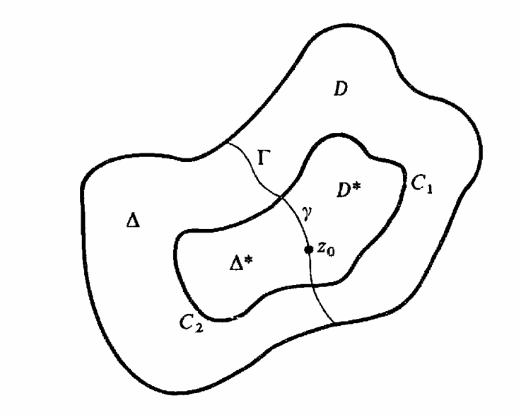

# Important Theorems 

```{theorem,name="Montel Theorem",label="montel"}
Every locally bounded family of analytic functions is normal.
```

```{proof}
.jpg)
.jpg)
```

```{theorem}
Let \( D \) and \( \Delta \) be disjoint domains with a common rectifiable boundary arc \( \Gamma \).
Let \( f \) be analytic in \( D \) and continuous in \( D \cup \Gamma \), and let \( g \) be analytic in \( \Delta \) and continuous in \( \Delta \cup \Gamma \).
Suppose \( f(z) = g(z) \) for all \( z \in \Gamma \).
Then \( f \) has an analytic continuation \( F \) to \( D \cup \Gamma \cup \Delta \) with \( F(z) = g(z) \) in \( \Delta \).
```
```{proof}
<div style="display: flex; gap: 2px;">
<div style="flex: 1;">
It must be shown that the function \( F \) defined as above is actually analytic on \( \Gamma \). Given a point \( z_{0} \in \Gamma \), choose Jordan arcs \( C_{1} \subset D \) and \( C_{2} \subset \Delta \) with common endpoints on \( \Gamma \) whose union \( C = C_{1} \cup C_{2} \) is a Jordan curve enclosing \( z_{0} \). Let \( \gamma \) be the subarc of \( \Gamma \) inside \( C \). Let \( D^{*} \) and \( \Delta^{*} \) be the subdomains of \( D \) and \( \Delta \) enclosed by the Jordan curves \( J_{1} = C_{1} \cup \gamma \) and \( J_{2} = C_{2} \cup (-\gamma) \), respectively.
</div>
<div style="flex: 1;">
{width=90%}
</div>
</div>


By the extended version of Cauchy's theorem,


\[
\frac{1}{2\pi i} \int_{J_{1}} \frac{f(\zeta)}{\zeta - z}\, d\zeta =
\begin{cases}
f(z), & z \in D^{*},\\[6pt]
0, & z \in \Delta^{*}.
\end{cases}
\]


Similarly,


\[
\frac{1}{2\pi i} \int_{J_{2}} \frac{g(\zeta)}{\zeta - z}\, d\zeta =
\begin{cases}
0, & z \in D^{*},\\[6pt]
g(z), & z \in \Delta^{*}.
\end{cases}
\]

- For $f(z)$:
\begin{equation}
\frac{1}{2\pi i} \int_{J_1} \frac{f(\zeta)}{\zeta - z} d\zeta = \frac{1}{2\pi i} \left( \int_{C_1} \frac{f(\zeta)}{\zeta - z} d\zeta + \int_{\gamma} \frac{f(\zeta)}{\zeta - z} d\zeta \right) (\#eq:e1)
\end{equation}

- For $g(z)$:
  
\begin{equation}
\frac{1}{2\pi i} \int_{J_2} \frac{g(\zeta)}{\zeta - z} d\zeta
= \frac{1}{2\pi i} \left( \int_{C_2} \frac{g(\zeta)}{\zeta - z} d\zeta
+ \int_{-\gamma} \frac{g(\zeta)}{\zeta - z} d\zeta \right)
 (\#eq:e2)
\end{equation}

Then \@ref(eq:e1)+\@ref(eq:e1),

\begin{eqnarray}
& \frac{1}{2\pi i} \left(\int_{J_1} \frac{f(\zeta)}{\zeta - z} d\zeta
  +\int_{J_2} \frac{g(\zeta)}{\zeta - z} d\zeta\right) \\
&= \frac{1}{2\pi i} \left( \int_{C_1} \frac{f(\zeta)}{\zeta - z} d\zeta + \int_{\gamma} \frac{f(\zeta)}{\zeta - z} d\zeta + \int_{C_2} \frac{g(\zeta)}{\zeta - z} d\zeta + \int_{-\gamma} \frac{g(\zeta)}{\zeta - z} d\zeta \right)\\
&= \frac{1}{2\pi i} \left( \int_{C_1} \frac{f(\zeta)}{\zeta - z} d\zeta + \int_{\gamma} \frac{f(\zeta)}{\zeta - z} d\zeta + \int_{C_2} \frac{g(\zeta)}{\zeta - z} d\zeta + \int_{-\gamma} \frac{g(\zeta)}{\zeta - z} d\zeta \right)\\

\end{eqnarray}

Because \( f(\zeta) = g(\zeta) \) on \( \Gamma \), the two integrals may
be added to produce


\[
\frac{1}{2\pi i} \int_{C} \frac{F(\zeta)}{\zeta - z}\, d\zeta = F(z).
\]


for \( z \in D^{*} \cup \Delta^{*} \). But this last integral is analytic
throughout the domain \( D^{*} \cup \gamma \cup \Delta^{*} \) bounded by \( C \).
In particular, \( F \) is analytic at \( z_{0} \). Since \( z_{0} \) was an
arbitrary point of \( \Gamma \), this proves the theorem.

\begin{eqnarray*}
& = & \frac{1}{2\pi i} \left( \int_{J_1} \frac{f(\xi)}{(\xi - z)} \, d\xi + \int_{J_2} \frac{g(\xi)}{(\xi - z)} \, d\xi \right) \\
& = & \frac{1}{2\pi i} \left( \int_{C_1} \frac{f(\xi)}{(\xi - z)} \, d\xi + \int_{\gamma} \frac{f(\xi)}{(\xi - z)} \, d\xi + \int_{C_2} \frac{g(\xi)}{(\xi - z)} \, d\xi + \int_{-\gamma} \frac{g(\xi)}{(\xi - z)} \, d\xi \right) \\
& = & \frac{1}{2\pi i} \left( \int_{C_1} \frac{f(\xi)}{(\xi - z)} \, d\xi + \int_{C_2} \frac{g(\xi)}{(\xi - z)} \, d\xi + \int_{\gamma} \frac{f(\xi)}{(\xi - z)} \, d\xi - \int_{\gamma} \frac{g(\xi)}{(\xi - z)} \, d\xi \right) \quad \left( \because \int_{-\gamma} d\xi = -\int_{\gamma} d\xi \right) \\
& = & \frac{1}{2\pi i} \left( \int_{C_1} \frac{f(\xi)}{(\xi - z)} \, d\xi + \int_{C_2} \frac{g(\xi)}{(\xi - z)} \, d\xi + \int_{\gamma} \frac{f(\xi)}{(\xi - z)} \, d\xi - \int_{\gamma} \frac{f(\xi)}{(\xi - z)} \, d\xi \right) \quad \left( \because f(\xi) = g(\xi) \text{ on } \gamma \right) \\
& = & \frac{1}{2\pi i} \left( \int_{C_1} \frac{f(\xi)}{(\xi - z)} \, d\xi + \int_{C_2} \frac{g(\xi)}{(\xi - z)} \, d\xi \right) \\
& = & \frac{1}{2\pi i} \int_{C} \frac{F(\xi)}{(\xi - z)} \, d\xi \quad \left( \because \begin{array}{ll} F(\xi) = f(\xi) & \text{on } C_1 \\ F(\xi) = g(\xi) & \text{on } C_2 \\ C_1 \cup C_2 = C & \end{array} \right) \\
& = & F(\xi)\quad \text{ for } z \in D^* \cup \Delta^*.
\end{eqnarray*}


But this last integral is analytic throughout the domain $D^* \cup \gamma \cup \Delta^*$ bounded by $C$. In particular, $F$ is analytic at $z_0$. Since $z_0$ was an arbitrary point of $\Gamma$, this proves the theorem.


```