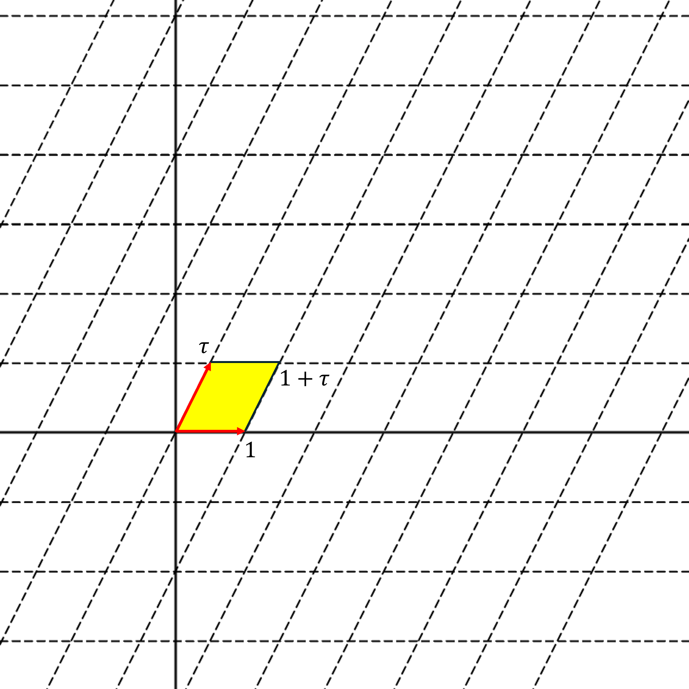

# Torus
First, we define a lattice $\Lambda$ in the complex plane $\mathbb{C}$. We can find $\tau$
A lattice is a discrete subgroup of $\mathbb{C}$ generated by two complex numbers that are linearly independent over the reals.In standard form, we can scale and rotate any lattice so that one generator is exactly $1$, and the other is a complex number $\tau$ located in the upper half-plane ($\text{Im}(\tau) > 0$). The lattice is defined as:
$$\Lambda = \{ m + n\tau \mid m, n \in \mathbb{Z} \}$$

## The four points you provided form the corners of a parallelogram in the complex plane:

- $0$
- $1$
- $1+\tau$
- $\tau$

This parallelogram represents one "tile" of the complex plane. 

Because the lattice $\Lambda$ extends infinitely in all directions, translating this single parallelogram by integer combinations of $1$ and $\tau$ will tile the entire complex plane perfectly without any gaps or overlaps.3. The Quotient Space (Gluing)To create the torus, we take the quotient space $\mathbb{C}/\Lambda$. Mathematically, this means we declare two complex numbers $z_1$ and $z_2$ to be "the same" if they differ by an element of the lattice:$$z_1 \sim z_2 \iff z_1 - z_2 \in \Lambda$$Geometrically, this quotient operation "glues" the opposite edges of the fundamental parallelogram together:Left and Right Edges: The line segment from $0$ to $\tau$ is glued to the segment from $1$ to $1+\tau$. (This rolls the parallelogram into a cylinder).Top and Bottom Edges: The line segment from $0$ to $1$ is glued to the segment from $\tau$ to $1+\tau$. (This bends the cylinder around and glues its open ends together).