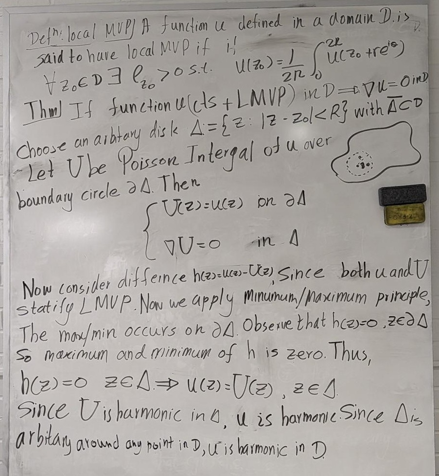
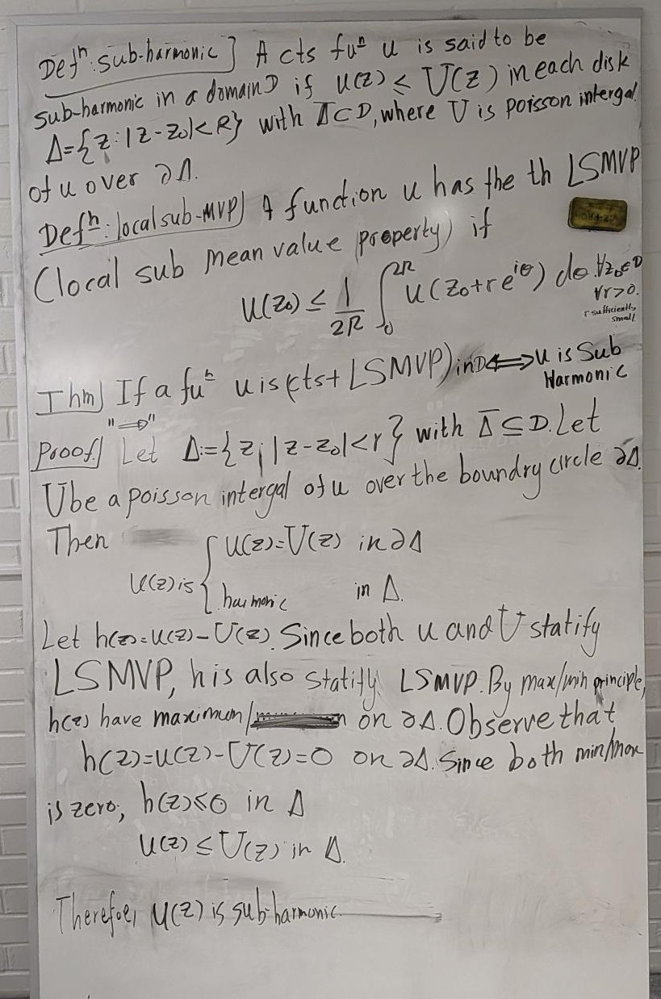
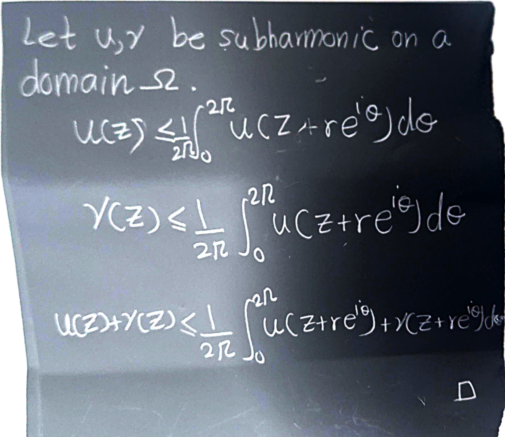
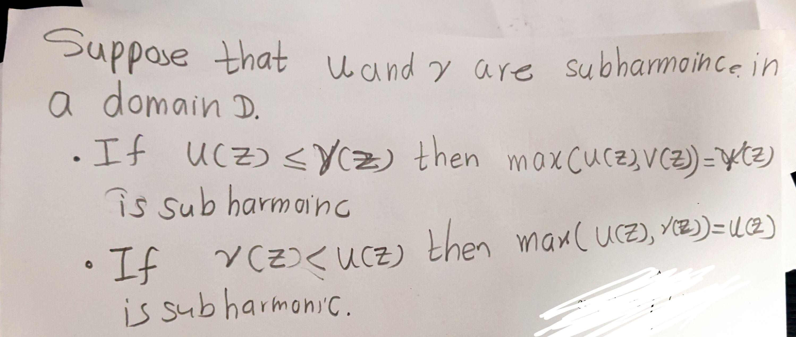
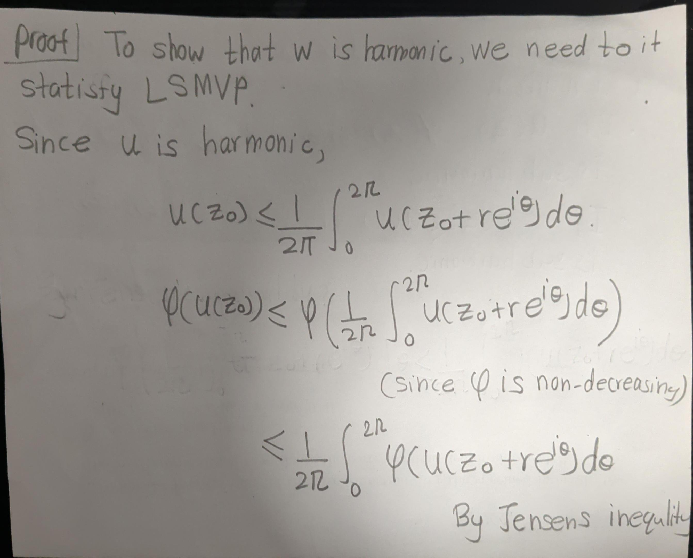
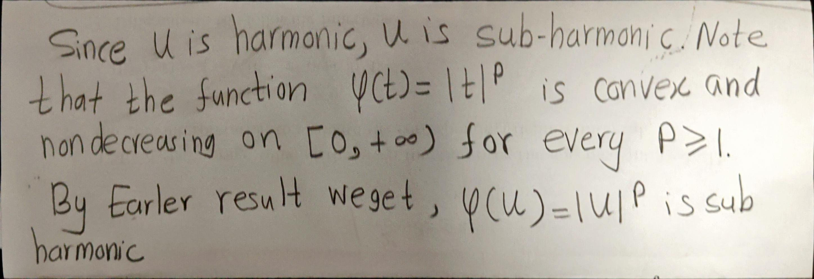
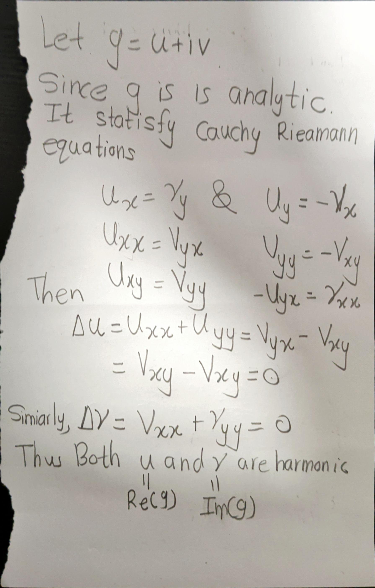
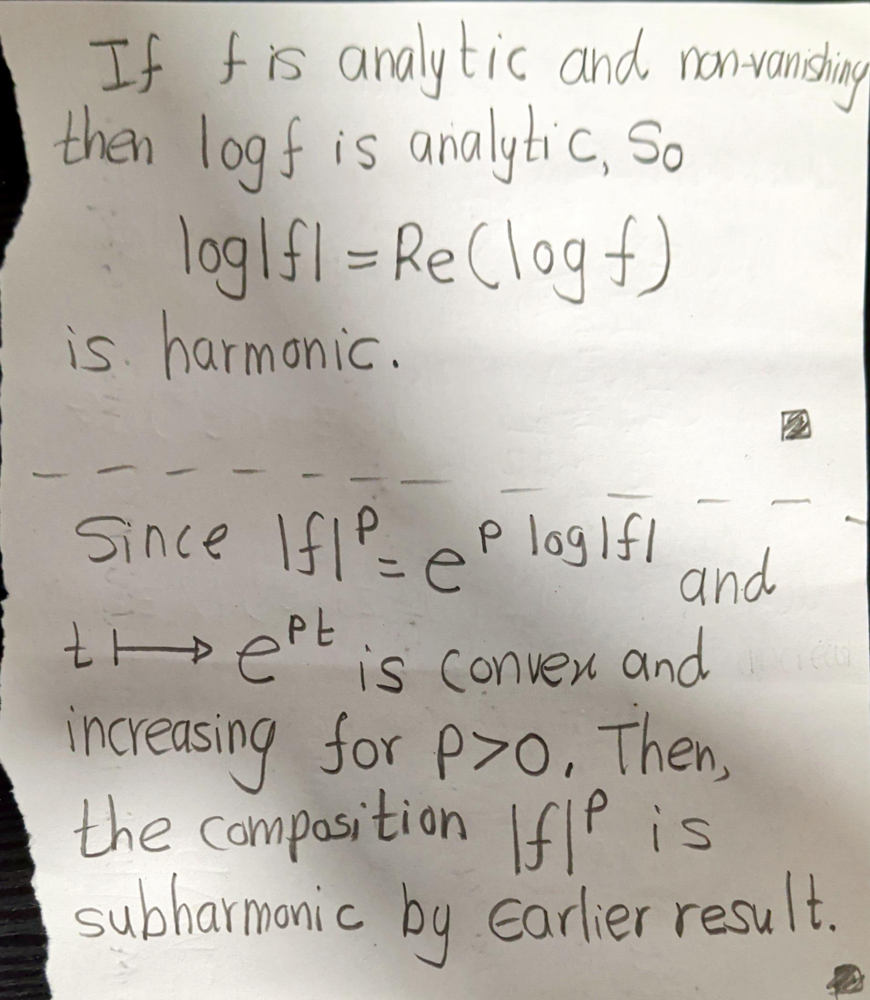

# Important Results 

```{theorem,montel,name="Montel Theorem"}
Every locally bounded family of analytic functions is normal.
```

```{proof}
.jpg)
.jpg)
```

```{theorem}
Let \( D \) and \( \Delta \) be disjoint domains with a common rectifiable boundary arc \( \Gamma \).
Let \( f \) be analytic in \( D \) and continuous in \( D \cup \Gamma \), and let \( g \) be analytic in \( \Delta \) and continuous in \( \Delta \cup \Gamma \).
Suppose \( f(z) = g(z) \) for all \( z \in \Gamma \).
Then \( f \) has an analytic continuation \( F \) to \( D \cup \Gamma \cup \Delta \) with \( F(z) = g(z) \) in \( \Delta \).
```


```{proof}
<div style="display: flex; gap: 2px;">
<div style="flex: 1;">
It must be shown that the function \( F \) defined as above is actually analytic on \( \Gamma \). Given a point \( z_{0} \in \Gamma \), choose Jordan arcs \( C_{1} \subset D \) and \( C_{2} \subset \Delta \) with common endpoints on \( \Gamma \) whose union \( C = C_{1} \cup C_{2} \) is a Jordan curve enclosing \( z_{0} \). Let \( \gamma \) be the subarc of \( \Gamma \) inside \( C \). Let \( D^{*} \) and \( \Delta^{*} \) be the subdomains of \( D \) and \( \Delta \) enclosed by the Jordan curves \( J_{1} = C_{1} \cup \gamma \) and \( J_{2} = C_{2} \cup (-\gamma) \), respectively.
</div>
<div style="flex: 1;">
{width=90%}
</div>
</div>


By the extended version of Cauchy's theorem,


\[
\frac{1}{2\pi i} \int_{J_{1}} \frac{f(\zeta)}{\zeta - z}\, d\zeta =
\begin{cases}
f(z), & z \in D^{*},\\[6pt]
0, & z \in \Delta^{*}.
\end{cases}
\]


Similarly,


\[
\frac{1}{2\pi i} \int_{J_{2}} \frac{g(\zeta)}{\zeta - z}\, d\zeta =
\begin{cases}
0, & z \in D^{*},\\[6pt]
g(z), & z \in \Delta^{*}.
\end{cases}
\]

- For $f(z)$:
\begin{equation}
\frac{1}{2\pi i} \int_{J_1} \frac{f(\zeta)}{\zeta - z} d\zeta = \frac{1}{2\pi i} \left( \int_{C_1} \frac{f(\zeta)}{\zeta - z} d\zeta + \int_{\gamma} \frac{f(\zeta)}{\zeta - z} d\zeta \right) (\#eq:e1)
\end{equation}

- For $g(z)$:
  
\begin{equation}
\frac{1}{2\pi i} \int_{J_2} \frac{g(\zeta)}{\zeta - z} d\zeta
= \frac{1}{2\pi i} \left( \int_{C_2} \frac{g(\zeta)}{\zeta - z} d\zeta
+ \int_{-\gamma} \frac{g(\zeta)}{\zeta - z} d\zeta \right)
 (\#eq:e2)
\end{equation}

Then \@ref(eq:e1)+\@ref(eq:e1),

\begin{eqnarray*}
&  & \frac{1}{2\pi i} \left( \int_{J_1} \frac{f(\xi)}{(\xi - z)} \, d\xi + \int_{J_2} \frac{g(\xi)}{(\xi - z)} \, d\xi \right) \\
& = & \frac{1}{2\pi i} \left( \int_{C_1} \frac{f(\xi)}{(\xi - z)} \, d\xi + \int_{\gamma} \frac{f(\xi)}{(\xi - z)} \, d\xi + \int_{C_2} \frac{g(\xi)}{(\xi - z)} \, d\xi + \int_{-\gamma} \frac{g(\xi)}{(\xi - z)} \, d\xi \right) \\
& = & \frac{1}{2\pi i} \left( \int_{C_1} \frac{f(\xi)}{(\xi - z)} \, d\xi + \int_{C_2} \frac{g(\xi)}{(\xi - z)} \, d\xi + \int_{\gamma} \frac{f(\xi)}{(\xi - z)} \, d\xi - \int_{\gamma} \frac{g(\xi)}{(\xi - z)} \, d\xi \right) \quad \left( \because \int_{-\gamma} d\xi = -\int_{\gamma} d\xi \right) \\
& = & \frac{1}{2\pi i} \left( \int_{C_1} \frac{f(\xi)}{(\xi - z)} \, d\xi + \int_{C_2} \frac{g(\xi)}{(\xi - z)} \, d\xi + \int_{\gamma} \frac{f(\xi)}{(\xi - z)} \, d\xi - \int_{\gamma} \frac{f(\xi)}{(\xi - z)} \, d\xi \right) \quad \left( \because f(\xi) = g(\xi) \text{ on } \gamma \right) \\
& = & \frac{1}{2\pi i} \left( \int_{C_1} \frac{f(\xi)}{(\xi - z)} \, d\xi + \int_{C_2} \frac{g(\xi)}{(\xi - z)} \, d\xi \right) \\
& = & \frac{1}{2\pi i} \int_{C} \frac{F(\xi)}{(\xi - z)} \, d\xi \quad \left( \because \begin{array}{ll} F(\xi) = f(\xi) & \text{on } C_1 \\ F(\xi) = g(\xi) & \text{on } C_2 \\ C_1 \cup C_2 = C & \end{array} \right) \\
& = & F(\xi)\quad \text{ for } z \in D^* \cup \Delta^*.
\end{eqnarray*}

But this last integral is analytic throughout the domain $D^* \cup \gamma \cup \Delta^*$ bounded by $C$. In particular, $F$ is analytic at $z_0$. Since $z_0$ was an arbitrary point of $\Gamma$, this proves the theorem.
```

```{theorem}
If a function \(u\) is continuous and has the local ```

<center>
{width=50%}
</center>
  
```{theorem}
If a function \(u\) is continuous and has the local sub-mean-value property in a domain \(D\), then \(u\) ```

<center>
{width=70%}
</center>
  
```{corollary}
A subharmonic function which is not identically constant cannot have a local maximum at an interior point.
```

```{proof}
<center>
{width=70%}
</center>
```

```{proposition}
The sum of two subharmonic functions is subharmonic.
```

```{proof}
<center>
{width=70%}
</center>
```


```{proposition}
If \(u\) and \(v\) are sub harmonic, then \(w(z) = \max\{u(z), v(z)\}\) is subharmonic.
```

```{proof}
<center>
{width=70%}
</center>
```


```{proposition}
Let $u$ be subharmonic on a domain $\Omega$, and let $\varphi : \mathbb{R} \to \mathbb{R}$ be a convex and nondecreasing function. Then \(w(z) = \varphi(u(z)).\) is subharmonic.
```

```{proof}
<center>
{width=70%}
</center>
```


```{proposition}
If $u$ is harmonic on a domain $\Omega$, then 
$|u|^{p}$ is subharmonic on $\Omega$ for every $p \ge 1$.
```

```{proof}
<center>
{width=70%}
</center>
```

```{proposition}
If $g$  is analytic, then $\Re(g)$ and $\Im(g)$ are harmonic.
```

```{proof}
<center>
{width=60%}
</center>
```

```{proposition}
Let $f$ be analytic on a domain $\Omega$. Then $\log |f|$ is harmonic on 
$\Omega \setminus f^{-1}(0)$, and for every $p>0$ the function $|f|^{p}$ is 
subharmonic on $\Omega$.
```

```{proof}
<center>
{width=60%}
</center>
```

```{proposition}
A function is subharmonic if it satisfies the sub-mean-value inequality and is upper semicontinuous, even if it takes the value 
$−\infty$.
```

In a region where $f$ has zeros, $\log| f(z)|$ is subharmonic in a generalized sense which allows the


- \(\log|f|\) is harmonic where \(f\neq 0\),
- \(\log|f|\) is allowed to be \(-\infty\) at zeros,
- and it satisfies the sub-mean inequality everywhere.

This is why we can still apply the convex-function principle to conclude:

\[
|f(z)|^{p} = e^{p\log|f(z)|}
\]

is **subharmonic for every \(p>0\)**.


## $n$-Dimensional Lebesgue Measure Theory

Since I am familiar with $n$-dimensional measure theory, I will go through the following steps.

```{definition}
The **$n$-dimensional Lebesgue outer measure** of a set $E \subset \mathbb{R}^n$ is

$$m_n^*(E) = \inf \left\{ \sum_{k=1}^{\infty} \operatorname{vol}_n(R_k) : E \subset \bigcup_{k=1}^{\infty} R_k \right\},$$

where the $R_k$ are $n$-dimensional rectangles (boxes)

$$R_k = [a_1,b_1] \times \cdots \times [a_n,b_n].$$

Their $n$-dimensional volume is

$$\operatorname{vol}_n(R_k) = \prod_{j=1}^{n}(b_j-a_j).$$

For measurable sets, the $n$-dimensional Lebesgue measure is

$$m_n(E) = m_n^*(E).$$
```


### Interpretation by Dimension

| Space | Lebesgue measure |
| :---: | :---: |
| $\mathbb{R}$ | length |
| $\mathbb{R}^2$ | area |
| $\mathbb{R}^3$ | volume |
| $\mathbb{R}^n$ | $n$-dimensional volume |


```{example}
| Dimension $n$ | Set | Measure | Interpretation |
| :---: | :---: | :---: | :---: |
| 1 | $[0,1]$ | $m_1([0,1]) = 1$ | Length |
| 2 | Unit disk | $m_2(\text{unit disk}) = \pi$ | Area |
| 3 | Unit ball | $m_3(\text{unit ball}) = \frac{4\pi}{3}$ | Volume |
*Table 1: Examples of Lebesgue measure in different dimensions.*
```


### Lower-dimensional sets have measure zero

A useful rule is:

> A $k$-dimensional object inside $\mathbb{R}^n$ has $n$-dimensional measure zero whenever $k < n$.

```{example}

- **In $\mathbb{R}^2$:**
  - A line segment $[-2,2] \times \{0\}$ has $m_2 = 0$. It has length, but no area.

- **In $\mathbb{R}^3$:**
  - A line has $m_3 = 0$.
  - A plane has $m_3 = 0$.
  
  They are too thin to have volume.

- **In $\mathbb{R}^n$:**
  - Any smooth curve or surface has $m_n = 0$ unless its dimension is actually $n$.
```


### Visualizing Lebesgue Measure and Rectangle Covers

```{r setup-tikz-table1, include=FALSE}
# Global setup to ensure TikZ chunks load required math packages
knitr::opts_chunk$set(
  tikz.preamble = c(
    "\\usepackage{amsmath}",
    "\\usepackage{amssymb}",
    "\\usepackage{xcolor}",
    "\\usetikzlibrary{positioning, calc}"
  )
)
```

```{tikz, label="irregularset", fig.path="fig/", echo=FALSE, fig.ext="png", fig.width=5, fig.height=2, fig.cap="An irregular measurable set $E\\subset\\mathbb{R}^2$. Its Lebesgue measure $m_2(E)$ is the area of the shaded region."}
\begin{tikzpicture}[scale=1]

    % Axes
    \draw[->] (-0.5,0) -- (5.5,0) node[right] {$x$};
    \draw[->] (0,-0.5) -- (0,4.5) node[above] {$y$};

    % Irregular shape
    \fill[blue!20]
      (0.8,1.2)
      .. controls (1.2,3.5) and (2.5,3.8) ..
      (3.5,3.0)
      .. controls (5.0,2.2) and (4.8,0.8) ..
      (3.6,0.5)
      .. controls (2.8,0.1) and (1.8,0.3) ..
      (0.8,1.2);

    \draw[thick]
      (0.8,1.2)
      .. controls (1.2,3.5) and (2.5,3.8) ..
      (3.5,3.0)
      .. controls (5.0,2.2) and (4.8,0.8) ..
      (3.6,0.5)
      .. controls (2.8,0.1) and (1.8,0.3) ..
      (0.8,1.2);

    \node at (2.8,2.0) {$E$};

\end{tikzpicture}
```

```{tikz, label="open-cover-set", fig.path="fig/", echo=FALSE, fig.ext="png", fig.width=6, fig.height=5, fig.cap="An open cover covering the set $E$."}
\begin{tikzpicture}[scale=1]

    % Shaded set E
    \fill[blue!15]
      (0.8,1.2)
      .. controls (1.2,3.5) and (2.5,3.8) ..
      (3.5,3.0)
      .. controls (5.0,2.2) and (4.8,0.8) ..
      (3.6,0.5)
      .. controls (2.8,0.1) and (1.8,0.3) ..
      (0.8,1.2);

    % Boundary of set E
    \draw[thick]
      (0.8,1.2)
      .. controls (1.2,3.5) and (2.5,3.8) ..
      (3.5,3.0)
      .. controls (5.0,2.2) and (4.8,0.8) ..
      (3.6,0.5)
      .. controls (2.8,0.1) and (1.8,0.3) ..
      (0.8,1.2);

    % Covering rectangles
    \draw[red] (0.5,0.5) rectangle (2.0,3.2);
    \draw[red] (1.5,1.5) rectangle (4.0,3.8);
    \draw[red] (1.8,0.2) rectangle (5.0,2.8);

    % Label for E
    \node at (2.7,2.0) {$E$};

    % Axes
    \draw[->] (-0.5,0) -- (5.5,0) node[right] {$x$};
    \draw[->] (0,-0.5) -- (0,4.5) node[above] {$y$};

\end{tikzpicture}
```


Then

$$\sum_{k=1}^{3}\operatorname{vol}_2(R_k) = \operatorname{vol}_2(R_1) + \operatorname{vol}_2(R_2) + \operatorname{vol}_2(R_3)$$

is the total area of the three rectangles covering $E$. Taking the infimum over all possible countable rectangle coverings gives

$$m_2(E) = \inf \left\{ \sum_{k=1}^{\infty}\operatorname{vol}_2(R_k) : E \subset \bigcup_{k=1}^{\infty} R_k \right\}.$$

Thus $m_2(E)$ is the smallest total covering area achievable, and this construction defines the $2$-dimensional Lebesgue measure.
